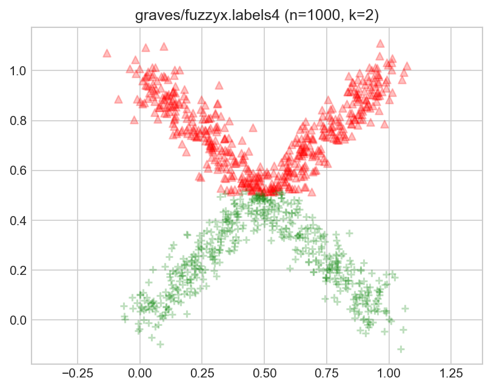
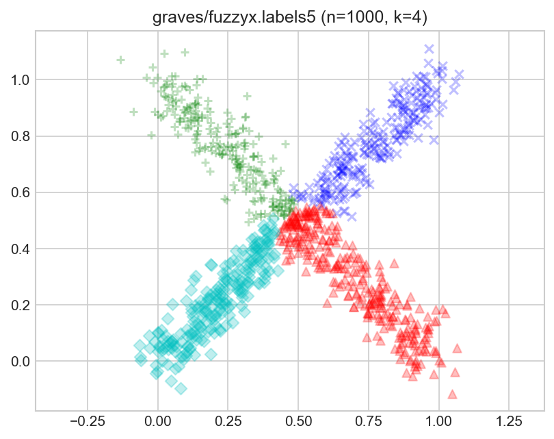
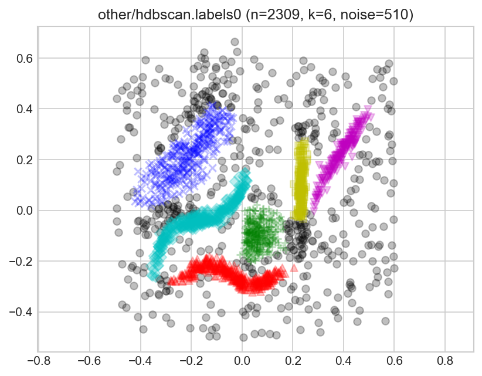

# Benchmark Suite for Clustering Algorithms
## Version 1

Maintained by [Marek Gagolewski](https://www.gagolewski.com).

[](https://doi.org/10.5281/zenodo.3815066)

> Raw results generated by many clustering algorithms for the datasets from
> this repository can now be found at https://github.com/gagolews/clustering_results_v1/.


It is not rare for clustering papers/graduate theses to consider only a small
number of datasets, say 5-10 UCI-sourced ones,
which obviously is too few to make any evaluations rigorous enough.
Other authors propose their own datasets, but forget to test their methods
against other benchmarks batteries, risking their evaluations be biased.

Authors who share their data (kudos to them!) might not necessarily make
the use of their suites particularly smooth (different file formats,
different ways to access, etc., even across a single repository).
On the other hand, other machine learning domains
(but also: [optimisation](https://en.wikipedia.org/wiki/Test_functions_for_optimization))
have had some standardised, well agreed-upon approaches for testing
the quality of the algorithms for quite a long time.


In this project we aim to **aggregate, polish and standardise the existing
clustering benchmark suites** referred to across the machine learning
and data mining literature. Moreover, we introduce **new datasets**
of different dimensionalities, sizes and cluster types.


This is **version 1** of the suite, dated 8 May 2020.
The contents of this repository are frozen –
no new datasets will be added. This will ensure
that everyone evaluates their methods on the same test data.


You can download the repository in its entirety at:
https://github.com/gagolews/clustering_benchmarks_v1/releases/tag/v1


Please cite this repository as:

> M. Gagolewski and others (Eds.),
> *Benchmark Suite for Clustering Algorithms – Version 1*,
> 2020, https://github.com/gagolews/clustering_benchmarks_v1,
> doi:10.5281/zenodo.3815066


```bibtex
@misc{clustering_benchmarks_v1,
    author = {Marek Gagolewski and others},
    title = {Benchmark Suite for Clustering Algorithms -- Version 1},
    year = {2020},
    url = {https://github.com/gagolews/clustering_benchmarks_v1},
    doi = {10.5281/zenodo.3815066}
}
```


New releases/versions of this benchmark suite
(as separate repositories)
are likely to appear in the future.
If you have any suggestions regarding its scope
(e.g., request the addition of new datasets),
please contact the maintainer,
[Marek Gagolewski](https://www.gagolewski.com).

Raw results generated by many clustering algorithms
can be found at https://github.com/gagolews/clustering_results_v1/.

The following is provided **solely for research purposes**,
unless stated otherwise. Please cite the literature references mentioned
in the corresponding dataset description files in any publications
that make use of these.


# Measuring Clustering Quality

> For an example study featuring this benchmark battery,
> see https://genieclust.gagolewski.com.


**Ground-truth/reference label vectors are provided alongside each dataset.**
These have been created by various experts.
They define the desired number of clusters, `k`.

Cluster similarity measures (such as the adjusted Rand index or
normalised mutual information score,
see, e.g., Hubert and Arabie, 1985) can be used to compare
the agreement between the reference and the generated partition.


Nevertheless, we strongly believe that it is in the very spirit
of unsupervised learning that for some datasets,
**there might be multiple equally valid/plausible/useful partitions**
(see also Dasgupta and Ng, 2009 for discussion). That is why
many benchmark sets come with alternative labellings.
Therefore, we claim that the
outputs generated by a single algorithm
should be  evaluated against all the available reference labellings
and the *maximal* similarity score should be reported.





Note that **noise points** (cluster ID=0)
can be present to make the life of a clustering algorithm
harder, but a method should not be penalised if it hasn't been designed
to incorporate the notion of a separate noise cluster.
**When computing cluster similarity scores, the actual labels assigned
to the noise points (as indicated by the ground truth labels)
should be ignored whatsoever.**
In other words, use
`similarity_score(y_predicted[y_truth>0], y_truth[y_truth>0])`.


On a side note, we discourage the use of the (raw) Fowlkes-Mallows (FM) index,
because its expected value for two unrelated partitions is 1/k,
therefore averaging of FM scores for partitions of different cardinalities
becomes meaningless.





# Benchmark Data


## Data Sources

There is some inherent overlap between the original databases.
We have tried to resolve any conflicts in the *best* possible manner.


1. [`fcps`](catalogue/fcps.md) -
    the Fundamental Clustering Problem Suite proposed by A. Ultsch (2005)
    from the Marburg University, Germany

    Each dataset consists of 212-4096 observations in 2-3 dimensions.

    Source: https://www.uni-marburg.de/fb12/arbeitsgruppen/datenbionik/data


2. [`graves`](catalogue/graves.md) -
    *synthetic data sets* considered in the paper (Graves and Pedrycz, 2010)

    Each dataset consists of 200-1050 observations in 2 dimensions.


3. [`mnist`](catalogue/mnist.md) -
    LeCun's MNIST database of handwritten digits
    and Zalando's Fashion-MNIST dataset.


4. [`other`](catalogue/other.md) includes:

    * `hdbscan` - a dataset used for demonstrating the outputs of the
        [Python implementation](https://github.com/scikit-learn-contrib/hdbscan)
        of the HDBSCAN (Campello et al., 2015) algorithm

        Source: https://github.com/scikit-learn-contrib/hdbscan/blob/master/notebooks/clusterable_data.npy

    * `chameleon_t4_8k`, `chameleon_t5_8k`, `chameleon_t7_10k`,
       `chameleon_t8_8k` - datasets supposedly related to the
       CHAMELEON algorithm (Karypis et al., 1999).

       Source: http://glaros.dtc.umn.edu/gkhome/cluto/cluto/download

       In fact, (Karypis et al., 1999) studies two of the above
       and two quite different ones:
       `chameleon_t7_10k` is named `DS3` in the paper, while
       `chameleon_t8_8k` is referred to as `DS4`.
       The `DS2` set looks like a more noisy version of `fcps_twodiamonds`.
       Interestingly,  [SIPU](https://cs.joensuu.fi/sipu/datasets/) also provides
       `chameleon_t4_8k` and suggests its relation with CHAMELEON, but
       its screenshot does not appear in the paper.

    * `iris`, `iris5` - "the" (for discussion see Bezdek et al., 1999)
        famous Iris dataset and its imbalanced version considered
        in (Gagolewski et al., 2016).

    as well as some datasets of unknown/unconfirmed origin
    (TODO: help needed).


5. [`sipu`](catalogue/sipu.md) -
    datasets available at the SIPU (Speech and Image Processing Unit,
    School of Computing, University of Eastern Finland) website

    Many datasets were proposed by P. Fränti et al., see
    (Fränti, Sieranoja, 2018). However, some datasets gathered from other
    sources (see the referenced catalogue for citations) but available
    for download via the SIPU website are also included.

    Source: https://cs.joensuu.fi/sipu/datasets/

    We do not include the `G2` sets as the cluster variances
    should be corrected for space dimensionality, see `g2mg` below
    for an alternative.
    `Birch3` is not included as no ground-truth labels were provided.
    We excluded the `DIM`-sets as they turn out to be too easy
    for most algorithms.

6. [`uci`](catalogue/uci.md) -
    a selection of datasets available at the University of California, Irvine,
    [Machine Learning Repository](http://archive.ics.uci.edu/ml/)
    (Dua and Graff, 2019)

    Some of these datasets in this selection were considered
    for benchmark purposes
    in - among others - (Graves and Pedrycz, 2010); they are
    also listed in the SIPU repository.
    Note that "the" Iris dataset is available elsewhere (see `other`).

7. [`wut`](catalogue/wut.md) -
    authored by the fantastic students
    of [Marek Gagolewski](https://www.gagolewski.com)'s Python
    for Data Analysis course at Warsaw University of Technology:
    Przemysław Kosewski, Jędrzej Krauze, Eliza Kaczorek, Anna Gierlak,
    Adam Wawrzyniak, Aleksander Truszczyński, Mateusz Kobyłka and Michał Maciąg.


8. [`g2mg`](catalogue/g2mg.md) -
    a modified version of `G2`-sets from SIPU with variances
    dependent on datasets' dimensionalities, i.e., s*np.sqrt(d/2),
    which makes these problems more difficult.

    Each dataset consists of 2048 observations belonging
    to either of two Gaussian clusters in 1, 2, ..., 128 dimensions.

9. [`h2mg`](catalogue/h2mg.md) -
    two Gaussian-like hubs with spread dependent on datasets' dimensionalities

    Each dataset consists of 2048 observations in 1, 2, ..., 128 dimensions.
    Each point is sampled from a sphere centred at its own cluster's centre,
    of radius that follows the Gaussian distribution with a predefined scale.


## List of Datasets


|   |dataset                |      n|   d|
|:--|:----------------------|------:|---:|
|1  |fcps/atom              |    800|   3|
|2  |fcps/chainlink         |   1000|   3|
|3  |fcps/engytime          |   4096|   2|
|4  |fcps/hepta             |    212|   3|
|5  |fcps/lsun              |    400|   2|
|6  |fcps/target            |    770|   2|
|7  |fcps/tetra             |    400|   3|
|8  |fcps/twodiamonds       |    800|   2|
|9  |fcps/wingnut           |   1016|   2|
|10 |graves/dense           |    200|   2|
|11 |graves/fuzzyx          |   1000|   2|
|12 |graves/line            |    250|   2|
|13 |graves/parabolic       |   1000|   2|
|14 |graves/ring            |   1000|   2|
|15 |graves/ring_noisy      |   1050|   2|
|16 |graves/ring_outliers   |   1030|   2|
|17 |graves/zigzag          |    250|   2|
|18 |graves/zigzag_noisy    |    300|   2|
|19 |graves/zigzag_outliers |    280|   2|
|20 |mnist/digits           |  70000| 784|
|21 |mnist/fashion          |  70000| 784|
|22 |other/chameleon_t4_8k  |   8000|   2|
|23 |other/chameleon_t5_8k  |   8000|   2|
|24 |other/chameleon_t7_10k |  10000|   2|
|25 |other/chameleon_t8_8k  |   8000|   2|
|26 |other/hdbscan          |   2309|   2|
|27 |other/iris             |    150|   4|
|28 |other/iris5            |    105|   4|
|29 |other/square           |   1000|   2|
|30 |sipu/a1                |   3000|   2|
|31 |sipu/a2                |   5250|   2|
|32 |sipu/a3                |   7500|   2|
|33 |sipu/aggregation       |    788|   2|
|34 |sipu/birch1            | 100000|   2|
|35 |sipu/birch2            | 100000|   2|
|36 |sipu/compound          |    399|   2|
|37 |sipu/d31               |   3100|   2|
|38 |sipu/flame             |    240|   2|
|39 |sipu/jain              |    373|   2|
|40 |sipu/pathbased         |    300|   2|
|41 |sipu/r15               |    600|   2|
|42 |sipu/s1                |   5000|   2|
|43 |sipu/s2                |   5000|   2|
|44 |sipu/s3                |   5000|   2|
|45 |sipu/s4                |   5000|   2|
|46 |sipu/spiral            |    312|   2|
|47 |sipu/unbalance         |   6500|   2|
|48 |sipu/worms_2           | 105600|   2|
|49 |sipu/worms_64          | 105000|  64|
|50 |uci/ecoli              |    336|   7|
|51 |uci/glass              |    214|   9|
|52 |uci/ionosphere         |    351|  34|
|53 |uci/sonar              |    208|  60|
|54 |uci/statlog            |   2310|  19|
|55 |uci/wdbc               |    569|  30|
|56 |uci/wine               |    178|  13|
|57 |uci/yeast              |   1484|   8|
|58 |wut/circles            |   4000|   2|
|59 |wut/cross              |   2000|   2|
|60 |wut/graph              |   2500|   2|
|61 |wut/isolation          |   9000|   2|
|62 |wut/labirynth          |   3546|   2|
|63 |wut/mk1                |    300|   2|
|64 |wut/mk2                |   1000|   2|
|65 |wut/mk3                |    600|   3|
|66 |wut/mk4                |   1500|   3|
|67 |wut/olympic            |   5000|   2|
|68 |wut/smile              |   1000|   2|
|69 |wut/stripes            |   5000|   2|
|70 |wut/trajectories       |  10000|   2|
|71 |wut/trapped_lovers     |   5000|   3|
|72 |wut/twosplashes        |    400|   2|
|73 |wut/windows            |   2977|   2|
|74 |wut/x1                 |    120|   2|
|75 |wut/x2                 |    120|   2|
|76 |wut/x3                 |    185|   2|
|77 |wut/z1                 |    192|   2|
|78 |wut/z2                 |    900|   2|
|79 |wut/z3                 |   1000|   2|


We recommend that the `h2mg` sets should be studied separately
(there are too many of them -- they can easily overshadow the
above ones).

|   |dataset          |    n|   d|
|:--|:----------------|----:|---:|
|1  |h2mg/h2mg_1_10   | 2048|   1|
|2  |h2mg/h2mg_1_20   | 2048|   1|
|3  |h2mg/h2mg_1_30   | 2048|   1|
|...|                 |     |    |
|10 |h2mg/h2mg_2_10   | 2048|   2|
|11 |h2mg/h2mg_2_20   | 2048|   2|
|12 |h2mg/h2mg_2_30   | 2048|   2|
|...|                 |     |    |
|19 |h2mg/h2mg_4_10   | 2048|   4|
|...|                 |     |    |
|28 |h2mg/h2mg_8_10   | 2048|   8|
|...|                 |     |    |
|37 |h2mg/h2mg_16_10  | 2048|  16|
|...|                 |     |    |
|46 |h2mg/h2mg_32_10  | 2048|  32|
|...|                 |     |    |
|72 |h2mg/h2mg_128_90 | 2048| 128|


The `g2mg` sets should be studied separately too.


|   |dataset          |    n|   d|
|:--|:----------------|----:|---:|
|1  |g2mg/g2mg_1_10   | 2048|   1|
|2  |g2mg/g2mg_1_20   | 2048|   1|
|3  |g2mg/g2mg_1_30   | 2048|   1|
|...|                 |     |    |
|10 |g2mg/g2mg_2_10   | 2048|   2|
|11 |g2mg/g2mg_2_20   | 2048|   2|
|12 |g2mg/g2mg_2_30   | 2048|   2|
|...|                 |     |    |
|19 |g2mg/g2mg_4_10   | 2048|   4|
|...|                 |     |    |
|28 |g2mg/g2mg_8_10   | 2048|   8|
|...|                 |     |    |
|37 |g2mg/g2mg_16_10  | 2048|  16|
|...|                 |     |    |
|46 |g2mg/g2mg_32_10  | 2048|  32|
|...|                 |     |    |
|72 |g2mg/g2mg_128_90 | 2048| 128|


## File Format Specification


For each `dataset`, we have the following corresponding files:

* `dataset.txt` - provides the dataset description, gives copyright info, source, etc.

* `dataset.data.gz` - defines the `n`*`d` data matrix:

    * a gzipped text file storing data in tabular format (many software packages
    can decompress `.gz` inputs on the fly)
    * columns are whitespace-delimited
    * there are exactly `n` file lines (no column names, no headers, no comments)
    * values are might be in a decimal or scientific notation (e.g, 1.0, 1.23e-8)
    * to avoid ambiguity,
    consider adding some tiny amount of noise to each element
    in X, e.g., `iris` columns are rounded to 1 decimal digits.


* `dataset.labels0.gz`, `dataset.labels1.gz`, `dataset.labels2.gz`, ... -
ground truth label vectors

    * a gzipped text file with exactly `n` integers, one per each line
    * the `i`-th label (line) corresponds to the `i`-th data point
    * `0` denotes the noise class (if present), first meaningful cluster is
    named `1`
    * hence, class labels are consecutive integers: `0`, `1`, `2`, ..., `k`,
    where `k` is the total number of clusters (noise not included in
    the counting)
    * `labels0` usually denotes the original label vector as defined by
    the dataset's creator (if provided)


# How to Load and Use


It is assumed that you, the researcher/graduate student/curious user,
are already able to work with (e.g., import, batch process) structured data
in your favourite programming language (e.g., C, Java, Python, Matlab, R etc.).
Please do not ask for help on the basics of computer programming here
(in particular: in this repository's *Issues* section), we all have
[StackOverflow](https://stackoverflow.com/) (amongst others) for that.
Below are just few *illustrations* on how to load the datasets in some popular
scientific computing packages.


## Python

```python
import numpy as np
dataset = "..." # e.g., "wut/smile" (UNIX-like) or r"wut\smile" (Windows)
data    = np.loadtxt(dataset+".data.gz", ndmin=2)
labels  = np.loadtxt(dataset+".labels0.gz", dtype=np.intc)
# recall that 0 denotes the noise class, 1 - 1st cluster, 2 - 2nd one, etc.
```


Note that some clustering similarity measures
are available in [scikit-learn](https://scikit-learn.org/stable/modules/clustering.html#clustering-evaluation),
e.g.,
`sklearn.metrics.adjusted_rand_score()` or
`sklearn.metrics.adjusted_mutual_info_score()`.


## R

```R
dataset <- "..." # e.g., "wut/smile"
data    <- read.table(paste0(dataset, ".data.gz"))
labels  <- as.integer(read.table(paste0(dataset, ".labels0.gz"))[,1])
# recall that 0 denotes the noise class, 1 - 1st cluster, 2 - 2nd one, etc.
```

See, e.g., `mclust::adjustedRandIndex()` for a cluster similarity score.


## Matlab/Scilab/Octave

TODO: describe (help needed)


## Julia

TODO: describe (help needed)


# Bibliography

Bezdek J.C. et al. (1999). Will the real iris data please
stand up?, *IEEE Transactions on Fuzzy Systems* **7**, pp. 368-369.
[doi:10.1109/91.771092](https://dx.doi.org/10.1109/91.771092)

Campello R., Moulavi D., Zimek A., Sander J. (2015).
Hierarchical Density Estimates for Data Clustering, Visualization and Outlier Detection,
*ACM Transactions on Knowledge Discovery from Data* **10**, art. no. 5.
[doi:10.1145/2733381](https://dx.doi.org/10.1145/2733381)

Dasgupta S., Ng V. (2009). *Single Data, Multiple Clusterings*, In:
Proc. NIPS Workshop *Clustering: Science or Art? Towards Principled Approaches*.
Available at [clusteringtheory.org](http://clusteringtheory.org)

Dua D., Graff C. (2019). *UCI Machine Learning Repository*
[http://archive.ics.uci.edu/ml]. Irvine, CA: University of California,
School of Information and Computer Science.

Fränti P., Mariescu-Istodor R., Zhong C. (2016). XNN graph,
In: *Proc. IAPR Joint Int. Workshop on Structural, Syntactic,
and Statistical Pattern Recognition*, Merida, Mexico,
*Lecture Notes in Computer Science* **10029**, pp. 207-217.
[doi:10.1007/978-3-319-49055-7_19](https://dx.doi.org/10.1007/978-3-319-49055-7_19)

Fränti P., Sieranoja S. (2018).
K-means properties on six clustering benchmark datasets,
*Applied Intelligence* **48**, 2018, pp. 4743-4759.
[doi:10.1007/s10489-018-1238-7](https://dx.doi.org/10.1007/s10489-018-1238-7)

Gagolewski M., Bartoszuk M., Cena A. (2016).
Genie: A new, fast and outlier-resistant hierarchical clustering algorithm,
*Information Sciences* **363**, pp. 8-23.
[doi:10.1016/j.ins.2016.05.003](https://dx.doi.org/10.1016/j.ins.2016.05.003)

Graves D., Pedrycz W. (2010).
Kernel-based fuzzy clustering and fuzzy clustering:
A comparative experimental study,
*Fuzzy Sets and Systems* **161**(4), pp. 522-543.
[doi:10.1016/j.fss.2009.10.021](https://dx.doi.org/10.1016/j.fss.2009.10.021)

Hubert L., Arabie P. (1985). Comparing Partitions,
*Journal of Classification* **2**(1), pp. 193-218.

Karypis G., Han E.H., Kumar V. (1999).
CHAMELEON: A hierarchical clustering algorithm using dynamic modeling,
*IEEE Transactions on Computers* **32**(8), pp. 68-75.
[doi:10.1109/2.781637](https://dx.doi.org/10.1109/2.781637)

Ultsch A. (2005). Clustering with SOM: U\*C,
In: *Proc. Workshop on Self-Organizing Maps*, Paris, France, pp. 75-82.
