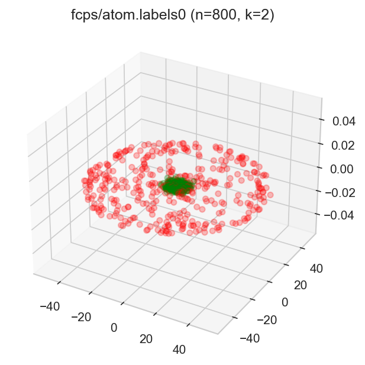
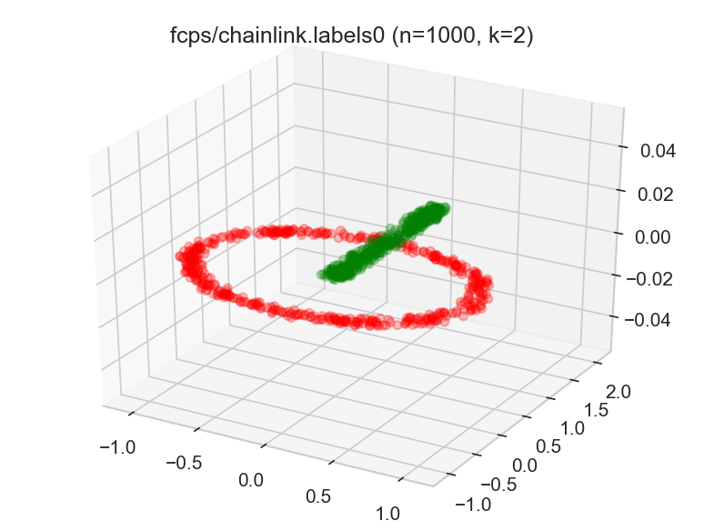
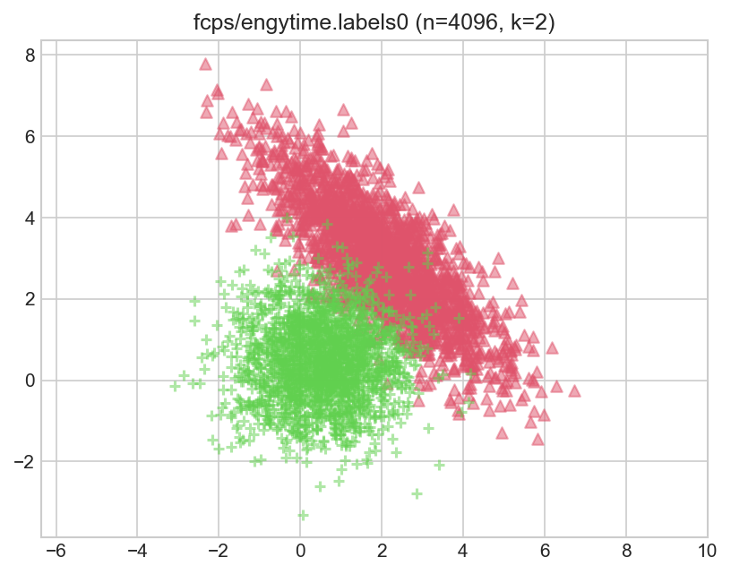
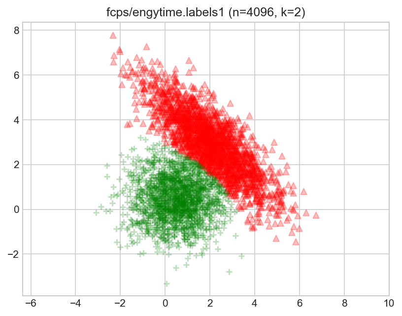
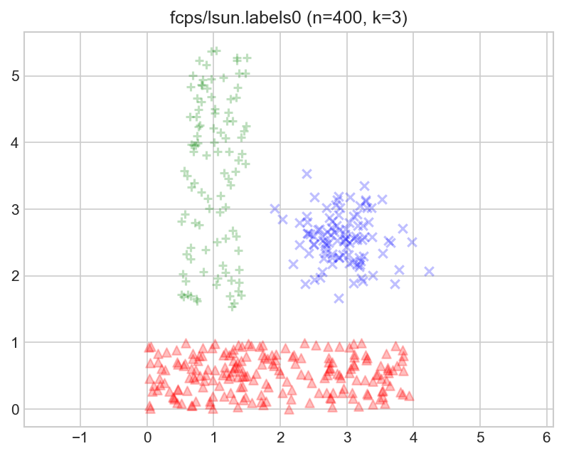
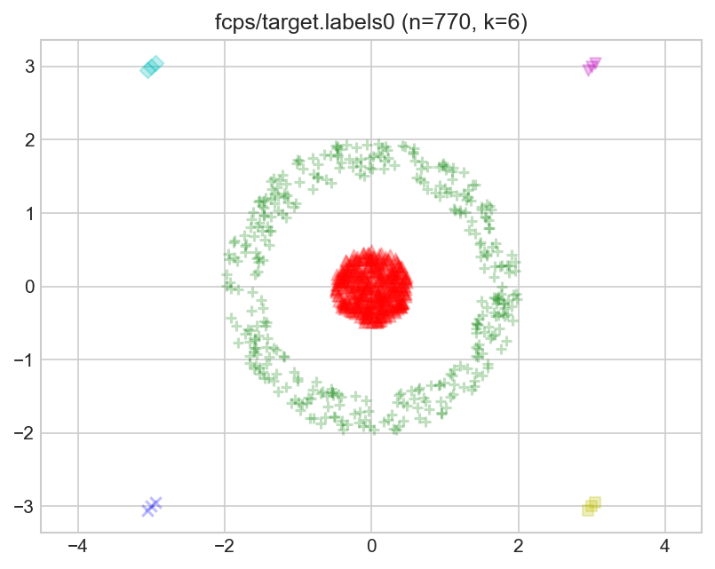
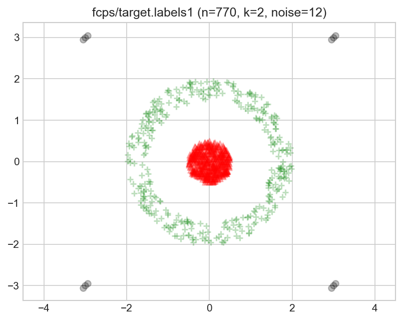
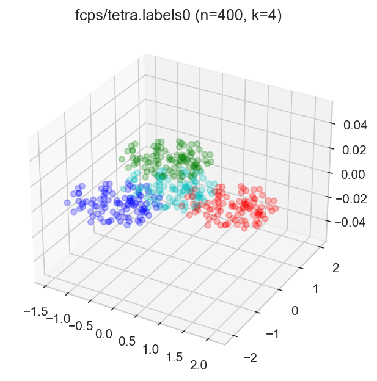
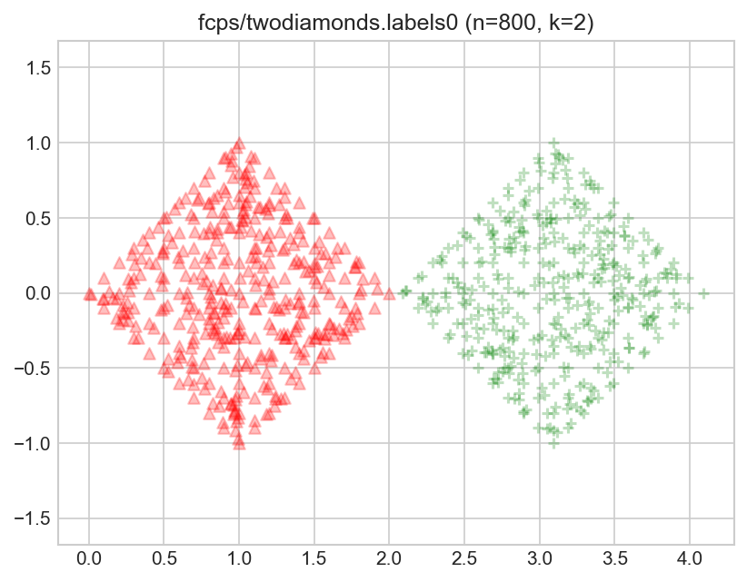
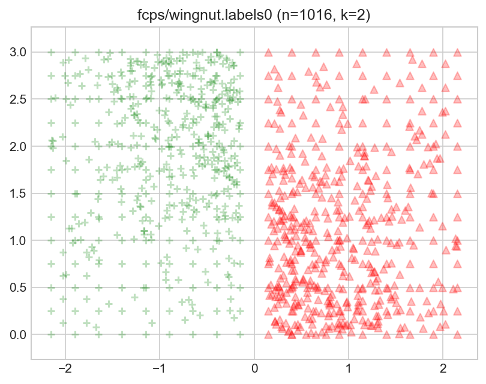

**[Benchmark Suite for Clustering Algorithms -- Version 1](https://github.com/gagolews/clustering_benchmarks_v1)
is maintained by [Marek Gagolewski](http://www.gagolewski.com)**

--------------------------------------------------------------------------------

**Datasets**

* [fcps/atom](#fcps_atom)
* [fcps/chainlink](#fcps_chainlink)
* [fcps/engytime](#fcps_engytime)
* [fcps/hepta](#fcps_hepta)
* [fcps/lsun](#fcps_lsun)
* [fcps/target](#fcps_target)
* [fcps/tetra](#fcps_tetra)
* [fcps/twodiamonds](#fcps_twodiamonds)
* [fcps/wingnut](#fcps_wingnut)

--------------------------------------------------------------------------------

## fcps/atom (n=800, d=3) 

    Source: Ultsch, A.: Clustering with SOM: U*C,
    In Proc. Workshop on Self-Organizing Maps, Paris, France, 2005, 75-82.
    
    Web: https://www.uni-marburg.de/fb12/arbeitsgruppen/datenbionik/data
    
    One of the datasets in the Fundamental Clustering Problems Suite (FCPS).
    
    `labels0` come from the Author. `0` denotes the noise class (if present).
    
    

#### `labels0`

true_k= 2, noise=    0, true_g=0.000

label_counts=[400, 400]

## fcps/chainlink (n=1000, d=3) 

    Source: Ultsch, A.: Clustering with SOM: U*C,
    In Proc. Workshop on Self-Organizing Maps, Paris, France, 2005, 75-82.
    
    Web: https://www.uni-marburg.de/fb12/arbeitsgruppen/datenbionik/data
    
    One of the datasets in the Fundamental Clustering Problems Suite (FCPS).
    
    `labels0` come from the Author. `0` denotes the noise class (if present).
    
    

#### `labels0`

true_k= 2, noise=    0, true_g=0.000

label_counts=[500, 500]

## fcps/engytime (n=4096, d=2) 

    Source: Ultsch, A.: Clustering with SOM: U*C,
    In Proc. Workshop on Self-Organizing Maps, Paris, France, 2005, 75-82.
    
    Web: https://www.uni-marburg.de/fb12/arbeitsgruppen/datenbionik/data
    
    One of the datasets in the Fundamental Clustering Problems Suite (FCPS).
    
    `labels0` and `labels1` come from the Author.
    

#### `labels0`

true_k= 2, noise=    0, true_g=0.000

label_counts=[2048, 2048]

#### `labels1`

true_k= 2, noise=    0, true_g=0.001

label_counts=[2050, 2046]

## fcps/hepta (n=212, d=3) 

    Source: Ultsch, A.: Clustering with SOM: U*C,
    In Proc. Workshop on Self-Organizing Maps, Paris, France, 2005, 75-82.
    
    Web: https://www.uni-marburg.de/fb12/arbeitsgruppen/datenbionik/data
    
    One of the datasets in the Fundamental Clustering Problems Suite (FCPS).
    
    `labels0` come from the Author. `0` denotes the noise class (if present).
    
    

#### `labels0`

true_k= 7, noise=    0, true_g=0.009

label_counts=[32, 30, 30, 30, 30, 30, 30]

## fcps/lsun (n=400, d=2) 

    Source: Ultsch, A.: Clustering with SOM: U*C,
    In Proc. Workshop on Self-Organizing Maps, Paris, France, 2005, 75-82.
    
    Web: https://www.uni-marburg.de/fb12/arbeitsgruppen/datenbionik/data
    
    One of the datasets in the Fundamental Clustering Problems Suite (FCPS).
    
    `labels0` come from the Author. `0` denotes the noise class (if present).
    
    

#### `labels0`

true_k= 3, noise=    0, true_g=0.250

label_counts=[200, 100, 100]

## fcps/target (n=770, d=2) 

    Source: Ultsch, A.: Clustering with SOM: U*C,
    In Proc. Workshop on Self-Organizing Maps, Paris, France, 2005, 75-82.
    
    Web: https://www.uni-marburg.de/fb12/arbeitsgruppen/datenbionik/data
    
    One of the datasets in the Fundamental Clustering Problems Suite (FCPS).
    
    `labels0` come from the Author.
    
    `labels1` by A.Cena and M.Gagolewski.
    
    `0` denotes the noise class (if present).
    

#### `labels0`

true_k= 6, noise=    0, true_g=0.790

label_counts=[395, 363, 3, 3, 3, 3]

#### `labels1`

true_k= 2, noise=   12, true_g=0.042

label_counts=[395, 363]

## fcps/tetra (n=400, d=3) 

    Source: Ultsch, A.: Clustering with SOM: U*C,
    In Proc. Workshop on Self-Organizing Maps, Paris, France, 2005, 75-82.
    
    Web: https://www.uni-marburg.de/fb12/arbeitsgruppen/datenbionik/data
    
    One of the datasets in the Fundamental Clustering Problems Suite (FCPS).
    
    `labels0` come from the Author. `0` denotes the noise class (if present).
    
    

#### `labels0`

true_k= 4, noise=    0, true_g=0.000

label_counts=[100, 100, 100, 100]

## fcps/twodiamonds (n=800, d=2) 

    Source: Ultsch, A.: Clustering with SOM: U*C,
    In Proc. Workshop on Self-Organizing Maps, Paris, France, 2005, 75-82.
    
    Web: https://www.uni-marburg.de/fb12/arbeitsgruppen/datenbionik/data
    
    One of the datasets in the Fundamental Clustering Problems Suite (FCPS).
    
    `labels0` come from the Author. `0` denotes the noise class (if present).
    
    

#### `labels0`

true_k= 2, noise=    0, true_g=0.000

label_counts=[400, 400]

## fcps/wingnut (n=1016, d=2) 

    Source: Ultsch, A.: Clustering with SOM: U*C,
    In Proc. Workshop on Self-Organizing Maps, Paris, France, 2005, 75-82.
    
    Web: https://www.uni-marburg.de/fb12/arbeitsgruppen/datenbionik/data
    
    One of the datasets in the Fundamental Clustering Problems Suite (FCPS).
    
    `labels0` come from the Author. `0` denotes the noise class (if present).
    
    

#### `labels0`

true_k= 2, noise=    0, true_g=0.000

label_counts=[508, 508]

