**[Benchmark Suite for Clustering Algorithms -- Version 1](https://github.com/gagolews/clustering_benchmarks_v1)
is maintained by [Marek Gagolewski](https://www.gagolewski.com)**

--------------------------------------------------------------------------------

**Datasets**

* [g2mg/g2mg_1_10](#g2mg_g2mg_1_10)
* [g2mg/g2mg_1_20](#g2mg_g2mg_1_20)
* [g2mg/g2mg_1_30](#g2mg_g2mg_1_30)
* [g2mg/g2mg_1_40](#g2mg_g2mg_1_40)
* [g2mg/g2mg_1_50](#g2mg_g2mg_1_50)
* [g2mg/g2mg_1_60](#g2mg_g2mg_1_60)
* [g2mg/g2mg_1_70](#g2mg_g2mg_1_70)
* [g2mg/g2mg_1_80](#g2mg_g2mg_1_80)
* [g2mg/g2mg_1_90](#g2mg_g2mg_1_90)
* [g2mg/g2mg_2_10](#g2mg_g2mg_2_10)
* [g2mg/g2mg_2_20](#g2mg_g2mg_2_20)
* [g2mg/g2mg_2_30](#g2mg_g2mg_2_30)
* [g2mg/g2mg_2_40](#g2mg_g2mg_2_40)
* [g2mg/g2mg_2_50](#g2mg_g2mg_2_50)
* [g2mg/g2mg_2_60](#g2mg_g2mg_2_60)
* [g2mg/g2mg_2_70](#g2mg_g2mg_2_70)
* [g2mg/g2mg_2_80](#g2mg_g2mg_2_80)
* [g2mg/g2mg_2_90](#g2mg_g2mg_2_90)
* [g2mg/g2mg_4_10](#g2mg_g2mg_4_10)
* [g2mg/g2mg_4_20](#g2mg_g2mg_4_20)
* [g2mg/g2mg_4_30](#g2mg_g2mg_4_30)
* [g2mg/g2mg_4_40](#g2mg_g2mg_4_40)
* [g2mg/g2mg_4_50](#g2mg_g2mg_4_50)
* [g2mg/g2mg_4_60](#g2mg_g2mg_4_60)
* [g2mg/g2mg_4_70](#g2mg_g2mg_4_70)
* [g2mg/g2mg_4_80](#g2mg_g2mg_4_80)
* [g2mg/g2mg_4_90](#g2mg_g2mg_4_90)
* [g2mg/g2mg_8_10](#g2mg_g2mg_8_10)
* [g2mg/g2mg_8_20](#g2mg_g2mg_8_20)
* [g2mg/g2mg_8_30](#g2mg_g2mg_8_30)
* [g2mg/g2mg_8_40](#g2mg_g2mg_8_40)
* [g2mg/g2mg_8_50](#g2mg_g2mg_8_50)
* [g2mg/g2mg_8_60](#g2mg_g2mg_8_60)
* [g2mg/g2mg_8_70](#g2mg_g2mg_8_70)
* [g2mg/g2mg_8_80](#g2mg_g2mg_8_80)
* [g2mg/g2mg_8_90](#g2mg_g2mg_8_90)
* [g2mg/g2mg_16_10](#g2mg_g2mg_16_10)
* [g2mg/g2mg_16_20](#g2mg_g2mg_16_20)
* [g2mg/g2mg_16_30](#g2mg_g2mg_16_30)
* [g2mg/g2mg_16_40](#g2mg_g2mg_16_40)
* [g2mg/g2mg_16_50](#g2mg_g2mg_16_50)
* [g2mg/g2mg_16_60](#g2mg_g2mg_16_60)
* [g2mg/g2mg_16_70](#g2mg_g2mg_16_70)
* [g2mg/g2mg_16_80](#g2mg_g2mg_16_80)
* [g2mg/g2mg_16_90](#g2mg_g2mg_16_90)
* [g2mg/g2mg_32_10](#g2mg_g2mg_32_10)
* [g2mg/g2mg_32_20](#g2mg_g2mg_32_20)
* [g2mg/g2mg_32_30](#g2mg_g2mg_32_30)
* [g2mg/g2mg_32_40](#g2mg_g2mg_32_40)
* [g2mg/g2mg_32_50](#g2mg_g2mg_32_50)
* [g2mg/g2mg_32_60](#g2mg_g2mg_32_60)
* [g2mg/g2mg_32_70](#g2mg_g2mg_32_70)
* [g2mg/g2mg_32_80](#g2mg_g2mg_32_80)
* [g2mg/g2mg_32_90](#g2mg_g2mg_32_90)
* [g2mg/g2mg_64_10](#g2mg_g2mg_64_10)
* [g2mg/g2mg_64_20](#g2mg_g2mg_64_20)
* [g2mg/g2mg_64_30](#g2mg_g2mg_64_30)
* [g2mg/g2mg_64_40](#g2mg_g2mg_64_40)
* [g2mg/g2mg_64_50](#g2mg_g2mg_64_50)
* [g2mg/g2mg_64_60](#g2mg_g2mg_64_60)
* [g2mg/g2mg_64_70](#g2mg_g2mg_64_70)
* [g2mg/g2mg_64_80](#g2mg_g2mg_64_80)
* [g2mg/g2mg_64_90](#g2mg_g2mg_64_90)
* [g2mg/g2mg_128_10](#g2mg_g2mg_128_10)
* [g2mg/g2mg_128_20](#g2mg_g2mg_128_20)
* [g2mg/g2mg_128_30](#g2mg_g2mg_128_30)
* [g2mg/g2mg_128_40](#g2mg_g2mg_128_40)
* [g2mg/g2mg_128_50](#g2mg_g2mg_128_50)
* [g2mg/g2mg_128_60](#g2mg_g2mg_128_60)
* [g2mg/g2mg_128_70](#g2mg_g2mg_128_70)
* [g2mg/g2mg_128_80](#g2mg_g2mg_128_80)
* [g2mg/g2mg_128_90](#g2mg_g2mg_128_90)

--------------------------------------------------------------------------------

## g2mg/g2mg_1_10 (n=2048, d=1) 

    g2mg clustering benchmark
    Two 1-dimensional clusters, each with 1024 points that have
    i.i.d. Gaussian components with standard deviation 10*sqrt(1/2).
    
    
    Author: Marek Gagolewski (http://www.gagolewski.com)
    Copyleft 2020
    Licensed under the Creative Commons Attribution 4.0 International License
    
    `labels0` gives reference labels based on which probability distribution's
    mixture component was used to generate the corresponding points.
    `labels1` gives reference labels based on the distance to
    the true cluster centre (i.e., arg max_ p_i(x)).
    There is no noise class.
    

#### `labels0`

true_k= 2, noise=    0, true_g=0.000

label_counts=[1024, 1024]

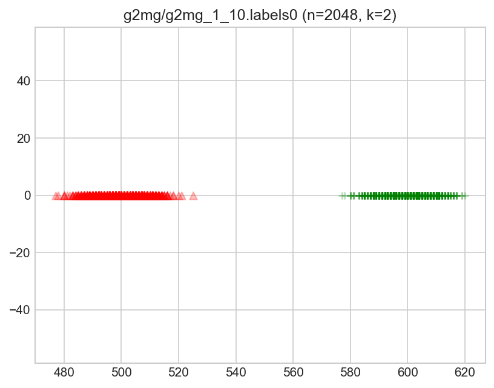

#### `labels1`

true_k= 2, noise=    0, true_g=0.000

label_counts=[1024, 1024]

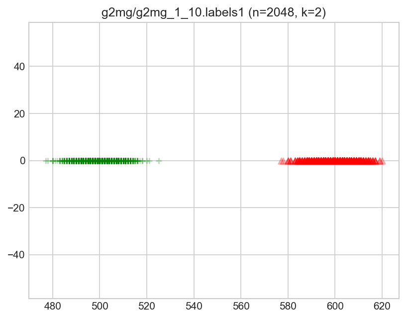

## g2mg/g2mg_1_20 (n=2048, d=1) 

    g2mg clustering benchmark
    Two 1-dimensional clusters, each with 1024 points that have
    i.i.d. Gaussian components with standard deviation 20*sqrt(1/2).
    
    
    Author: Marek Gagolewski (http://www.gagolewski.com)
    Copyleft 2020
    Licensed under the Creative Commons Attribution 4.0 International License
    
    `labels0` gives reference labels based on which probability distribution's
    mixture component was used to generate the corresponding points.
    `labels1` gives reference labels based on the distance to
    the true cluster centre (i.e., arg max_ p_i(x)).
    There is no noise class.
    

#### `labels0`

true_k= 2, noise=    0, true_g=0.000

label_counts=[1024, 1024]

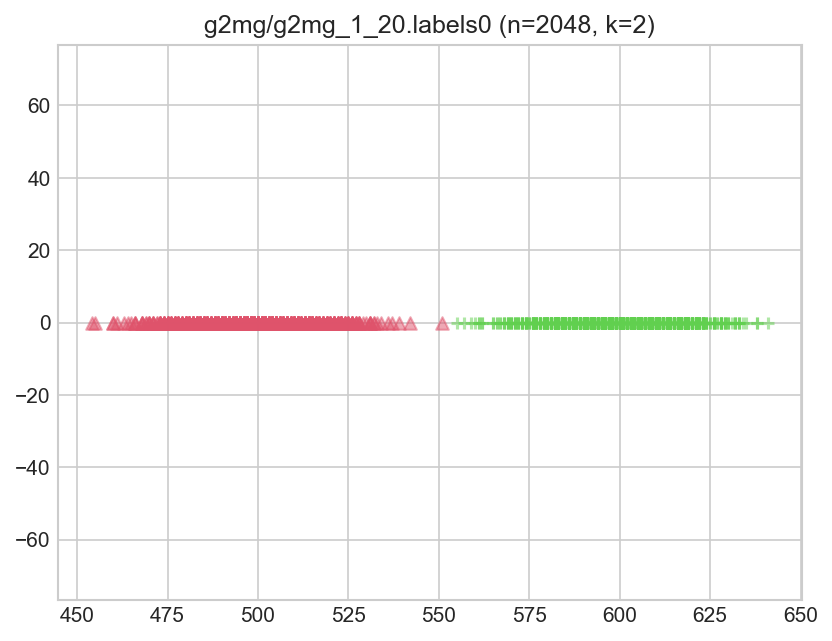

#### `labels1`

true_k= 2, noise=    0, true_g=0.001

label_counts=[1025, 1023]

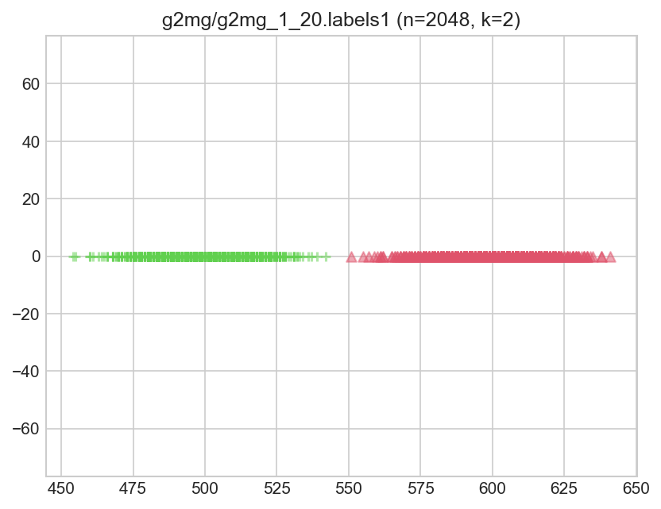

## g2mg/g2mg_1_30 (n=2048, d=1) 

    g2mg clustering benchmark
    Two 1-dimensional clusters, each with 1024 points that have
    i.i.d. Gaussian components with standard deviation 30*sqrt(1/2).
    
    
    Author: Marek Gagolewski (http://www.gagolewski.com)
    Copyleft 2020
    Licensed under the Creative Commons Attribution 4.0 International License
    
    `labels0` gives reference labels based on which probability distribution's
    mixture component was used to generate the corresponding points.
    `labels1` gives reference labels based on the distance to
    the true cluster centre (i.e., arg max_ p_i(x)).
    There is no noise class.
    

#### `labels0`

true_k= 2, noise=    0, true_g=0.000

label_counts=[1024, 1024]

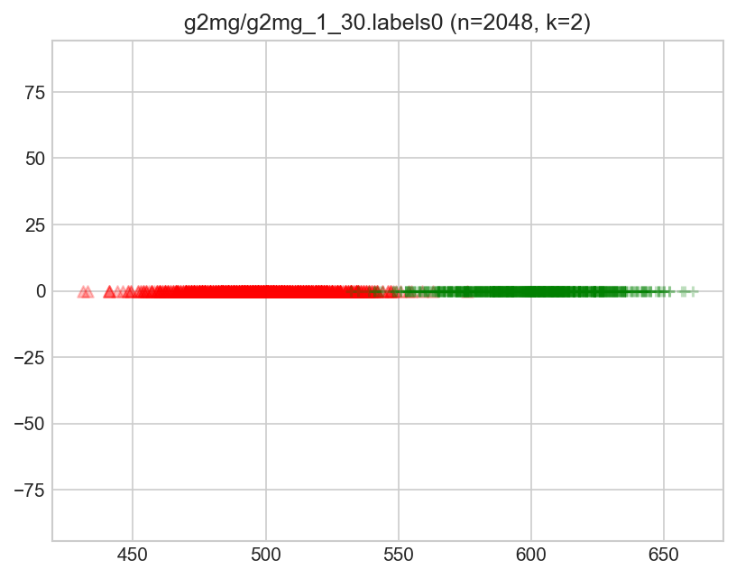

#### `labels1`

true_k= 2, noise=    0, true_g=0.006

label_counts=[1018, 1030]

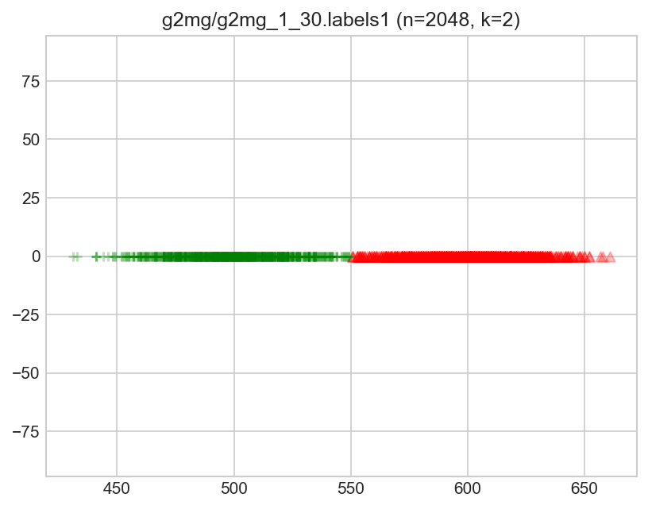

## g2mg/g2mg_1_40 (n=2048, d=1) 

    g2mg clustering benchmark
    Two 1-dimensional clusters, each with 1024 points that have
    i.i.d. Gaussian components with standard deviation 40*sqrt(1/2).
    
    
    Author: Marek Gagolewski (http://www.gagolewski.com)
    Copyleft 2020
    Licensed under the Creative Commons Attribution 4.0 International License
    
    `labels0` gives reference labels based on which probability distribution's
    mixture component was used to generate the corresponding points.
    `labels1` gives reference labels based on the distance to
    the true cluster centre (i.e., arg max_ p_i(x)).
    There is no noise class.
    

#### `labels0`

true_k= 2, noise=    0, true_g=0.000

label_counts=[1024, 1024]

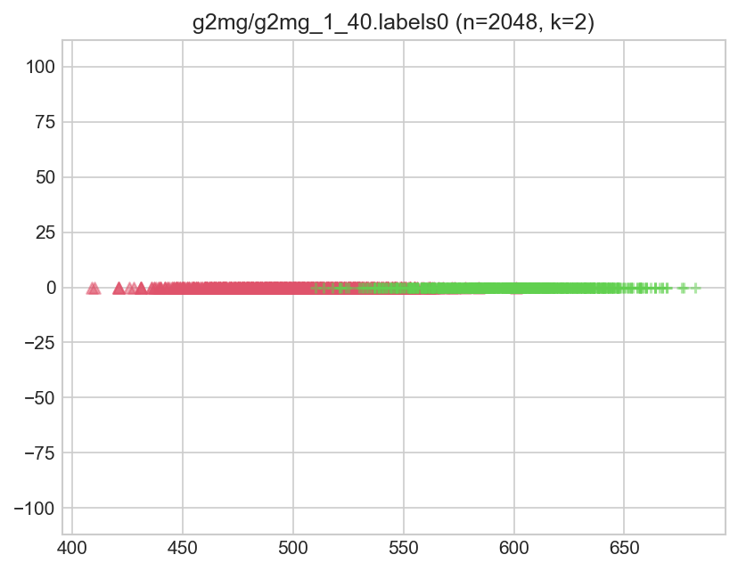

#### `labels1`

true_k= 2, noise=    0, true_g=0.012

label_counts=[1012, 1036]

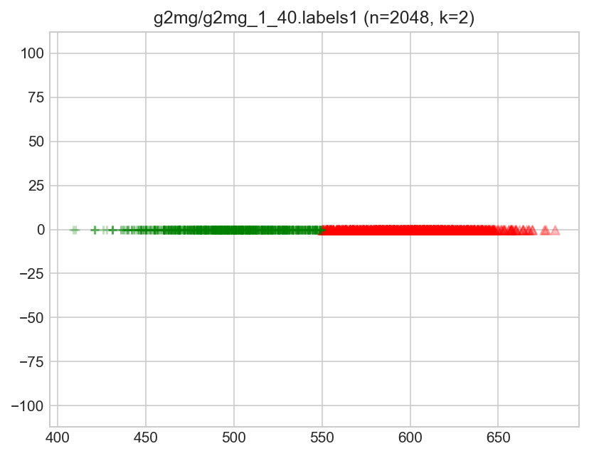

## g2mg/g2mg_1_50 (n=2048, d=1) 

    g2mg clustering benchmark
    Two 1-dimensional clusters, each with 1024 points that have
    i.i.d. Gaussian components with standard deviation 50*sqrt(1/2).
    
    
    Author: Marek Gagolewski (http://www.gagolewski.com)
    Copyleft 2020
    Licensed under the Creative Commons Attribution 4.0 International License
    
    `labels0` gives reference labels based on which probability distribution's
    mixture component was used to generate the corresponding points.
    `labels1` gives reference labels based on the distance to
    the true cluster centre (i.e., arg max_ p_i(x)).
    There is no noise class.
    

#### `labels0`

true_k= 2, noise=    0, true_g=0.000

label_counts=[1024, 1024]

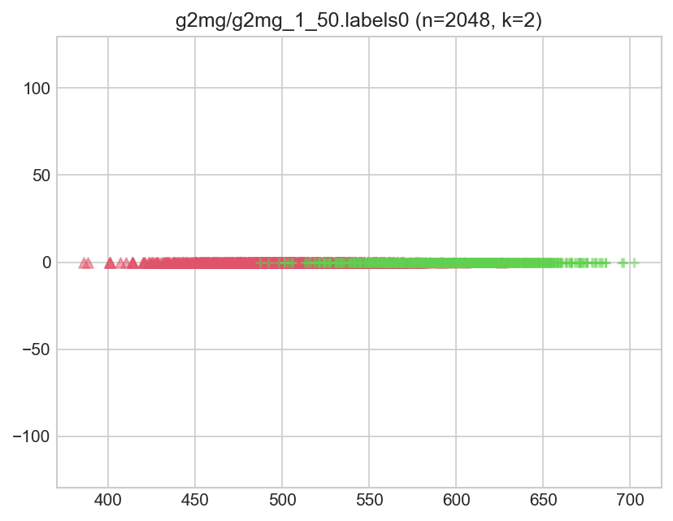

#### `labels1`

true_k= 2, noise=    0, true_g=0.006

label_counts=[1018, 1030]

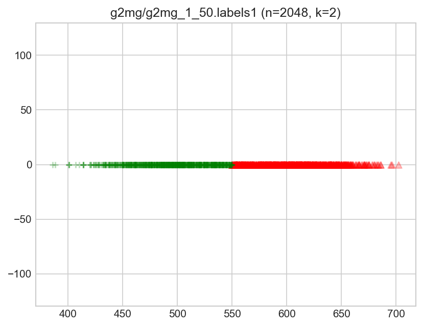

## g2mg/g2mg_1_60 (n=2048, d=1) 

    g2mg clustering benchmark
    Two 1-dimensional clusters, each with 1024 points that have
    i.i.d. Gaussian components with standard deviation 60*sqrt(1/2).
    
    
    Author: Marek Gagolewski (http://www.gagolewski.com)
    Copyleft 2020
    Licensed under the Creative Commons Attribution 4.0 International License
    
    `labels0` gives reference labels based on which probability distribution's
    mixture component was used to generate the corresponding points.
    `labels1` gives reference labels based on the distance to
    the true cluster centre (i.e., arg max_ p_i(x)).
    There is no noise class.
    

#### `labels0`

true_k= 2, noise=    0, true_g=0.000

label_counts=[1024, 1024]

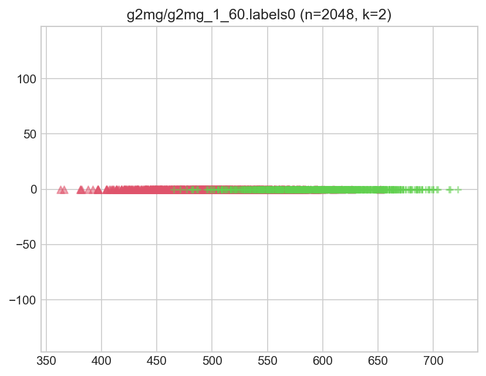

#### `labels1`

true_k= 2, noise=    0, true_g=0.021

label_counts=[1003, 1045]

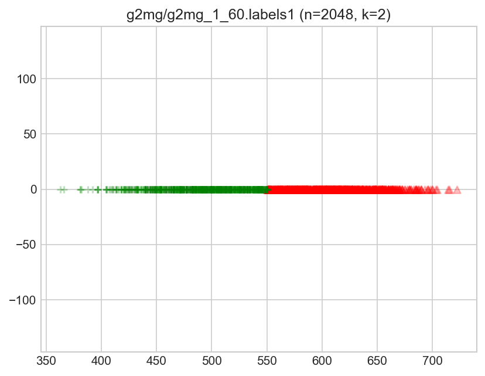

## g2mg/g2mg_1_70 (n=2048, d=1) 

    g2mg clustering benchmark
    Two 1-dimensional clusters, each with 1024 points that have
    i.i.d. Gaussian components with standard deviation 70*sqrt(1/2).
    
    
    Author: Marek Gagolewski (http://www.gagolewski.com)
    Copyleft 2020
    Licensed under the Creative Commons Attribution 4.0 International License
    
    `labels0` gives reference labels based on which probability distribution's
    mixture component was used to generate the corresponding points.
    `labels1` gives reference labels based on the distance to
    the true cluster centre (i.e., arg max_ p_i(x)).
    There is no noise class.
    

#### `labels0`

true_k= 2, noise=    0, true_g=0.000

label_counts=[1024, 1024]

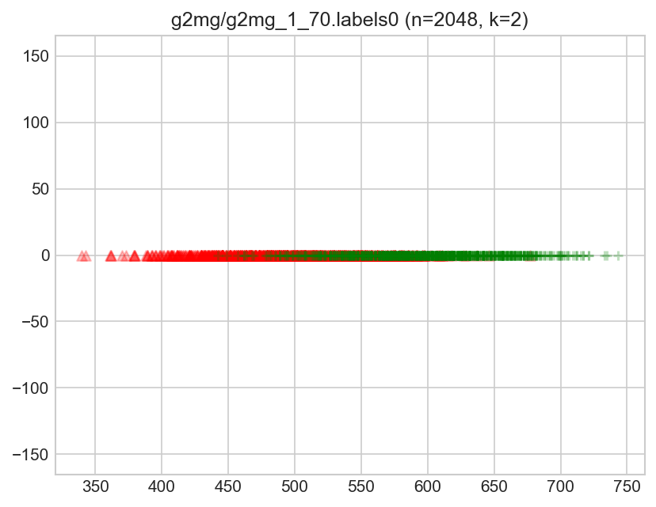

#### `labels1`

true_k= 2, noise=    0, true_g=0.014

label_counts=[1010, 1038]

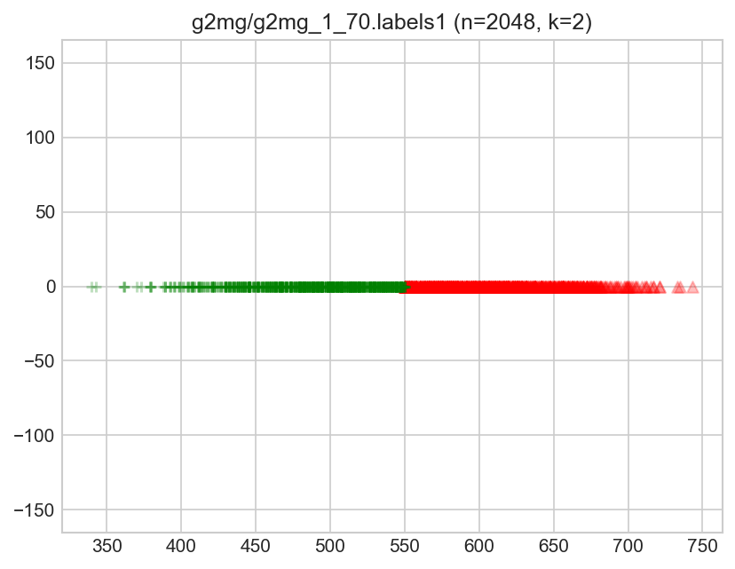

## g2mg/g2mg_1_80 (n=2048, d=1) 

    g2mg clustering benchmark
    Two 1-dimensional clusters, each with 1024 points that have
    i.i.d. Gaussian components with standard deviation 80*sqrt(1/2).
    
    
    Author: Marek Gagolewski (http://www.gagolewski.com)
    Copyleft 2020
    Licensed under the Creative Commons Attribution 4.0 International License
    
    `labels0` gives reference labels based on which probability distribution's
    mixture component was used to generate the corresponding points.
    `labels1` gives reference labels based on the distance to
    the true cluster centre (i.e., arg max_ p_i(x)).
    There is no noise class.
    

#### `labels0`

true_k= 2, noise=    0, true_g=0.000

label_counts=[1024, 1024]

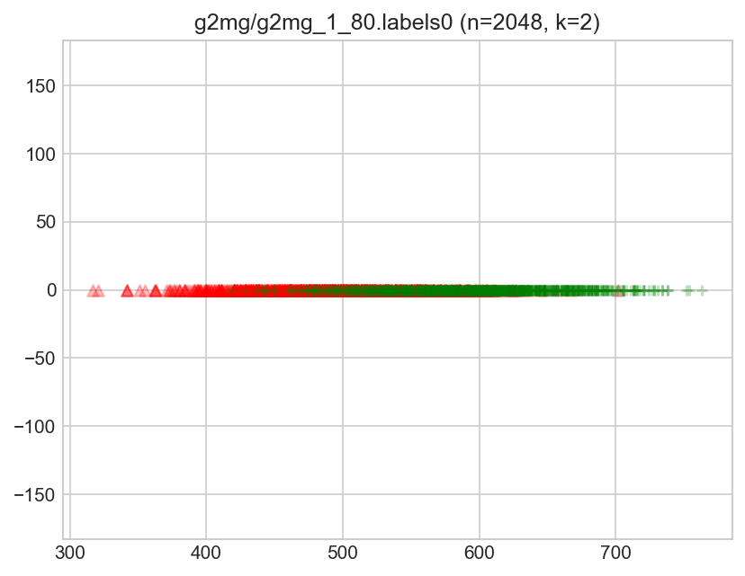

#### `labels1`

true_k= 2, noise=    0, true_g=0.003

label_counts=[1021, 1027]

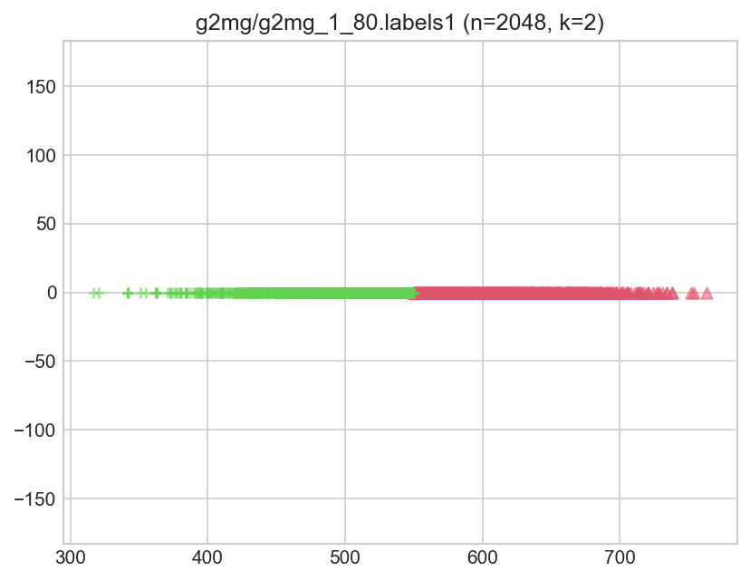

## g2mg/g2mg_1_90 (n=2048, d=1) 

    g2mg clustering benchmark
    Two 1-dimensional clusters, each with 1024 points that have
    i.i.d. Gaussian components with standard deviation 90*sqrt(1/2).
    
    
    Author: Marek Gagolewski (http://www.gagolewski.com)
    Copyleft 2020
    Licensed under the Creative Commons Attribution 4.0 International License
    
    `labels0` gives reference labels based on which probability distribution's
    mixture component was used to generate the corresponding points.
    `labels1` gives reference labels based on the distance to
    the true cluster centre (i.e., arg max_ p_i(x)).
    There is no noise class.
    

#### `labels0`

true_k= 2, noise=    0, true_g=0.000

label_counts=[1024, 1024]

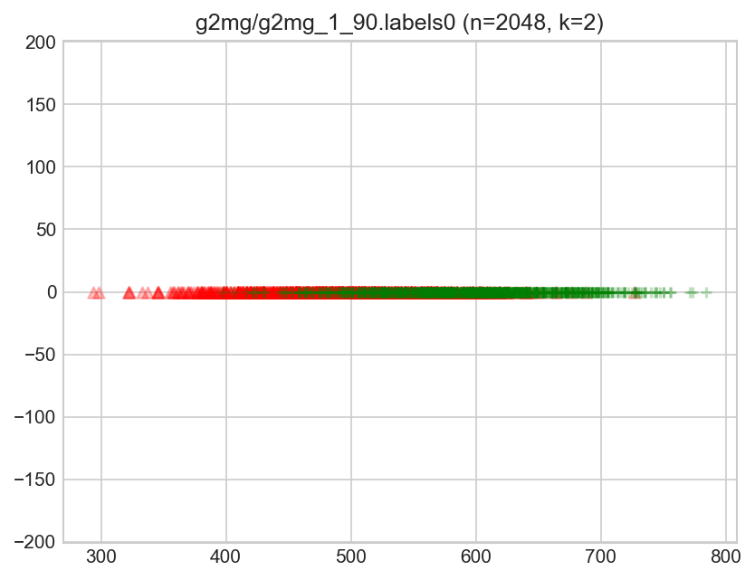

#### `labels1`

true_k= 2, noise=    0, true_g=0.004

label_counts=[1020, 1028]

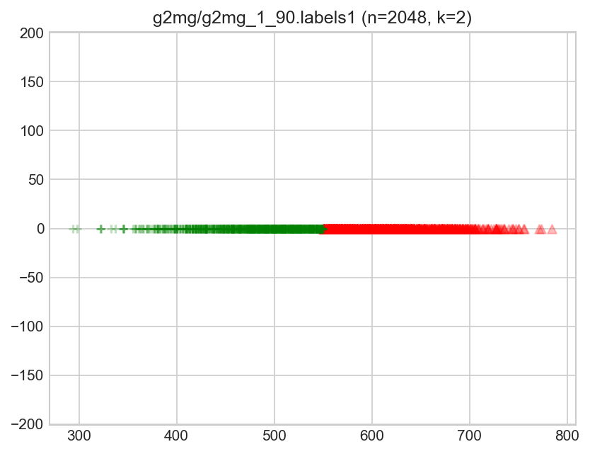

## g2mg/g2mg_2_10 (n=2048, d=2) 

    g2mg clustering benchmark
    Two 2-dimensional clusters, each with 1024 points that have
    i.i.d. Gaussian components with standard deviation 10*sqrt(2/2).
    
    
    Author: Marek Gagolewski (http://www.gagolewski.com)
    Copyleft 2020
    Licensed under the Creative Commons Attribution 4.0 International License
    
    `labels0` gives reference labels based on which probability distribution's
    mixture component was used to generate the corresponding points.
    `labels1` gives reference labels based on the distance to
    the true cluster centre (i.e., arg max_ p_i(x)).
    There is no noise class.
    

#### `labels0`

true_k= 2, noise=    0, true_g=0.000

label_counts=[1024, 1024]

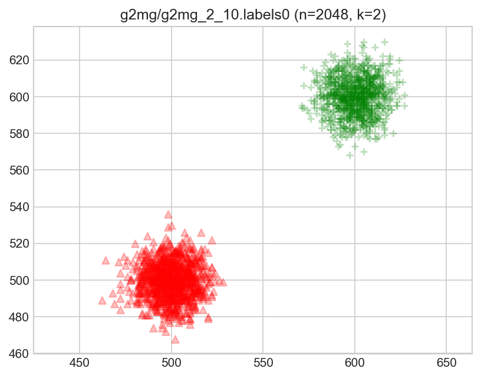

#### `labels1`

true_k= 2, noise=    0, true_g=0.000

label_counts=[1024, 1024]

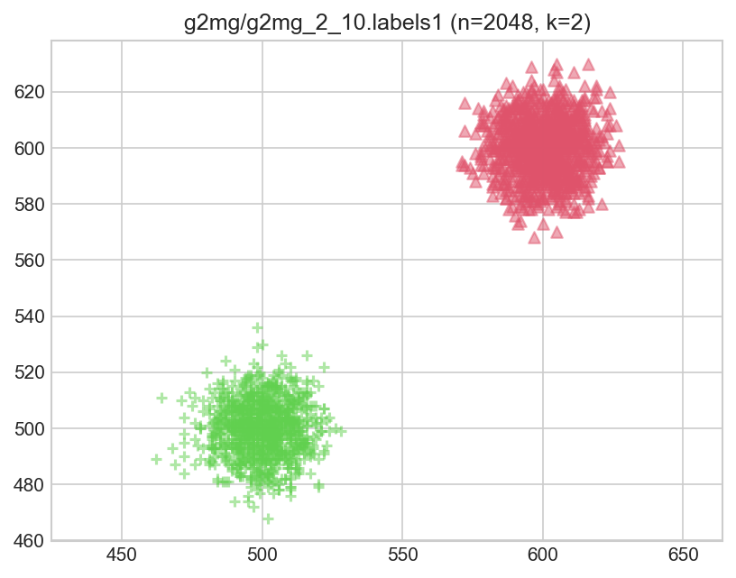

## g2mg/g2mg_2_20 (n=2048, d=2) 

    g2mg clustering benchmark
    Two 2-dimensional clusters, each with 1024 points that have
    i.i.d. Gaussian components with standard deviation 20*sqrt(2/2).
    
    
    Author: Marek Gagolewski (http://www.gagolewski.com)
    Copyleft 2020
    Licensed under the Creative Commons Attribution 4.0 International License
    
    `labels0` gives reference labels based on which probability distribution's
    mixture component was used to generate the corresponding points.
    `labels1` gives reference labels based on the distance to
    the true cluster centre (i.e., arg max_ p_i(x)).
    There is no noise class.
    

#### `labels0`

true_k= 2, noise=    0, true_g=0.000

label_counts=[1024, 1024]

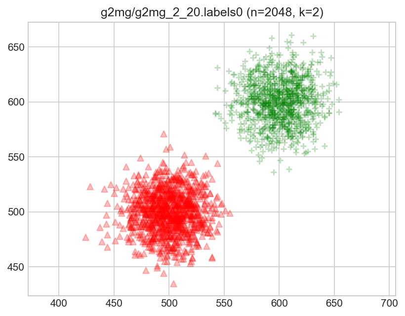

#### `labels1`

true_k= 2, noise=    0, true_g=0.000

label_counts=[1024, 1024]

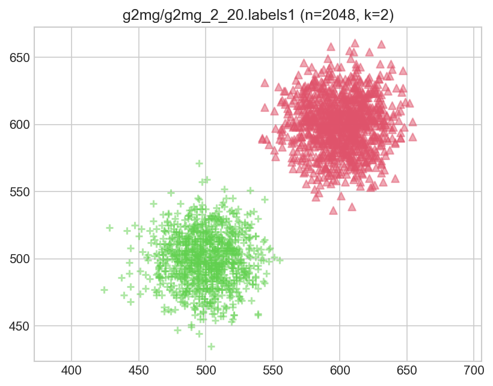

## g2mg/g2mg_2_30 (n=2048, d=2) 

    g2mg clustering benchmark
    Two 2-dimensional clusters, each with 1024 points that have
    i.i.d. Gaussian components with standard deviation 30*sqrt(2/2).
    
    
    Author: Marek Gagolewski (http://www.gagolewski.com)
    Copyleft 2020
    Licensed under the Creative Commons Attribution 4.0 International License
    
    `labels0` gives reference labels based on which probability distribution's
    mixture component was used to generate the corresponding points.
    `labels1` gives reference labels based on the distance to
    the true cluster centre (i.e., arg max_ p_i(x)).
    There is no noise class.
    

#### `labels0`

true_k= 2, noise=    0, true_g=0.000

label_counts=[1024, 1024]

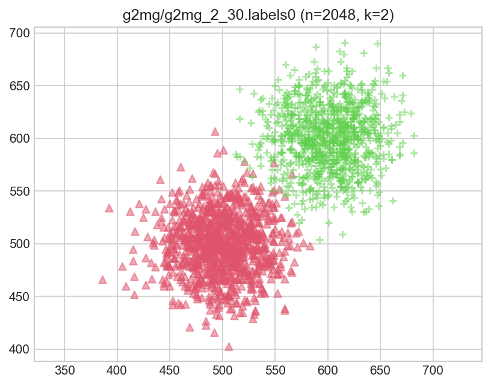

#### `labels1`

true_k= 2, noise=    0, true_g=0.005

label_counts=[1019, 1029]

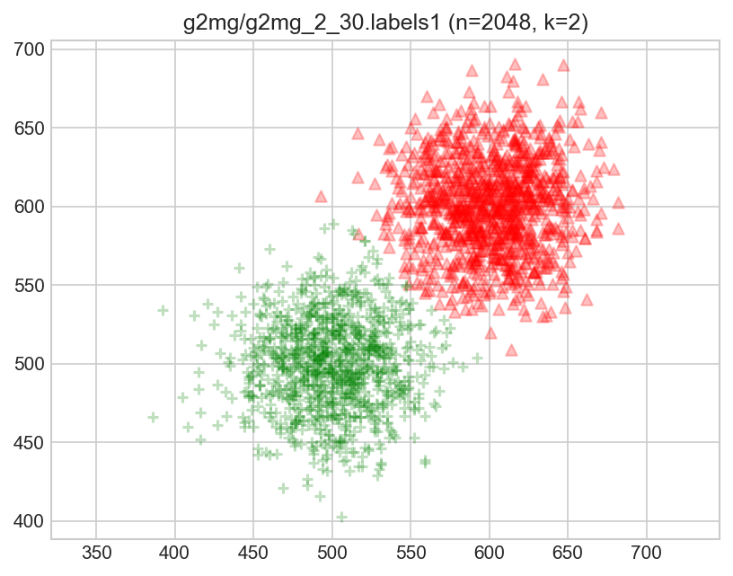

## g2mg/g2mg_2_40 (n=2048, d=2) 

    g2mg clustering benchmark
    Two 2-dimensional clusters, each with 1024 points that have
    i.i.d. Gaussian components with standard deviation 40*sqrt(2/2).
    
    
    Author: Marek Gagolewski (http://www.gagolewski.com)
    Copyleft 2020
    Licensed under the Creative Commons Attribution 4.0 International License
    
    `labels0` gives reference labels based on which probability distribution's
    mixture component was used to generate the corresponding points.
    `labels1` gives reference labels based on the distance to
    the true cluster centre (i.e., arg max_ p_i(x)).
    There is no noise class.
    

#### `labels0`

true_k= 2, noise=    0, true_g=0.000

label_counts=[1024, 1024]

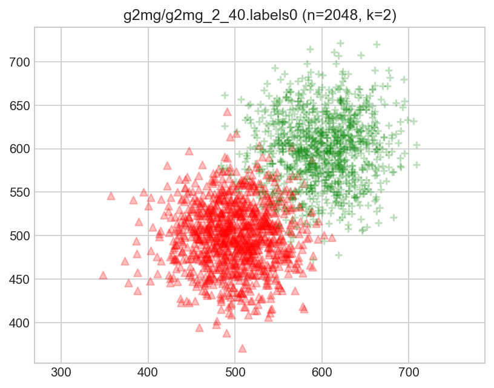

#### `labels1`

true_k= 2, noise=    0, true_g=0.006

label_counts=[1018, 1030]

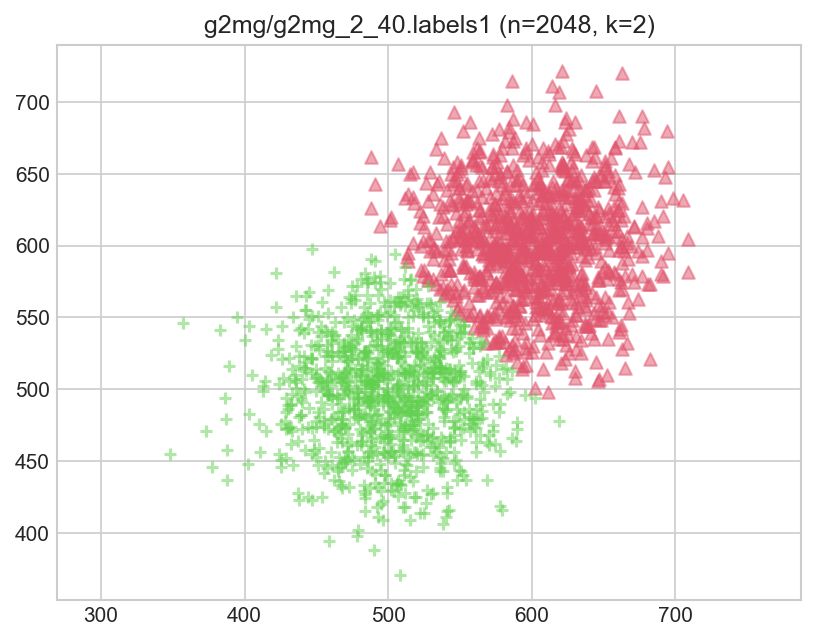

## g2mg/g2mg_2_50 (n=2048, d=2) 

    g2mg clustering benchmark
    Two 2-dimensional clusters, each with 1024 points that have
    i.i.d. Gaussian components with standard deviation 50*sqrt(2/2).
    
    
    Author: Marek Gagolewski (http://www.gagolewski.com)
    Copyleft 2020
    Licensed under the Creative Commons Attribution 4.0 International License
    
    `labels0` gives reference labels based on which probability distribution's
    mixture component was used to generate the corresponding points.
    `labels1` gives reference labels based on the distance to
    the true cluster centre (i.e., arg max_ p_i(x)).
    There is no noise class.
    

#### `labels0`

true_k= 2, noise=    0, true_g=0.000

label_counts=[1024, 1024]

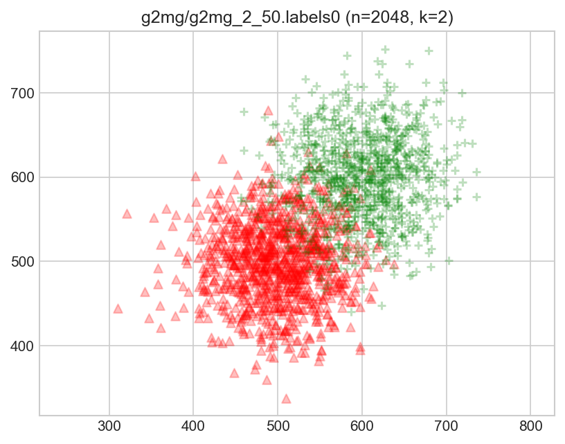

#### `labels1`

true_k= 2, noise=    0, true_g=0.006

label_counts=[1018, 1030]

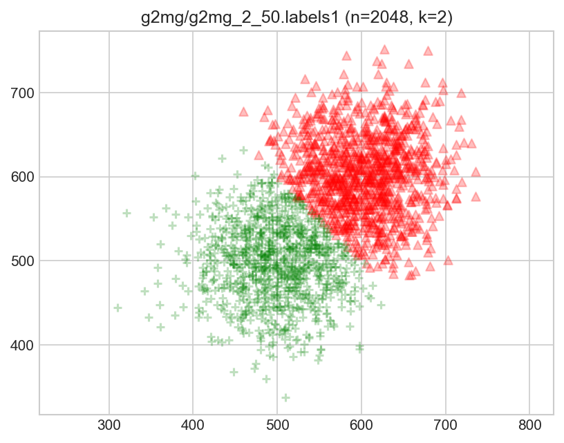

## g2mg/g2mg_2_60 (n=2048, d=2) 

    g2mg clustering benchmark
    Two 2-dimensional clusters, each with 1024 points that have
    i.i.d. Gaussian components with standard deviation 60*sqrt(2/2).
    
    
    Author: Marek Gagolewski (http://www.gagolewski.com)
    Copyleft 2020
    Licensed under the Creative Commons Attribution 4.0 International License
    
    `labels0` gives reference labels based on which probability distribution's
    mixture component was used to generate the corresponding points.
    `labels1` gives reference labels based on the distance to
    the true cluster centre (i.e., arg max_ p_i(x)).
    There is no noise class.
    

#### `labels0`

true_k= 2, noise=    0, true_g=0.000

label_counts=[1024, 1024]

#### `labels1`

true_k= 2, noise=    0, true_g=0.003

label_counts=[1027, 1021]

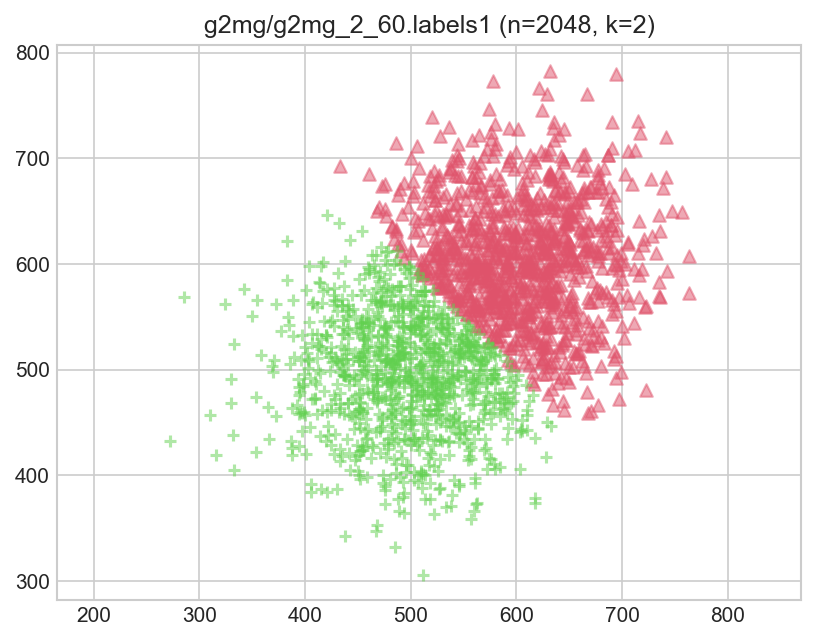

## g2mg/g2mg_2_70 (n=2048, d=2) 

    g2mg clustering benchmark
    Two 2-dimensional clusters, each with 1024 points that have
    i.i.d. Gaussian components with standard deviation 70*sqrt(2/2).
    
    
    Author: Marek Gagolewski (http://www.gagolewski.com)
    Copyleft 2020
    Licensed under the Creative Commons Attribution 4.0 International License
    
    `labels0` gives reference labels based on which probability distribution's
    mixture component was used to generate the corresponding points.
    `labels1` gives reference labels based on the distance to
    the true cluster centre (i.e., arg max_ p_i(x)).
    There is no noise class.
    

#### `labels0`

true_k= 2, noise=    0, true_g=0.000

label_counts=[1024, 1024]

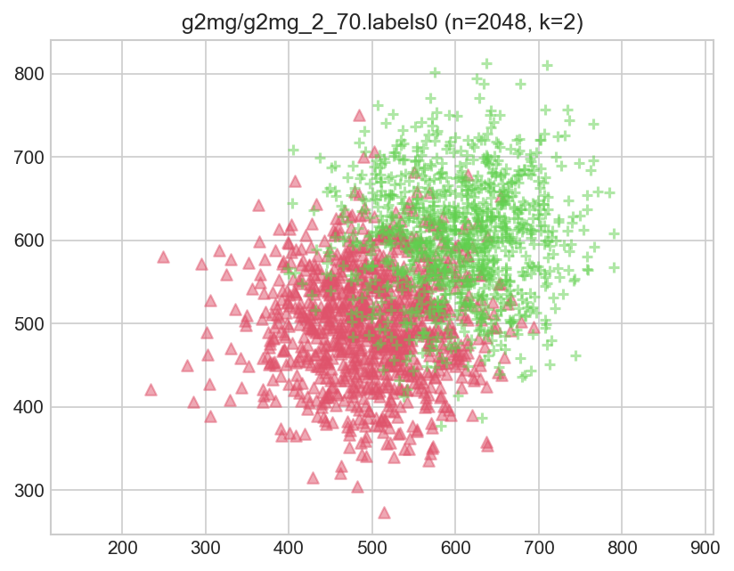

#### `labels1`

true_k= 2, noise=    0, true_g=0.008

label_counts=[1016, 1032]

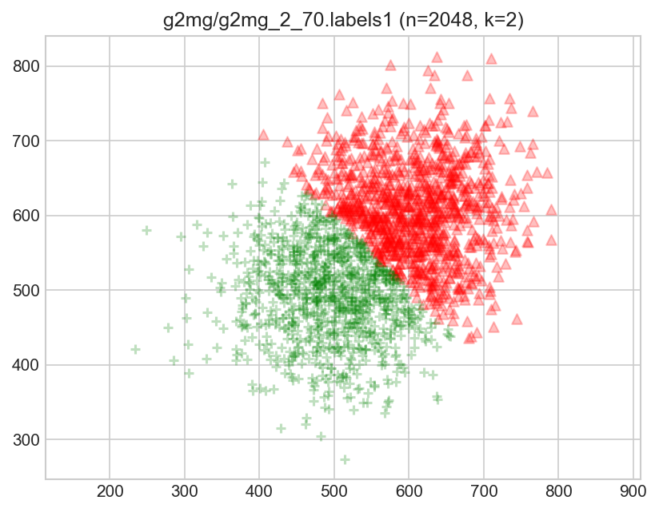

## g2mg/g2mg_2_80 (n=2048, d=2) 

    g2mg clustering benchmark
    Two 2-dimensional clusters, each with 1024 points that have
    i.i.d. Gaussian components with standard deviation 80*sqrt(2/2).
    
    
    Author: Marek Gagolewski (http://www.gagolewski.com)
    Copyleft 2020
    Licensed under the Creative Commons Attribution 4.0 International License
    
    `labels0` gives reference labels based on which probability distribution's
    mixture component was used to generate the corresponding points.
    `labels1` gives reference labels based on the distance to
    the true cluster centre (i.e., arg max_ p_i(x)).
    There is no noise class.
    

#### `labels0`

true_k= 2, noise=    0, true_g=0.000

label_counts=[1024, 1024]

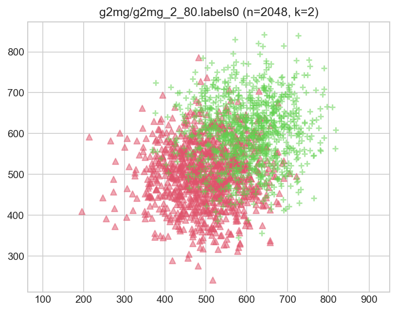

#### `labels1`

true_k= 2, noise=    0, true_g=0.009

label_counts=[1033, 1015]

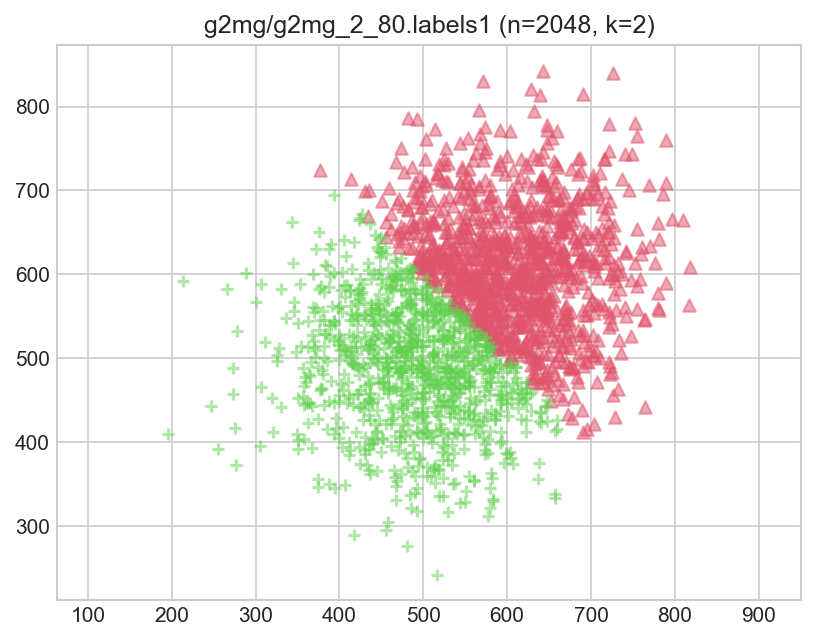

## g2mg/g2mg_2_90 (n=2048, d=2) 

    g2mg clustering benchmark
    Two 2-dimensional clusters, each with 1024 points that have
    i.i.d. Gaussian components with standard deviation 90*sqrt(2/2).
    
    
    Author: Marek Gagolewski (http://www.gagolewski.com)
    Copyleft 2020
    Licensed under the Creative Commons Attribution 4.0 International License
    
    `labels0` gives reference labels based on which probability distribution's
    mixture component was used to generate the corresponding points.
    `labels1` gives reference labels based on the distance to
    the true cluster centre (i.e., arg max_ p_i(x)).
    There is no noise class.
    

#### `labels0`

true_k= 2, noise=    0, true_g=0.000

label_counts=[1024, 1024]

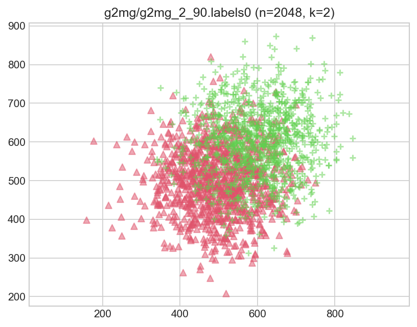

#### `labels1`

true_k= 2, noise=    0, true_g=0.021

label_counts=[1045, 1003]

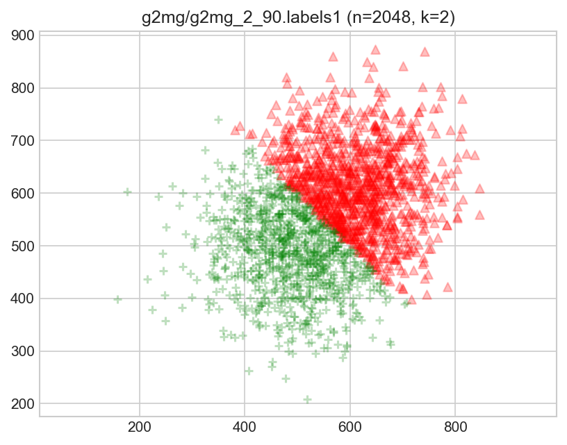

## g2mg/g2mg_4_10 (n=2048, d=4) 

    g2mg clustering benchmark
    Two 4-dimensional clusters, each with 1024 points that have
    i.i.d. Gaussian components with standard deviation 10*sqrt(4/2).
    
    
    Author: Marek Gagolewski (http://www.gagolewski.com)
    Copyleft 2020
    Licensed under the Creative Commons Attribution 4.0 International License
    
    `labels0` gives reference labels based on which probability distribution's
    mixture component was used to generate the corresponding points.
    `labels1` gives reference labels based on the distance to
    the true cluster centre (i.e., arg max_ p_i(x)).
    There is no noise class.
    

#### `labels0`

true_k= 2, noise=    0, true_g=0.000

label_counts=[1024, 1024]

> **(preview generation suppressed)**

#### `labels1`

true_k= 2, noise=    0, true_g=0.000

label_counts=[1024, 1024]

> **(preview generation suppressed)**

## g2mg/g2mg_4_20 (n=2048, d=4) 

    g2mg clustering benchmark
    Two 4-dimensional clusters, each with 1024 points that have
    i.i.d. Gaussian components with standard deviation 20*sqrt(4/2).
    
    
    Author: Marek Gagolewski (http://www.gagolewski.com)
    Copyleft 2020
    Licensed under the Creative Commons Attribution 4.0 International License
    
    `labels0` gives reference labels based on which probability distribution's
    mixture component was used to generate the corresponding points.
    `labels1` gives reference labels based on the distance to
    the true cluster centre (i.e., arg max_ p_i(x)).
    There is no noise class.
    

#### `labels0`

true_k= 2, noise=    0, true_g=0.000

label_counts=[1024, 1024]

> **(preview generation suppressed)**

#### `labels1`

true_k= 2, noise=    0, true_g=0.000

label_counts=[1024, 1024]

> **(preview generation suppressed)**

## g2mg/g2mg_4_30 (n=2048, d=4) 

    g2mg clustering benchmark
    Two 4-dimensional clusters, each with 1024 points that have
    i.i.d. Gaussian components with standard deviation 30*sqrt(4/2).
    
    
    Author: Marek Gagolewski (http://www.gagolewski.com)
    Copyleft 2020
    Licensed under the Creative Commons Attribution 4.0 International License
    
    `labels0` gives reference labels based on which probability distribution's
    mixture component was used to generate the corresponding points.
    `labels1` gives reference labels based on the distance to
    the true cluster centre (i.e., arg max_ p_i(x)).
    There is no noise class.
    

#### `labels0`

true_k= 2, noise=    0, true_g=0.000

label_counts=[1024, 1024]

> **(preview generation suppressed)**

#### `labels1`

true_k= 2, noise=    0, true_g=0.002

label_counts=[1026, 1022]

> **(preview generation suppressed)**

## g2mg/g2mg_4_40 (n=2048, d=4) 

    g2mg clustering benchmark
    Two 4-dimensional clusters, each with 1024 points that have
    i.i.d. Gaussian components with standard deviation 40*sqrt(4/2).
    
    
    Author: Marek Gagolewski (http://www.gagolewski.com)
    Copyleft 2020
    Licensed under the Creative Commons Attribution 4.0 International License
    
    `labels0` gives reference labels based on which probability distribution's
    mixture component was used to generate the corresponding points.
    `labels1` gives reference labels based on the distance to
    the true cluster centre (i.e., arg max_ p_i(x)).
    There is no noise class.
    

#### `labels0`

true_k= 2, noise=    0, true_g=0.000

label_counts=[1024, 1024]

> **(preview generation suppressed)**

#### `labels1`

true_k= 2, noise=    0, true_g=0.004

label_counts=[1028, 1020]

> **(preview generation suppressed)**

## g2mg/g2mg_4_50 (n=2048, d=4) 

    g2mg clustering benchmark
    Two 4-dimensional clusters, each with 1024 points that have
    i.i.d. Gaussian components with standard deviation 50*sqrt(4/2).
    
    
    Author: Marek Gagolewski (http://www.gagolewski.com)
    Copyleft 2020
    Licensed under the Creative Commons Attribution 4.0 International License
    
    `labels0` gives reference labels based on which probability distribution's
    mixture component was used to generate the corresponding points.
    `labels1` gives reference labels based on the distance to
    the true cluster centre (i.e., arg max_ p_i(x)).
    There is no noise class.
    

#### `labels0`

true_k= 2, noise=    0, true_g=0.000

label_counts=[1024, 1024]

> **(preview generation suppressed)**

#### `labels1`

true_k= 2, noise=    0, true_g=0.004

label_counts=[1028, 1020]

> **(preview generation suppressed)**

## g2mg/g2mg_4_60 (n=2048, d=4) 

    g2mg clustering benchmark
    Two 4-dimensional clusters, each with 1024 points that have
    i.i.d. Gaussian components with standard deviation 60*sqrt(4/2).
    
    
    Author: Marek Gagolewski (http://www.gagolewski.com)
    Copyleft 2020
    Licensed under the Creative Commons Attribution 4.0 International License
    
    `labels0` gives reference labels based on which probability distribution's
    mixture component was used to generate the corresponding points.
    `labels1` gives reference labels based on the distance to
    the true cluster centre (i.e., arg max_ p_i(x)).
    There is no noise class.
    

#### `labels0`

true_k= 2, noise=    0, true_g=0.000

label_counts=[1024, 1024]

> **(preview generation suppressed)**

#### `labels1`

true_k= 2, noise=    0, true_g=0.005

label_counts=[1029, 1019]

> **(preview generation suppressed)**

## g2mg/g2mg_4_70 (n=2048, d=4) 

    g2mg clustering benchmark
    Two 4-dimensional clusters, each with 1024 points that have
    i.i.d. Gaussian components with standard deviation 70*sqrt(4/2).
    
    
    Author: Marek Gagolewski (http://www.gagolewski.com)
    Copyleft 2020
    Licensed under the Creative Commons Attribution 4.0 International License
    
    `labels0` gives reference labels based on which probability distribution's
    mixture component was used to generate the corresponding points.
    `labels1` gives reference labels based on the distance to
    the true cluster centre (i.e., arg max_ p_i(x)).
    There is no noise class.
    

#### `labels0`

true_k= 2, noise=    0, true_g=0.000

label_counts=[1024, 1024]

> **(preview generation suppressed)**

#### `labels1`

true_k= 2, noise=    0, true_g=0.018

label_counts=[1042, 1006]

> **(preview generation suppressed)**

## g2mg/g2mg_4_80 (n=2048, d=4) 

    g2mg clustering benchmark
    Two 4-dimensional clusters, each with 1024 points that have
    i.i.d. Gaussian components with standard deviation 80*sqrt(4/2).
    
    
    Author: Marek Gagolewski (http://www.gagolewski.com)
    Copyleft 2020
    Licensed under the Creative Commons Attribution 4.0 International License
    
    `labels0` gives reference labels based on which probability distribution's
    mixture component was used to generate the corresponding points.
    `labels1` gives reference labels based on the distance to
    the true cluster centre (i.e., arg max_ p_i(x)).
    There is no noise class.
    

#### `labels0`

true_k= 2, noise=    0, true_g=0.000

label_counts=[1024, 1024]

> **(preview generation suppressed)**

#### `labels1`

true_k= 2, noise=    0, true_g=0.013

label_counts=[1037, 1011]

> **(preview generation suppressed)**

## g2mg/g2mg_4_90 (n=2048, d=4) 

    g2mg clustering benchmark
    Two 4-dimensional clusters, each with 1024 points that have
    i.i.d. Gaussian components with standard deviation 90*sqrt(4/2).
    
    
    Author: Marek Gagolewski (http://www.gagolewski.com)
    Copyleft 2020
    Licensed under the Creative Commons Attribution 4.0 International License
    
    `labels0` gives reference labels based on which probability distribution's
    mixture component was used to generate the corresponding points.
    `labels1` gives reference labels based on the distance to
    the true cluster centre (i.e., arg max_ p_i(x)).
    There is no noise class.
    

#### `labels0`

true_k= 2, noise=    0, true_g=0.000

label_counts=[1024, 1024]

> **(preview generation suppressed)**

#### `labels1`

true_k= 2, noise=    0, true_g=0.014

label_counts=[1038, 1010]

> **(preview generation suppressed)**

## g2mg/g2mg_8_10 (n=2048, d=8) 

    g2mg clustering benchmark
    Two 8-dimensional clusters, each with 1024 points that have
    i.i.d. Gaussian components with standard deviation 10*sqrt(8/2).
    
    
    Author: Marek Gagolewski (http://www.gagolewski.com)
    Copyleft 2020
    Licensed under the Creative Commons Attribution 4.0 International License
    
    `labels0` gives reference labels based on which probability distribution's
    mixture component was used to generate the corresponding points.
    `labels1` gives reference labels based on the distance to
    the true cluster centre (i.e., arg max_ p_i(x)).
    There is no noise class.
    

#### `labels0`

true_k= 2, noise=    0, true_g=0.000

label_counts=[1024, 1024]

> **(preview generation suppressed)**

#### `labels1`

true_k= 2, noise=    0, true_g=0.000

label_counts=[1024, 1024]

> **(preview generation suppressed)**

## g2mg/g2mg_8_20 (n=2048, d=8) 

    g2mg clustering benchmark
    Two 8-dimensional clusters, each with 1024 points that have
    i.i.d. Gaussian components with standard deviation 20*sqrt(8/2).
    
    
    Author: Marek Gagolewski (http://www.gagolewski.com)
    Copyleft 2020
    Licensed under the Creative Commons Attribution 4.0 International License
    
    `labels0` gives reference labels based on which probability distribution's
    mixture component was used to generate the corresponding points.
    `labels1` gives reference labels based on the distance to
    the true cluster centre (i.e., arg max_ p_i(x)).
    There is no noise class.
    

#### `labels0`

true_k= 2, noise=    0, true_g=0.000

label_counts=[1024, 1024]

> **(preview generation suppressed)**

#### `labels1`

true_k= 2, noise=    0, true_g=0.000

label_counts=[1024, 1024]

> **(preview generation suppressed)**

## g2mg/g2mg_8_30 (n=2048, d=8) 

    g2mg clustering benchmark
    Two 8-dimensional clusters, each with 1024 points that have
    i.i.d. Gaussian components with standard deviation 30*sqrt(8/2).
    
    
    Author: Marek Gagolewski (http://www.gagolewski.com)
    Copyleft 2020
    Licensed under the Creative Commons Attribution 4.0 International License
    
    `labels0` gives reference labels based on which probability distribution's
    mixture component was used to generate the corresponding points.
    `labels1` gives reference labels based on the distance to
    the true cluster centre (i.e., arg max_ p_i(x)).
    There is no noise class.
    

#### `labels0`

true_k= 2, noise=    0, true_g=0.000

label_counts=[1024, 1024]

> **(preview generation suppressed)**

#### `labels1`

true_k= 2, noise=    0, true_g=0.004

label_counts=[1020, 1028]

> **(preview generation suppressed)**

## g2mg/g2mg_8_40 (n=2048, d=8) 

    g2mg clustering benchmark
    Two 8-dimensional clusters, each with 1024 points that have
    i.i.d. Gaussian components with standard deviation 40*sqrt(8/2).
    
    
    Author: Marek Gagolewski (http://www.gagolewski.com)
    Copyleft 2020
    Licensed under the Creative Commons Attribution 4.0 International License
    
    `labels0` gives reference labels based on which probability distribution's
    mixture component was used to generate the corresponding points.
    `labels1` gives reference labels based on the distance to
    the true cluster centre (i.e., arg max_ p_i(x)).
    There is no noise class.
    

#### `labels0`

true_k= 2, noise=    0, true_g=0.000

label_counts=[1024, 1024]

> **(preview generation suppressed)**

#### `labels1`

true_k= 2, noise=    0, true_g=0.009

label_counts=[1015, 1033]

> **(preview generation suppressed)**

## g2mg/g2mg_8_50 (n=2048, d=8) 

    g2mg clustering benchmark
    Two 8-dimensional clusters, each with 1024 points that have
    i.i.d. Gaussian components with standard deviation 50*sqrt(8/2).
    
    
    Author: Marek Gagolewski (http://www.gagolewski.com)
    Copyleft 2020
    Licensed under the Creative Commons Attribution 4.0 International License
    
    `labels0` gives reference labels based on which probability distribution's
    mixture component was used to generate the corresponding points.
    `labels1` gives reference labels based on the distance to
    the true cluster centre (i.e., arg max_ p_i(x)).
    There is no noise class.
    

#### `labels0`

true_k= 2, noise=    0, true_g=0.000

label_counts=[1024, 1024]

> **(preview generation suppressed)**

#### `labels1`

true_k= 2, noise=    0, true_g=0.015

label_counts=[1039, 1009]

> **(preview generation suppressed)**

## g2mg/g2mg_8_60 (n=2048, d=8) 

    g2mg clustering benchmark
    Two 8-dimensional clusters, each with 1024 points that have
    i.i.d. Gaussian components with standard deviation 60*sqrt(8/2).
    
    
    Author: Marek Gagolewski (http://www.gagolewski.com)
    Copyleft 2020
    Licensed under the Creative Commons Attribution 4.0 International License
    
    `labels0` gives reference labels based on which probability distribution's
    mixture component was used to generate the corresponding points.
    `labels1` gives reference labels based on the distance to
    the true cluster centre (i.e., arg max_ p_i(x)).
    There is no noise class.
    

#### `labels0`

true_k= 2, noise=    0, true_g=0.000

label_counts=[1024, 1024]

> **(preview generation suppressed)**

#### `labels1`

true_k= 2, noise=    0, true_g=0.011

label_counts=[1035, 1013]

> **(preview generation suppressed)**

## g2mg/g2mg_8_70 (n=2048, d=8) 

    g2mg clustering benchmark
    Two 8-dimensional clusters, each with 1024 points that have
    i.i.d. Gaussian components with standard deviation 70*sqrt(8/2).
    
    
    Author: Marek Gagolewski (http://www.gagolewski.com)
    Copyleft 2020
    Licensed under the Creative Commons Attribution 4.0 International License
    
    `labels0` gives reference labels based on which probability distribution's
    mixture component was used to generate the corresponding points.
    `labels1` gives reference labels based on the distance to
    the true cluster centre (i.e., arg max_ p_i(x)).
    There is no noise class.
    

#### `labels0`

true_k= 2, noise=    0, true_g=0.000

label_counts=[1024, 1024]

> **(preview generation suppressed)**

#### `labels1`

true_k= 2, noise=    0, true_g=0.023

label_counts=[1048, 1000]

> **(preview generation suppressed)**

## g2mg/g2mg_8_80 (n=2048, d=8) 

    g2mg clustering benchmark
    Two 8-dimensional clusters, each with 1024 points that have
    i.i.d. Gaussian components with standard deviation 80*sqrt(8/2).
    
    
    Author: Marek Gagolewski (http://www.gagolewski.com)
    Copyleft 2020
    Licensed under the Creative Commons Attribution 4.0 International License
    
    `labels0` gives reference labels based on which probability distribution's
    mixture component was used to generate the corresponding points.
    `labels1` gives reference labels based on the distance to
    the true cluster centre (i.e., arg max_ p_i(x)).
    There is no noise class.
    

#### `labels0`

true_k= 2, noise=    0, true_g=0.000

label_counts=[1024, 1024]

> **(preview generation suppressed)**

#### `labels1`

true_k= 2, noise=    0, true_g=0.034

label_counts=[1059, 989]

> **(preview generation suppressed)**

## g2mg/g2mg_8_90 (n=2048, d=8) 

    g2mg clustering benchmark
    Two 8-dimensional clusters, each with 1024 points that have
    i.i.d. Gaussian components with standard deviation 90*sqrt(8/2).
    
    
    Author: Marek Gagolewski (http://www.gagolewski.com)
    Copyleft 2020
    Licensed under the Creative Commons Attribution 4.0 International License
    
    `labels0` gives reference labels based on which probability distribution's
    mixture component was used to generate the corresponding points.
    `labels1` gives reference labels based on the distance to
    the true cluster centre (i.e., arg max_ p_i(x)).
    There is no noise class.
    

#### `labels0`

true_k= 2, noise=    0, true_g=0.000

label_counts=[1024, 1024]

> **(preview generation suppressed)**

#### `labels1`

true_k= 2, noise=    0, true_g=0.027

label_counts=[1052, 996]

> **(preview generation suppressed)**

## g2mg/g2mg_16_10 (n=2048, d=16) 

    g2mg clustering benchmark
    Two 16-dimensional clusters, each with 1024 points that have
    i.i.d. Gaussian components with standard deviation 10*sqrt(16/2).
    
    
    Author: Marek Gagolewski (http://www.gagolewski.com)
    Copyleft 2020
    Licensed under the Creative Commons Attribution 4.0 International License
    
    `labels0` gives reference labels based on which probability distribution's
    mixture component was used to generate the corresponding points.
    `labels1` gives reference labels based on the distance to
    the true cluster centre (i.e., arg max_ p_i(x)).
    There is no noise class.
    

#### `labels0`

true_k= 2, noise=    0, true_g=0.000

label_counts=[1024, 1024]

> **(preview generation suppressed)**

#### `labels1`

true_k= 2, noise=    0, true_g=0.000

label_counts=[1024, 1024]

> **(preview generation suppressed)**

## g2mg/g2mg_16_20 (n=2048, d=16) 

    g2mg clustering benchmark
    Two 16-dimensional clusters, each with 1024 points that have
    i.i.d. Gaussian components with standard deviation 20*sqrt(16/2).
    
    
    Author: Marek Gagolewski (http://www.gagolewski.com)
    Copyleft 2020
    Licensed under the Creative Commons Attribution 4.0 International License
    
    `labels0` gives reference labels based on which probability distribution's
    mixture component was used to generate the corresponding points.
    `labels1` gives reference labels based on the distance to
    the true cluster centre (i.e., arg max_ p_i(x)).
    There is no noise class.
    

#### `labels0`

true_k= 2, noise=    0, true_g=0.000

label_counts=[1024, 1024]

> **(preview generation suppressed)**

#### `labels1`

true_k= 2, noise=    0, true_g=0.000

label_counts=[1024, 1024]

> **(preview generation suppressed)**

## g2mg/g2mg_16_30 (n=2048, d=16) 

    g2mg clustering benchmark
    Two 16-dimensional clusters, each with 1024 points that have
    i.i.d. Gaussian components with standard deviation 30*sqrt(16/2).
    
    
    Author: Marek Gagolewski (http://www.gagolewski.com)
    Copyleft 2020
    Licensed under the Creative Commons Attribution 4.0 International License
    
    `labels0` gives reference labels based on which probability distribution's
    mixture component was used to generate the corresponding points.
    `labels1` gives reference labels based on the distance to
    the true cluster centre (i.e., arg max_ p_i(x)).
    There is no noise class.
    

#### `labels0`

true_k= 2, noise=    0, true_g=0.000

label_counts=[1024, 1024]

> **(preview generation suppressed)**

#### `labels1`

true_k= 2, noise=    0, true_g=0.002

label_counts=[1022, 1026]

> **(preview generation suppressed)**

## g2mg/g2mg_16_40 (n=2048, d=16) 

    g2mg clustering benchmark
    Two 16-dimensional clusters, each with 1024 points that have
    i.i.d. Gaussian components with standard deviation 40*sqrt(16/2).
    
    
    Author: Marek Gagolewski (http://www.gagolewski.com)
    Copyleft 2020
    Licensed under the Creative Commons Attribution 4.0 International License
    
    `labels0` gives reference labels based on which probability distribution's
    mixture component was used to generate the corresponding points.
    `labels1` gives reference labels based on the distance to
    the true cluster centre (i.e., arg max_ p_i(x)).
    There is no noise class.
    

#### `labels0`

true_k= 2, noise=    0, true_g=0.000

label_counts=[1024, 1024]

> **(preview generation suppressed)**

#### `labels1`

true_k= 2, noise=    0, true_g=0.000

label_counts=[1024, 1024]

> **(preview generation suppressed)**

## g2mg/g2mg_16_50 (n=2048, d=16) 

    g2mg clustering benchmark
    Two 16-dimensional clusters, each with 1024 points that have
    i.i.d. Gaussian components with standard deviation 50*sqrt(16/2).
    
    
    Author: Marek Gagolewski (http://www.gagolewski.com)
    Copyleft 2020
    Licensed under the Creative Commons Attribution 4.0 International License
    
    `labels0` gives reference labels based on which probability distribution's
    mixture component was used to generate the corresponding points.
    `labels1` gives reference labels based on the distance to
    the true cluster centre (i.e., arg max_ p_i(x)).
    There is no noise class.
    

#### `labels0`

true_k= 2, noise=    0, true_g=0.000

label_counts=[1024, 1024]

> **(preview generation suppressed)**

#### `labels1`

true_k= 2, noise=    0, true_g=0.004

label_counts=[1028, 1020]

> **(preview generation suppressed)**

## g2mg/g2mg_16_60 (n=2048, d=16) 

    g2mg clustering benchmark
    Two 16-dimensional clusters, each with 1024 points that have
    i.i.d. Gaussian components with standard deviation 60*sqrt(16/2).
    
    
    Author: Marek Gagolewski (http://www.gagolewski.com)
    Copyleft 2020
    Licensed under the Creative Commons Attribution 4.0 International License
    
    `labels0` gives reference labels based on which probability distribution's
    mixture component was used to generate the corresponding points.
    `labels1` gives reference labels based on the distance to
    the true cluster centre (i.e., arg max_ p_i(x)).
    There is no noise class.
    

#### `labels0`

true_k= 2, noise=    0, true_g=0.000

label_counts=[1024, 1024]

> **(preview generation suppressed)**

#### `labels1`

true_k= 2, noise=    0, true_g=0.014

label_counts=[1038, 1010]

> **(preview generation suppressed)**

## g2mg/g2mg_16_70 (n=2048, d=16) 

    g2mg clustering benchmark
    Two 16-dimensional clusters, each with 1024 points that have
    i.i.d. Gaussian components with standard deviation 70*sqrt(16/2).
    
    
    Author: Marek Gagolewski (http://www.gagolewski.com)
    Copyleft 2020
    Licensed under the Creative Commons Attribution 4.0 International License
    
    `labels0` gives reference labels based on which probability distribution's
    mixture component was used to generate the corresponding points.
    `labels1` gives reference labels based on the distance to
    the true cluster centre (i.e., arg max_ p_i(x)).
    There is no noise class.
    

#### `labels0`

true_k= 2, noise=    0, true_g=0.000

label_counts=[1024, 1024]

> **(preview generation suppressed)**

#### `labels1`

true_k= 2, noise=    0, true_g=0.011

label_counts=[1035, 1013]

> **(preview generation suppressed)**

## g2mg/g2mg_16_80 (n=2048, d=16) 

    g2mg clustering benchmark
    Two 16-dimensional clusters, each with 1024 points that have
    i.i.d. Gaussian components with standard deviation 80*sqrt(16/2).
    
    
    Author: Marek Gagolewski (http://www.gagolewski.com)
    Copyleft 2020
    Licensed under the Creative Commons Attribution 4.0 International License
    
    `labels0` gives reference labels based on which probability distribution's
    mixture component was used to generate the corresponding points.
    `labels1` gives reference labels based on the distance to
    the true cluster centre (i.e., arg max_ p_i(x)).
    There is no noise class.
    

#### `labels0`

true_k= 2, noise=    0, true_g=0.000

label_counts=[1024, 1024]

> **(preview generation suppressed)**

#### `labels1`

true_k= 2, noise=    0, true_g=0.019

label_counts=[1043, 1005]

> **(preview generation suppressed)**

## g2mg/g2mg_16_90 (n=2048, d=16) 

    g2mg clustering benchmark
    Two 16-dimensional clusters, each with 1024 points that have
    i.i.d. Gaussian components with standard deviation 90*sqrt(16/2).
    
    
    Author: Marek Gagolewski (http://www.gagolewski.com)
    Copyleft 2020
    Licensed under the Creative Commons Attribution 4.0 International License
    
    `labels0` gives reference labels based on which probability distribution's
    mixture component was used to generate the corresponding points.
    `labels1` gives reference labels based on the distance to
    the true cluster centre (i.e., arg max_ p_i(x)).
    There is no noise class.
    

#### `labels0`

true_k= 2, noise=    0, true_g=0.000

label_counts=[1024, 1024]

> **(preview generation suppressed)**

#### `labels1`

true_k= 2, noise=    0, true_g=0.020

label_counts=[1044, 1004]

> **(preview generation suppressed)**

## g2mg/g2mg_32_10 (n=2048, d=32) 

    g2mg clustering benchmark
    Two 32-dimensional clusters, each with 1024 points that have
    i.i.d. Gaussian components with standard deviation 10*sqrt(32/2).
    
    
    Author: Marek Gagolewski (http://www.gagolewski.com)
    Copyleft 2020
    Licensed under the Creative Commons Attribution 4.0 International License
    
    `labels0` gives reference labels based on which probability distribution's
    mixture component was used to generate the corresponding points.
    `labels1` gives reference labels based on the distance to
    the true cluster centre (i.e., arg max_ p_i(x)).
    There is no noise class.
    

#### `labels0`

true_k= 2, noise=    0, true_g=0.000

label_counts=[1024, 1024]

> **(preview generation suppressed)**

#### `labels1`

true_k= 2, noise=    0, true_g=0.000

label_counts=[1024, 1024]

> **(preview generation suppressed)**

## g2mg/g2mg_32_20 (n=2048, d=32) 

    g2mg clustering benchmark
    Two 32-dimensional clusters, each with 1024 points that have
    i.i.d. Gaussian components with standard deviation 20*sqrt(32/2).
    
    
    Author: Marek Gagolewski (http://www.gagolewski.com)
    Copyleft 2020
    Licensed under the Creative Commons Attribution 4.0 International License
    
    `labels0` gives reference labels based on which probability distribution's
    mixture component was used to generate the corresponding points.
    `labels1` gives reference labels based on the distance to
    the true cluster centre (i.e., arg max_ p_i(x)).
    There is no noise class.
    

#### `labels0`

true_k= 2, noise=    0, true_g=0.000

label_counts=[1024, 1024]

> **(preview generation suppressed)**

#### `labels1`

true_k= 2, noise=    0, true_g=0.000

label_counts=[1024, 1024]

> **(preview generation suppressed)**

## g2mg/g2mg_32_30 (n=2048, d=32) 

    g2mg clustering benchmark
    Two 32-dimensional clusters, each with 1024 points that have
    i.i.d. Gaussian components with standard deviation 30*sqrt(32/2).
    
    
    Author: Marek Gagolewski (http://www.gagolewski.com)
    Copyleft 2020
    Licensed under the Creative Commons Attribution 4.0 International License
    
    `labels0` gives reference labels based on which probability distribution's
    mixture component was used to generate the corresponding points.
    `labels1` gives reference labels based on the distance to
    the true cluster centre (i.e., arg max_ p_i(x)).
    There is no noise class.
    

#### `labels0`

true_k= 2, noise=    0, true_g=0.000

label_counts=[1024, 1024]

> **(preview generation suppressed)**

#### `labels1`

true_k= 2, noise=    0, true_g=0.002

label_counts=[1022, 1026]

> **(preview generation suppressed)**

## g2mg/g2mg_32_40 (n=2048, d=32) 

    g2mg clustering benchmark
    Two 32-dimensional clusters, each with 1024 points that have
    i.i.d. Gaussian components with standard deviation 40*sqrt(32/2).
    
    
    Author: Marek Gagolewski (http://www.gagolewski.com)
    Copyleft 2020
    Licensed under the Creative Commons Attribution 4.0 International License
    
    `labels0` gives reference labels based on which probability distribution's
    mixture component was used to generate the corresponding points.
    `labels1` gives reference labels based on the distance to
    the true cluster centre (i.e., arg max_ p_i(x)).
    There is no noise class.
    

#### `labels0`

true_k= 2, noise=    0, true_g=0.000

label_counts=[1024, 1024]

> **(preview generation suppressed)**

#### `labels1`

true_k= 2, noise=    0, true_g=0.011

label_counts=[1035, 1013]

> **(preview generation suppressed)**

## g2mg/g2mg_32_50 (n=2048, d=32) 

    g2mg clustering benchmark
    Two 32-dimensional clusters, each with 1024 points that have
    i.i.d. Gaussian components with standard deviation 50*sqrt(32/2).
    
    
    Author: Marek Gagolewski (http://www.gagolewski.com)
    Copyleft 2020
    Licensed under the Creative Commons Attribution 4.0 International License
    
    `labels0` gives reference labels based on which probability distribution's
    mixture component was used to generate the corresponding points.
    `labels1` gives reference labels based on the distance to
    the true cluster centre (i.e., arg max_ p_i(x)).
    There is no noise class.
    

#### `labels0`

true_k= 2, noise=    0, true_g=0.000

label_counts=[1024, 1024]

> **(preview generation suppressed)**

#### `labels1`

true_k= 2, noise=    0, true_g=0.003

label_counts=[1027, 1021]

> **(preview generation suppressed)**

## g2mg/g2mg_32_60 (n=2048, d=32) 

    g2mg clustering benchmark
    Two 32-dimensional clusters, each with 1024 points that have
    i.i.d. Gaussian components with standard deviation 60*sqrt(32/2).
    
    
    Author: Marek Gagolewski (http://www.gagolewski.com)
    Copyleft 2020
    Licensed under the Creative Commons Attribution 4.0 International License
    
    `labels0` gives reference labels based on which probability distribution's
    mixture component was used to generate the corresponding points.
    `labels1` gives reference labels based on the distance to
    the true cluster centre (i.e., arg max_ p_i(x)).
    There is no noise class.
    

#### `labels0`

true_k= 2, noise=    0, true_g=0.000

label_counts=[1024, 1024]

> **(preview generation suppressed)**

#### `labels1`

true_k= 2, noise=    0, true_g=0.005

label_counts=[1029, 1019]

> **(preview generation suppressed)**

## g2mg/g2mg_32_70 (n=2048, d=32) 

    g2mg clustering benchmark
    Two 32-dimensional clusters, each with 1024 points that have
    i.i.d. Gaussian components with standard deviation 70*sqrt(32/2).
    
    
    Author: Marek Gagolewski (http://www.gagolewski.com)
    Copyleft 2020
    Licensed under the Creative Commons Attribution 4.0 International License
    
    `labels0` gives reference labels based on which probability distribution's
    mixture component was used to generate the corresponding points.
    `labels1` gives reference labels based on the distance to
    the true cluster centre (i.e., arg max_ p_i(x)).
    There is no noise class.
    

#### `labels0`

true_k= 2, noise=    0, true_g=0.000

label_counts=[1024, 1024]

> **(preview generation suppressed)**

#### `labels1`

true_k= 2, noise=    0, true_g=0.016

label_counts=[1040, 1008]

> **(preview generation suppressed)**

## g2mg/g2mg_32_80 (n=2048, d=32) 

    g2mg clustering benchmark
    Two 32-dimensional clusters, each with 1024 points that have
    i.i.d. Gaussian components with standard deviation 80*sqrt(32/2).
    
    
    Author: Marek Gagolewski (http://www.gagolewski.com)
    Copyleft 2020
    Licensed under the Creative Commons Attribution 4.0 International License
    
    `labels0` gives reference labels based on which probability distribution's
    mixture component was used to generate the corresponding points.
    `labels1` gives reference labels based on the distance to
    the true cluster centre (i.e., arg max_ p_i(x)).
    There is no noise class.
    

#### `labels0`

true_k= 2, noise=    0, true_g=0.000

label_counts=[1024, 1024]

> **(preview generation suppressed)**

#### `labels1`

true_k= 2, noise=    0, true_g=0.017

label_counts=[1041, 1007]

> **(preview generation suppressed)**

## g2mg/g2mg_32_90 (n=2048, d=32) 

    g2mg clustering benchmark
    Two 32-dimensional clusters, each with 1024 points that have
    i.i.d. Gaussian components with standard deviation 90*sqrt(32/2).
    
    
    Author: Marek Gagolewski (http://www.gagolewski.com)
    Copyleft 2020
    Licensed under the Creative Commons Attribution 4.0 International License
    
    `labels0` gives reference labels based on which probability distribution's
    mixture component was used to generate the corresponding points.
    `labels1` gives reference labels based on the distance to
    the true cluster centre (i.e., arg max_ p_i(x)).
    There is no noise class.
    

#### `labels0`

true_k= 2, noise=    0, true_g=0.000

label_counts=[1024, 1024]

> **(preview generation suppressed)**

#### `labels1`

true_k= 2, noise=    0, true_g=0.018

label_counts=[1042, 1006]

> **(preview generation suppressed)**

## g2mg/g2mg_64_10 (n=2048, d=64) 

    g2mg clustering benchmark
    Two 64-dimensional clusters, each with 1024 points that have
    i.i.d. Gaussian components with standard deviation 10*sqrt(64/2).
    
    
    Author: Marek Gagolewski (http://www.gagolewski.com)
    Copyleft 2020
    Licensed under the Creative Commons Attribution 4.0 International License
    
    `labels0` gives reference labels based on which probability distribution's
    mixture component was used to generate the corresponding points.
    `labels1` gives reference labels based on the distance to
    the true cluster centre (i.e., arg max_ p_i(x)).
    There is no noise class.
    

#### `labels0`

true_k= 2, noise=    0, true_g=0.000

label_counts=[1024, 1024]

> **(preview generation suppressed)**

#### `labels1`

true_k= 2, noise=    0, true_g=0.000

label_counts=[1024, 1024]

> **(preview generation suppressed)**

## g2mg/g2mg_64_20 (n=2048, d=64) 

    g2mg clustering benchmark
    Two 64-dimensional clusters, each with 1024 points that have
    i.i.d. Gaussian components with standard deviation 20*sqrt(64/2).
    
    
    Author: Marek Gagolewski (http://www.gagolewski.com)
    Copyleft 2020
    Licensed under the Creative Commons Attribution 4.0 International License
    
    `labels0` gives reference labels based on which probability distribution's
    mixture component was used to generate the corresponding points.
    `labels1` gives reference labels based on the distance to
    the true cluster centre (i.e., arg max_ p_i(x)).
    There is no noise class.
    

#### `labels0`

true_k= 2, noise=    0, true_g=0.000

label_counts=[1024, 1024]

> **(preview generation suppressed)**

#### `labels1`

true_k= 2, noise=    0, true_g=0.001

label_counts=[1025, 1023]

> **(preview generation suppressed)**

## g2mg/g2mg_64_30 (n=2048, d=64) 

    g2mg clustering benchmark
    Two 64-dimensional clusters, each with 1024 points that have
    i.i.d. Gaussian components with standard deviation 30*sqrt(64/2).
    
    
    Author: Marek Gagolewski (http://www.gagolewski.com)
    Copyleft 2020
    Licensed under the Creative Commons Attribution 4.0 International License
    
    `labels0` gives reference labels based on which probability distribution's
    mixture component was used to generate the corresponding points.
    `labels1` gives reference labels based on the distance to
    the true cluster centre (i.e., arg max_ p_i(x)).
    There is no noise class.
    

#### `labels0`

true_k= 2, noise=    0, true_g=0.000

label_counts=[1024, 1024]

> **(preview generation suppressed)**

#### `labels1`

true_k= 2, noise=    0, true_g=0.006

label_counts=[1030, 1018]

> **(preview generation suppressed)**

## g2mg/g2mg_64_40 (n=2048, d=64) 

    g2mg clustering benchmark
    Two 64-dimensional clusters, each with 1024 points that have
    i.i.d. Gaussian components with standard deviation 40*sqrt(64/2).
    
    
    Author: Marek Gagolewski (http://www.gagolewski.com)
    Copyleft 2020
    Licensed under the Creative Commons Attribution 4.0 International License
    
    `labels0` gives reference labels based on which probability distribution's
    mixture component was used to generate the corresponding points.
    `labels1` gives reference labels based on the distance to
    the true cluster centre (i.e., arg max_ p_i(x)).
    There is no noise class.
    

#### `labels0`

true_k= 2, noise=    0, true_g=0.000

label_counts=[1024, 1024]

> **(preview generation suppressed)**

#### `labels1`

true_k= 2, noise=    0, true_g=0.009

label_counts=[1015, 1033]

> **(preview generation suppressed)**

## g2mg/g2mg_64_50 (n=2048, d=64) 

    g2mg clustering benchmark
    Two 64-dimensional clusters, each with 1024 points that have
    i.i.d. Gaussian components with standard deviation 50*sqrt(64/2).
    
    
    Author: Marek Gagolewski (http://www.gagolewski.com)
    Copyleft 2020
    Licensed under the Creative Commons Attribution 4.0 International License
    
    `labels0` gives reference labels based on which probability distribution's
    mixture component was used to generate the corresponding points.
    `labels1` gives reference labels based on the distance to
    the true cluster centre (i.e., arg max_ p_i(x)).
    There is no noise class.
    

#### `labels0`

true_k= 2, noise=    0, true_g=0.000

label_counts=[1024, 1024]

> **(preview generation suppressed)**

#### `labels1`

true_k= 2, noise=    0, true_g=0.009

label_counts=[1015, 1033]

> **(preview generation suppressed)**

## g2mg/g2mg_64_60 (n=2048, d=64) 

    g2mg clustering benchmark
    Two 64-dimensional clusters, each with 1024 points that have
    i.i.d. Gaussian components with standard deviation 60*sqrt(64/2).
    
    
    Author: Marek Gagolewski (http://www.gagolewski.com)
    Copyleft 2020
    Licensed under the Creative Commons Attribution 4.0 International License
    
    `labels0` gives reference labels based on which probability distribution's
    mixture component was used to generate the corresponding points.
    `labels1` gives reference labels based on the distance to
    the true cluster centre (i.e., arg max_ p_i(x)).
    There is no noise class.
    

#### `labels0`

true_k= 2, noise=    0, true_g=0.000

label_counts=[1024, 1024]

> **(preview generation suppressed)**

#### `labels1`

true_k= 2, noise=    0, true_g=0.006

label_counts=[1018, 1030]

> **(preview generation suppressed)**

## g2mg/g2mg_64_70 (n=2048, d=64) 

    g2mg clustering benchmark
    Two 64-dimensional clusters, each with 1024 points that have
    i.i.d. Gaussian components with standard deviation 70*sqrt(64/2).
    
    
    Author: Marek Gagolewski (http://www.gagolewski.com)
    Copyleft 2020
    Licensed under the Creative Commons Attribution 4.0 International License
    
    `labels0` gives reference labels based on which probability distribution's
    mixture component was used to generate the corresponding points.
    `labels1` gives reference labels based on the distance to
    the true cluster centre (i.e., arg max_ p_i(x)).
    There is no noise class.
    

#### `labels0`

true_k= 2, noise=    0, true_g=0.000

label_counts=[1024, 1024]

> **(preview generation suppressed)**

#### `labels1`

true_k= 2, noise=    0, true_g=0.000

label_counts=[1024, 1024]

> **(preview generation suppressed)**

## g2mg/g2mg_64_80 (n=2048, d=64) 

    g2mg clustering benchmark
    Two 64-dimensional clusters, each with 1024 points that have
    i.i.d. Gaussian components with standard deviation 80*sqrt(64/2).
    
    
    Author: Marek Gagolewski (http://www.gagolewski.com)
    Copyleft 2020
    Licensed under the Creative Commons Attribution 4.0 International License
    
    `labels0` gives reference labels based on which probability distribution's
    mixture component was used to generate the corresponding points.
    `labels1` gives reference labels based on the distance to
    the true cluster centre (i.e., arg max_ p_i(x)).
    There is no noise class.
    

#### `labels0`

true_k= 2, noise=    0, true_g=0.000

label_counts=[1024, 1024]

> **(preview generation suppressed)**

#### `labels1`

true_k= 2, noise=    0, true_g=0.007

label_counts=[1017, 1031]

> **(preview generation suppressed)**

## g2mg/g2mg_64_90 (n=2048, d=64) 

    g2mg clustering benchmark
    Two 64-dimensional clusters, each with 1024 points that have
    i.i.d. Gaussian components with standard deviation 90*sqrt(64/2).
    
    
    Author: Marek Gagolewski (http://www.gagolewski.com)
    Copyleft 2020
    Licensed under the Creative Commons Attribution 4.0 International License
    
    `labels0` gives reference labels based on which probability distribution's
    mixture component was used to generate the corresponding points.
    `labels1` gives reference labels based on the distance to
    the true cluster centre (i.e., arg max_ p_i(x)).
    There is no noise class.
    

#### `labels0`

true_k= 2, noise=    0, true_g=0.000

label_counts=[1024, 1024]

> **(preview generation suppressed)**

#### `labels1`

true_k= 2, noise=    0, true_g=0.008

label_counts=[1016, 1032]

> **(preview generation suppressed)**

## g2mg/g2mg_128_10 (n=2048, d=128) 

    g2mg clustering benchmark
    Two 128-dimensional clusters, each with 1024 points that have
    i.i.d. Gaussian components with standard deviation 10*sqrt(128/2).
    
    
    Author: Marek Gagolewski (http://www.gagolewski.com)
    Copyleft 2020
    Licensed under the Creative Commons Attribution 4.0 International License
    
    `labels0` gives reference labels based on which probability distribution's
    mixture component was used to generate the corresponding points.
    `labels1` gives reference labels based on the distance to
    the true cluster centre (i.e., arg max_ p_i(x)).
    There is no noise class.
    

#### `labels0`

true_k= 2, noise=    0, true_g=0.000

label_counts=[1024, 1024]

> **(preview generation suppressed)**

#### `labels1`

true_k= 2, noise=    0, true_g=0.000

label_counts=[1024, 1024]

> **(preview generation suppressed)**

## g2mg/g2mg_128_20 (n=2048, d=128) 

    g2mg clustering benchmark
    Two 128-dimensional clusters, each with 1024 points that have
    i.i.d. Gaussian components with standard deviation 20*sqrt(128/2).
    
    
    Author: Marek Gagolewski (http://www.gagolewski.com)
    Copyleft 2020
    Licensed under the Creative Commons Attribution 4.0 International License
    
    `labels0` gives reference labels based on which probability distribution's
    mixture component was used to generate the corresponding points.
    `labels1` gives reference labels based on the distance to
    the true cluster centre (i.e., arg max_ p_i(x)).
    There is no noise class.
    

#### `labels0`

true_k= 2, noise=    0, true_g=0.000

label_counts=[1024, 1024]

> **(preview generation suppressed)**

#### `labels1`

true_k= 2, noise=    0, true_g=0.000

label_counts=[1024, 1024]

> **(preview generation suppressed)**

## g2mg/g2mg_128_30 (n=2048, d=128) 

    g2mg clustering benchmark
    Two 128-dimensional clusters, each with 1024 points that have
    i.i.d. Gaussian components with standard deviation 30*sqrt(128/2).
    
    
    Author: Marek Gagolewski (http://www.gagolewski.com)
    Copyleft 2020
    Licensed under the Creative Commons Attribution 4.0 International License
    
    `labels0` gives reference labels based on which probability distribution's
    mixture component was used to generate the corresponding points.
    `labels1` gives reference labels based on the distance to
    the true cluster centre (i.e., arg max_ p_i(x)).
    There is no noise class.
    

#### `labels0`

true_k= 2, noise=    0, true_g=0.000

label_counts=[1024, 1024]

> **(preview generation suppressed)**

#### `labels1`

true_k= 2, noise=    0, true_g=0.001

label_counts=[1025, 1023]

> **(preview generation suppressed)**

## g2mg/g2mg_128_40 (n=2048, d=128) 

    g2mg clustering benchmark
    Two 128-dimensional clusters, each with 1024 points that have
    i.i.d. Gaussian components with standard deviation 40*sqrt(128/2).
    
    
    Author: Marek Gagolewski (http://www.gagolewski.com)
    Copyleft 2020
    Licensed under the Creative Commons Attribution 4.0 International License
    
    `labels0` gives reference labels based on which probability distribution's
    mixture component was used to generate the corresponding points.
    `labels1` gives reference labels based on the distance to
    the true cluster centre (i.e., arg max_ p_i(x)).
    There is no noise class.
    

#### `labels0`

true_k= 2, noise=    0, true_g=0.000

label_counts=[1024, 1024]

> **(preview generation suppressed)**

#### `labels1`

true_k= 2, noise=    0, true_g=0.002

label_counts=[1022, 1026]

> **(preview generation suppressed)**

## g2mg/g2mg_128_50 (n=2048, d=128) 

    g2mg clustering benchmark
    Two 128-dimensional clusters, each with 1024 points that have
    i.i.d. Gaussian components with standard deviation 50*sqrt(128/2).
    
    
    Author: Marek Gagolewski (http://www.gagolewski.com)
    Copyleft 2020
    Licensed under the Creative Commons Attribution 4.0 International License
    
    `labels0` gives reference labels based on which probability distribution's
    mixture component was used to generate the corresponding points.
    `labels1` gives reference labels based on the distance to
    the true cluster centre (i.e., arg max_ p_i(x)).
    There is no noise class.
    

#### `labels0`

true_k= 2, noise=    0, true_g=0.000

label_counts=[1024, 1024]

> **(preview generation suppressed)**

#### `labels1`

true_k= 2, noise=    0, true_g=0.010

label_counts=[1014, 1034]

> **(preview generation suppressed)**

## g2mg/g2mg_128_60 (n=2048, d=128) 

    g2mg clustering benchmark
    Two 128-dimensional clusters, each with 1024 points that have
    i.i.d. Gaussian components with standard deviation 60*sqrt(128/2).
    
    
    Author: Marek Gagolewski (http://www.gagolewski.com)
    Copyleft 2020
    Licensed under the Creative Commons Attribution 4.0 International License
    
    `labels0` gives reference labels based on which probability distribution's
    mixture component was used to generate the corresponding points.
    `labels1` gives reference labels based on the distance to
    the true cluster centre (i.e., arg max_ p_i(x)).
    There is no noise class.
    

#### `labels0`

true_k= 2, noise=    0, true_g=0.000

label_counts=[1024, 1024]

> **(preview generation suppressed)**

#### `labels1`

true_k= 2, noise=    0, true_g=0.016

label_counts=[1008, 1040]

> **(preview generation suppressed)**

## g2mg/g2mg_128_70 (n=2048, d=128) 

    g2mg clustering benchmark
    Two 128-dimensional clusters, each with 1024 points that have
    i.i.d. Gaussian components with standard deviation 70*sqrt(128/2).
    
    
    Author: Marek Gagolewski (http://www.gagolewski.com)
    Copyleft 2020
    Licensed under the Creative Commons Attribution 4.0 International License
    
    `labels0` gives reference labels based on which probability distribution's
    mixture component was used to generate the corresponding points.
    `labels1` gives reference labels based on the distance to
    the true cluster centre (i.e., arg max_ p_i(x)).
    There is no noise class.
    

#### `labels0`

true_k= 2, noise=    0, true_g=0.000

label_counts=[1024, 1024]

> **(preview generation suppressed)**

#### `labels1`

true_k= 2, noise=    0, true_g=0.016

label_counts=[1008, 1040]

> **(preview generation suppressed)**

## g2mg/g2mg_128_80 (n=2048, d=128) 

    g2mg clustering benchmark
    Two 128-dimensional clusters, each with 1024 points that have
    i.i.d. Gaussian components with standard deviation 80*sqrt(128/2).
    
    
    Author: Marek Gagolewski (http://www.gagolewski.com)
    Copyleft 2020
    Licensed under the Creative Commons Attribution 4.0 International License
    
    `labels0` gives reference labels based on which probability distribution's
    mixture component was used to generate the corresponding points.
    `labels1` gives reference labels based on the distance to
    the true cluster centre (i.e., arg max_ p_i(x)).
    There is no noise class.
    

#### `labels0`

true_k= 2, noise=    0, true_g=0.000

label_counts=[1024, 1024]

> **(preview generation suppressed)**

#### `labels1`

true_k= 2, noise=    0, true_g=0.014

label_counts=[1010, 1038]

> **(preview generation suppressed)**

## g2mg/g2mg_128_90 (n=2048, d=128) 

    g2mg clustering benchmark
    Two 128-dimensional clusters, each with 1024 points that have
    i.i.d. Gaussian components with standard deviation 90*sqrt(128/2).
    
    
    Author: Marek Gagolewski (http://www.gagolewski.com)
    Copyleft 2020
    Licensed under the Creative Commons Attribution 4.0 International License
    
    `labels0` gives reference labels based on which probability distribution's
    mixture component was used to generate the corresponding points.
    `labels1` gives reference labels based on the distance to
    the true cluster centre (i.e., arg max_ p_i(x)).
    There is no noise class.
    

#### `labels0`

true_k= 2, noise=    0, true_g=0.000

label_counts=[1024, 1024]

> **(preview generation suppressed)**

#### `labels1`

true_k= 2, noise=    0, true_g=0.014

label_counts=[1010, 1038]

> **(preview generation suppressed)**

