**[Benchmark Suite for Clustering Algorithms -- Version 1](https://github.com/gagolews/clustering_benchmarks_v1)
is maintained by [Marek Gagolewski](http://www.gagolewski.com)**

--------------------------------------------------------------------------------

**Datasets**

* [h2mg/h2mg_1_10](#h2mg_h2mg_1_10)
* [h2mg/h2mg_1_20](#h2mg_h2mg_1_20)
* [h2mg/h2mg_1_30](#h2mg_h2mg_1_30)
* [h2mg/h2mg_1_40](#h2mg_h2mg_1_40)
* [h2mg/h2mg_1_50](#h2mg_h2mg_1_50)
* [h2mg/h2mg_1_60](#h2mg_h2mg_1_60)
* [h2mg/h2mg_1_70](#h2mg_h2mg_1_70)
* [h2mg/h2mg_1_80](#h2mg_h2mg_1_80)
* [h2mg/h2mg_1_90](#h2mg_h2mg_1_90)
* [h2mg/h2mg_2_10](#h2mg_h2mg_2_10)
* [h2mg/h2mg_2_20](#h2mg_h2mg_2_20)
* [h2mg/h2mg_2_30](#h2mg_h2mg_2_30)
* [h2mg/h2mg_2_40](#h2mg_h2mg_2_40)
* [h2mg/h2mg_2_50](#h2mg_h2mg_2_50)
* [h2mg/h2mg_2_60](#h2mg_h2mg_2_60)
* [h2mg/h2mg_2_70](#h2mg_h2mg_2_70)
* [h2mg/h2mg_2_80](#h2mg_h2mg_2_80)
* [h2mg/h2mg_2_90](#h2mg_h2mg_2_90)
* [h2mg/h2mg_4_10](#h2mg_h2mg_4_10)
* [h2mg/h2mg_4_20](#h2mg_h2mg_4_20)
* [h2mg/h2mg_4_30](#h2mg_h2mg_4_30)
* [h2mg/h2mg_4_40](#h2mg_h2mg_4_40)
* [h2mg/h2mg_4_50](#h2mg_h2mg_4_50)
* [h2mg/h2mg_4_60](#h2mg_h2mg_4_60)
* [h2mg/h2mg_4_70](#h2mg_h2mg_4_70)
* [h2mg/h2mg_4_80](#h2mg_h2mg_4_80)
* [h2mg/h2mg_4_90](#h2mg_h2mg_4_90)
* [h2mg/h2mg_8_10](#h2mg_h2mg_8_10)
* [h2mg/h2mg_8_20](#h2mg_h2mg_8_20)
* [h2mg/h2mg_8_30](#h2mg_h2mg_8_30)
* [h2mg/h2mg_8_40](#h2mg_h2mg_8_40)
* [h2mg/h2mg_8_50](#h2mg_h2mg_8_50)
* [h2mg/h2mg_8_60](#h2mg_h2mg_8_60)
* [h2mg/h2mg_8_70](#h2mg_h2mg_8_70)
* [h2mg/h2mg_8_80](#h2mg_h2mg_8_80)
* [h2mg/h2mg_8_90](#h2mg_h2mg_8_90)
* [h2mg/h2mg_16_10](#h2mg_h2mg_16_10)
* [h2mg/h2mg_16_20](#h2mg_h2mg_16_20)
* [h2mg/h2mg_16_30](#h2mg_h2mg_16_30)
* [h2mg/h2mg_16_40](#h2mg_h2mg_16_40)
* [h2mg/h2mg_16_50](#h2mg_h2mg_16_50)
* [h2mg/h2mg_16_60](#h2mg_h2mg_16_60)
* [h2mg/h2mg_16_70](#h2mg_h2mg_16_70)
* [h2mg/h2mg_16_80](#h2mg_h2mg_16_80)
* [h2mg/h2mg_16_90](#h2mg_h2mg_16_90)
* [h2mg/h2mg_32_10](#h2mg_h2mg_32_10)
* [h2mg/h2mg_32_20](#h2mg_h2mg_32_20)
* [h2mg/h2mg_32_30](#h2mg_h2mg_32_30)
* [h2mg/h2mg_32_40](#h2mg_h2mg_32_40)
* [h2mg/h2mg_32_50](#h2mg_h2mg_32_50)
* [h2mg/h2mg_32_60](#h2mg_h2mg_32_60)
* [h2mg/h2mg_32_70](#h2mg_h2mg_32_70)
* [h2mg/h2mg_32_80](#h2mg_h2mg_32_80)
* [h2mg/h2mg_32_90](#h2mg_h2mg_32_90)
* [h2mg/h2mg_64_10](#h2mg_h2mg_64_10)
* [h2mg/h2mg_64_20](#h2mg_h2mg_64_20)
* [h2mg/h2mg_64_30](#h2mg_h2mg_64_30)
* [h2mg/h2mg_64_40](#h2mg_h2mg_64_40)
* [h2mg/h2mg_64_50](#h2mg_h2mg_64_50)
* [h2mg/h2mg_64_60](#h2mg_h2mg_64_60)
* [h2mg/h2mg_64_70](#h2mg_h2mg_64_70)
* [h2mg/h2mg_64_80](#h2mg_h2mg_64_80)
* [h2mg/h2mg_64_90](#h2mg_h2mg_64_90)
* [h2mg/h2mg_128_10](#h2mg_h2mg_128_10)
* [h2mg/h2mg_128_20](#h2mg_h2mg_128_20)
* [h2mg/h2mg_128_30](#h2mg_h2mg_128_30)
* [h2mg/h2mg_128_40](#h2mg_h2mg_128_40)
* [h2mg/h2mg_128_50](#h2mg_h2mg_128_50)
* [h2mg/h2mg_128_60](#h2mg_h2mg_128_60)
* [h2mg/h2mg_128_70](#h2mg_h2mg_128_70)
* [h2mg/h2mg_128_80](#h2mg_h2mg_128_80)
* [h2mg/h2mg_128_90](#h2mg_h2mg_128_90)

--------------------------------------------------------------------------------

## h2mg/h2mg_1_10 (n=2048, d=1) 

    h2mg clustering benchmark
    Two 1-dimensional clusters, each with 1024 points. Each point is sampled
    from a sphere centered at its own cluster's centre, of radius that follows
    the Gaussian distribution with scale 10*1.
    
    
    Author: Marek Gagolewski (http://www.gagolewski.com)
    Copyleft 2020
    Licensed under the Creative Commons Attribution 4.0 International License
    
    `labels0` gives reference labels based on which probability distribution's
    mixture component was used to generate the corresponding points.
    `labels1` gives reference labels based on the distance to
    the true cluster centre (i.e., arg max_ p_i(x)).
    There is no noise class.
    

#### `labels0`

true_k= 2, noise=    0, true_g=0.000

label_counts=[1024, 1024]

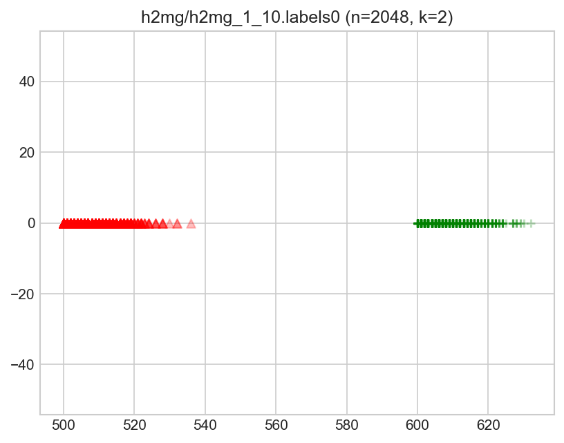

#### `labels1`

true_k= 2, noise=    0, true_g=0.000

label_counts=[1024, 1024]

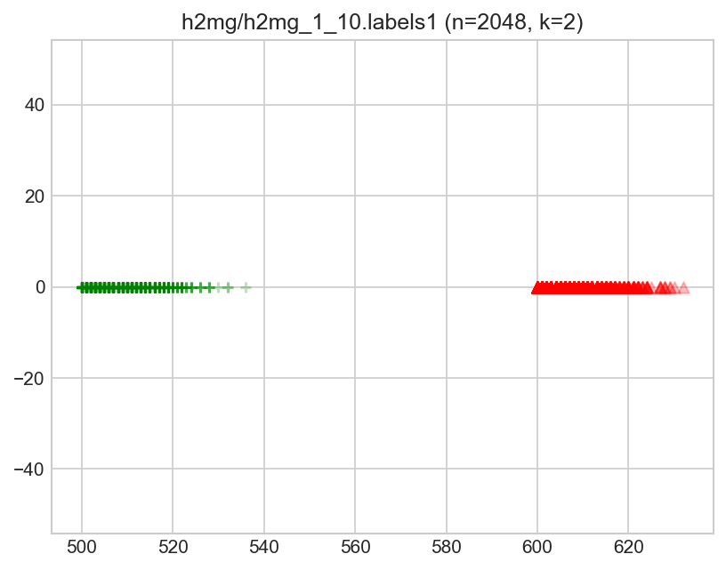

## h2mg/h2mg_1_20 (n=2048, d=1) 

    h2mg clustering benchmark
    Two 1-dimensional clusters, each with 1024 points. Each point is sampled
    from a sphere centered at its own cluster's centre, of radius that follows
    the Gaussian distribution with scale 20*1.
    
    
    Author: Marek Gagolewski (http://www.gagolewski.com)
    Copyleft 2020
    Licensed under the Creative Commons Attribution 4.0 International License
    
    `labels0` gives reference labels based on which probability distribution's
    mixture component was used to generate the corresponding points.
    `labels1` gives reference labels based on the distance to
    the true cluster centre (i.e., arg max_ p_i(x)).
    There is no noise class.
    

#### `labels0`

true_k= 2, noise=    0, true_g=0.000

label_counts=[1024, 1024]

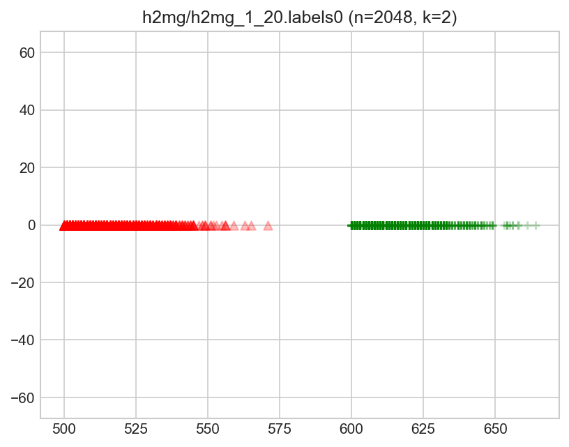

#### `labels1`

true_k= 2, noise=    0, true_g=0.012

label_counts=[1036, 1012]

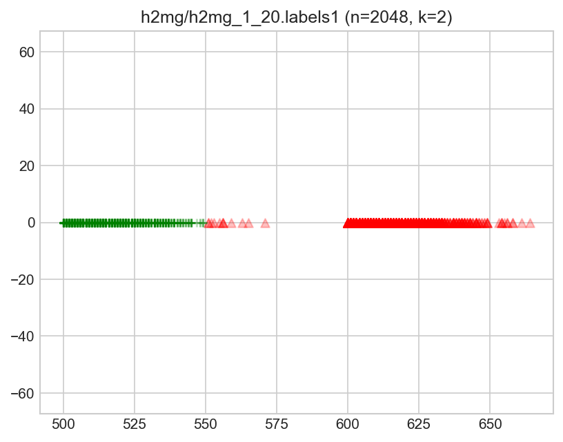

## h2mg/h2mg_1_30 (n=2048, d=1) 

    h2mg clustering benchmark
    Two 1-dimensional clusters, each with 1024 points. Each point is sampled
    from a sphere centered at its own cluster's centre, of radius that follows
    the Gaussian distribution with scale 30*1.
    
    
    Author: Marek Gagolewski (http://www.gagolewski.com)
    Copyleft 2020
    Licensed under the Creative Commons Attribution 4.0 International License
    
    `labels0` gives reference labels based on which probability distribution's
    mixture component was used to generate the corresponding points.
    `labels1` gives reference labels based on the distance to
    the true cluster centre (i.e., arg max_ p_i(x)).
    There is no noise class.
    

#### `labels0`

true_k= 2, noise=    0, true_g=0.000

label_counts=[1024, 1024]

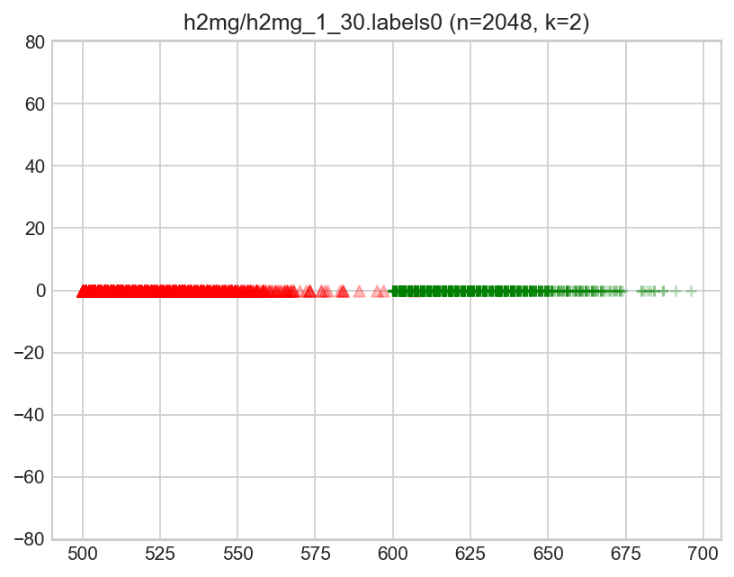

#### `labels1`

true_k= 2, noise=    0, true_g=0.094

label_counts=[1120, 928]

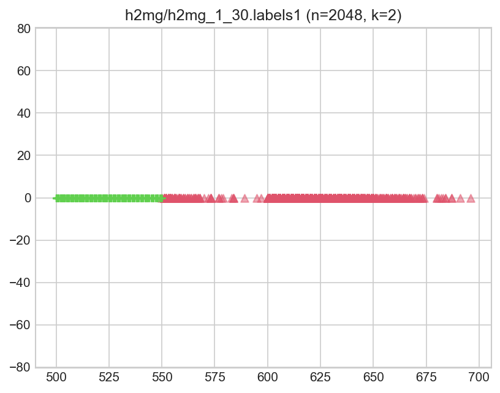

## h2mg/h2mg_1_40 (n=2048, d=1) 

    h2mg clustering benchmark
    Two 1-dimensional clusters, each with 1024 points. Each point is sampled
    from a sphere centered at its own cluster's centre, of radius that follows
    the Gaussian distribution with scale 40*1.
    
    
    Author: Marek Gagolewski (http://www.gagolewski.com)
    Copyleft 2020
    Licensed under the Creative Commons Attribution 4.0 International License
    
    `labels0` gives reference labels based on which probability distribution's
    mixture component was used to generate the corresponding points.
    `labels1` gives reference labels based on the distance to
    the true cluster centre (i.e., arg max_ p_i(x)).
    There is no noise class.
    

#### `labels0`

true_k= 2, noise=    0, true_g=0.000

label_counts=[1024, 1024]

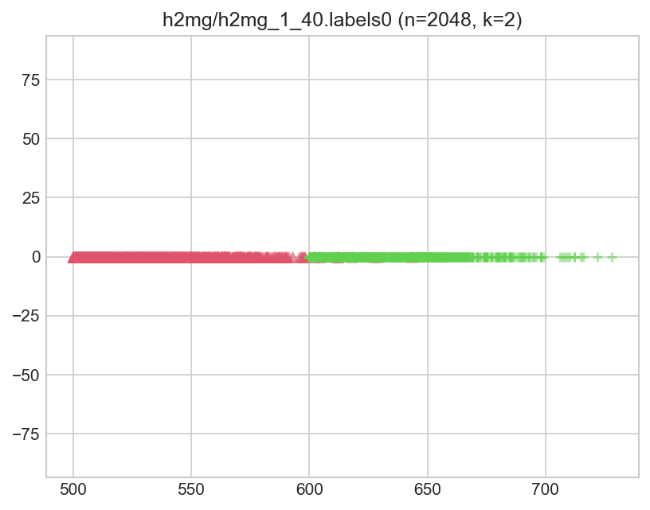

#### `labels1`

true_k= 2, noise=    0, true_g=0.219

label_counts=[1248, 800]

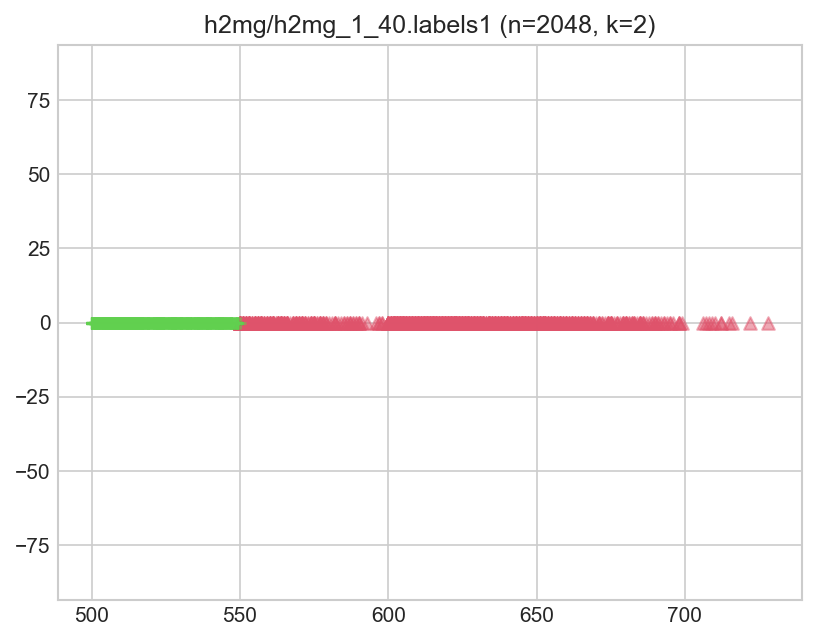

## h2mg/h2mg_1_50 (n=2048, d=1) 

    h2mg clustering benchmark
    Two 1-dimensional clusters, each with 1024 points. Each point is sampled
    from a sphere centered at its own cluster's centre, of radius that follows
    the Gaussian distribution with scale 50*1.
    
    
    Author: Marek Gagolewski (http://www.gagolewski.com)
    Copyleft 2020
    Licensed under the Creative Commons Attribution 4.0 International License
    
    `labels0` gives reference labels based on which probability distribution's
    mixture component was used to generate the corresponding points.
    `labels1` gives reference labels based on the distance to
    the true cluster centre (i.e., arg max_ p_i(x)).
    There is no noise class.
    

#### `labels0`

true_k= 2, noise=    0, true_g=0.000

label_counts=[1024, 1024]

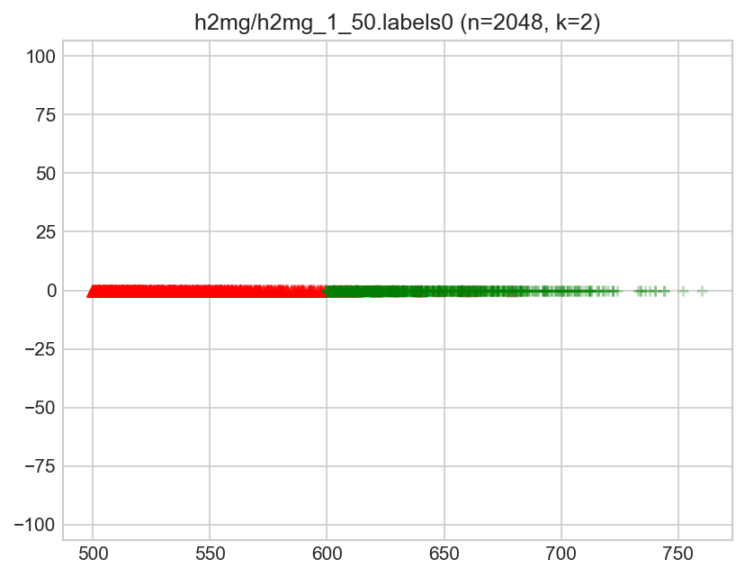

#### `labels1`

true_k= 2, noise=    0, true_g=0.324

label_counts=[1356, 692]

## h2mg/h2mg_1_60 (n=2048, d=1) 

    h2mg clustering benchmark
    Two 1-dimensional clusters, each with 1024 points. Each point is sampled
    from a sphere centered at its own cluster's centre, of radius that follows
    the Gaussian distribution with scale 60*1.
    
    
    Author: Marek Gagolewski (http://www.gagolewski.com)
    Copyleft 2020
    Licensed under the Creative Commons Attribution 4.0 International License
    
    `labels0` gives reference labels based on which probability distribution's
    mixture component was used to generate the corresponding points.
    `labels1` gives reference labels based on the distance to
    the true cluster centre (i.e., arg max_ p_i(x)).
    There is no noise class.
    

#### `labels0`

true_k= 2, noise=    0, true_g=0.000

label_counts=[1024, 1024]

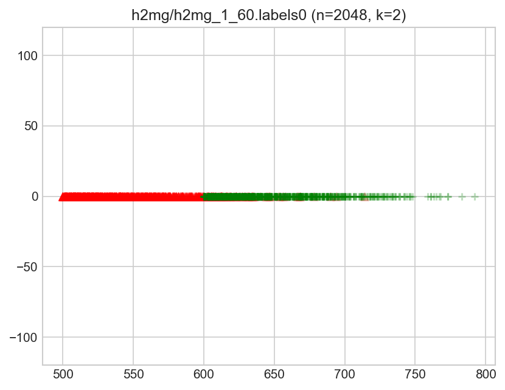

#### `labels1`

true_k= 2, noise=    0, true_g=0.408

label_counts=[1442, 606]

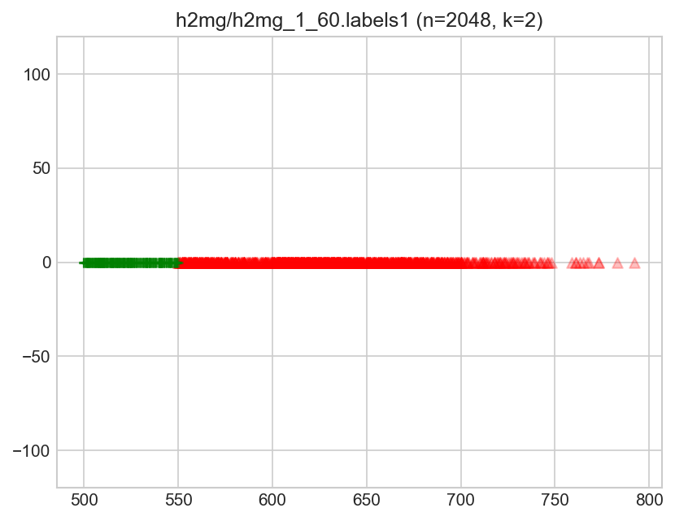

## h2mg/h2mg_1_70 (n=2048, d=1) 

    h2mg clustering benchmark
    Two 1-dimensional clusters, each with 1024 points. Each point is sampled
    from a sphere centered at its own cluster's centre, of radius that follows
    the Gaussian distribution with scale 70*1.
    
    
    Author: Marek Gagolewski (http://www.gagolewski.com)
    Copyleft 2020
    Licensed under the Creative Commons Attribution 4.0 International License
    
    `labels0` gives reference labels based on which probability distribution's
    mixture component was used to generate the corresponding points.
    `labels1` gives reference labels based on the distance to
    the true cluster centre (i.e., arg max_ p_i(x)).
    There is no noise class.
    

#### `labels0`

true_k= 2, noise=    0, true_g=0.000

label_counts=[1024, 1024]

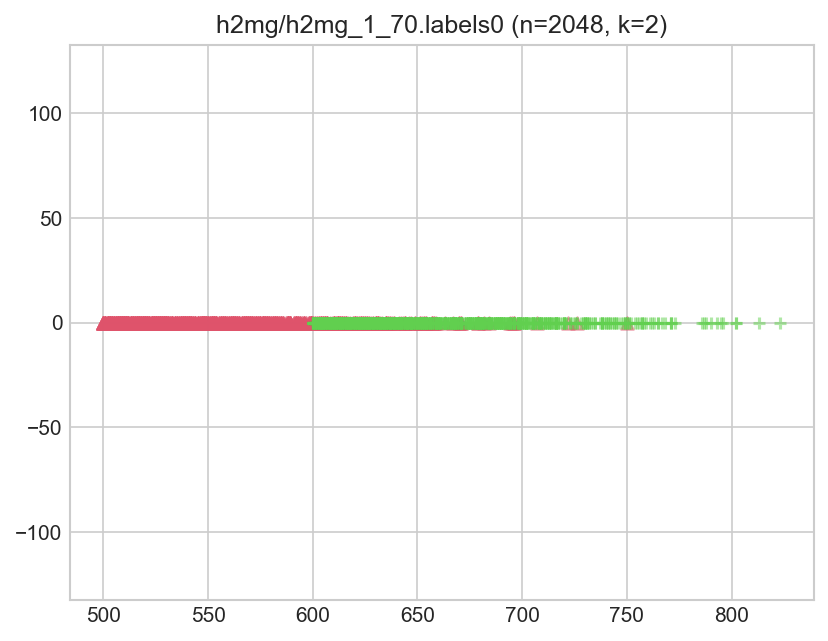

#### `labels1`

true_k= 2, noise=    0, true_g=0.471

label_counts=[1506, 542]

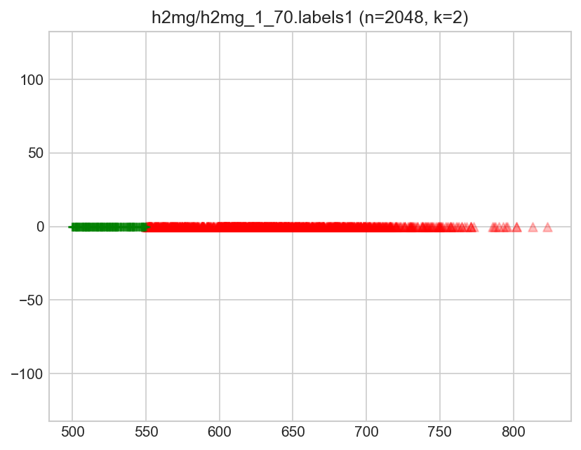

## h2mg/h2mg_1_80 (n=2048, d=1) 

    h2mg clustering benchmark
    Two 1-dimensional clusters, each with 1024 points. Each point is sampled
    from a sphere centered at its own cluster's centre, of radius that follows
    the Gaussian distribution with scale 80*1.
    
    
    Author: Marek Gagolewski (http://www.gagolewski.com)
    Copyleft 2020
    Licensed under the Creative Commons Attribution 4.0 International License
    
    `labels0` gives reference labels based on which probability distribution's
    mixture component was used to generate the corresponding points.
    `labels1` gives reference labels based on the distance to
    the true cluster centre (i.e., arg max_ p_i(x)).
    There is no noise class.
    

#### `labels0`

true_k= 2, noise=    0, true_g=0.000

label_counts=[1024, 1024]

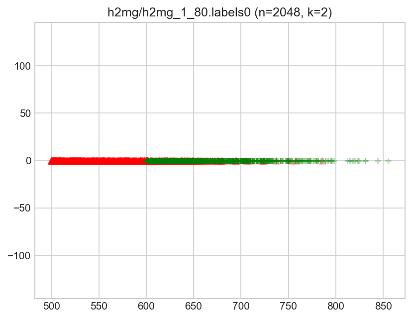

#### `labels1`

true_k= 2, noise=    0, true_g=0.531

label_counts=[1568, 480]

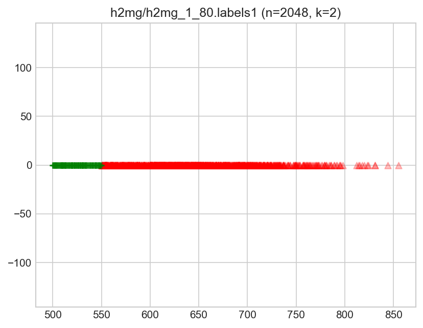

## h2mg/h2mg_1_90 (n=2048, d=1) 

    h2mg clustering benchmark
    Two 1-dimensional clusters, each with 1024 points. Each point is sampled
    from a sphere centered at its own cluster's centre, of radius that follows
    the Gaussian distribution with scale 90*1.
    
    
    Author: Marek Gagolewski (http://www.gagolewski.com)
    Copyleft 2020
    Licensed under the Creative Commons Attribution 4.0 International License
    
    `labels0` gives reference labels based on which probability distribution's
    mixture component was used to generate the corresponding points.
    `labels1` gives reference labels based on the distance to
    the true cluster centre (i.e., arg max_ p_i(x)).
    There is no noise class.
    

#### `labels0`

true_k= 2, noise=    0, true_g=0.000

label_counts=[1024, 1024]

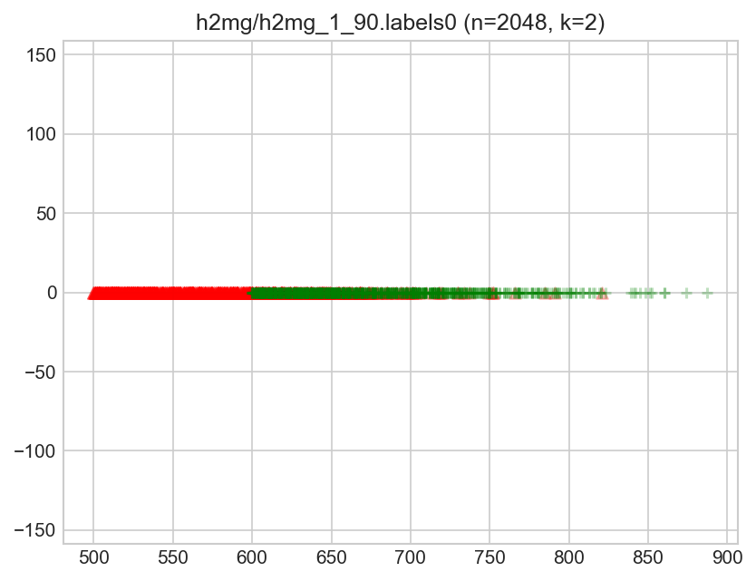

#### `labels1`

true_k= 2, noise=    0, true_g=0.569

label_counts=[1607, 441]

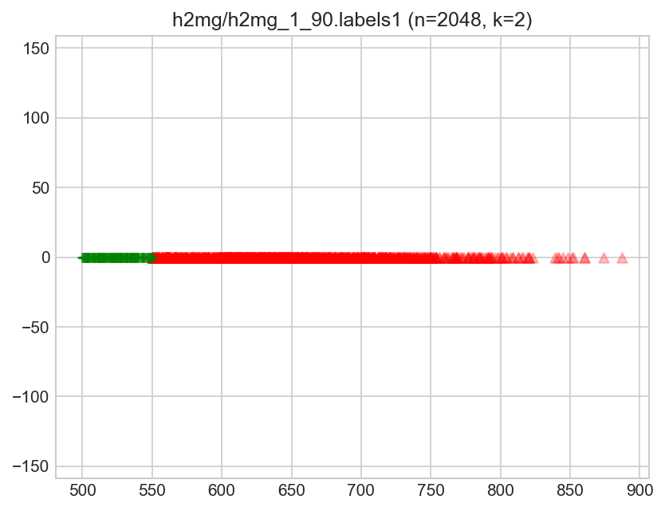

## h2mg/h2mg_2_10 (n=2048, d=2) 

    h2mg clustering benchmark
    Two 2-dimensional clusters, each with 1024 points. Each point is sampled
    from a sphere centered at its own cluster's centre, of radius that follows
    the Gaussian distribution with scale 10*2.
    
    
    Author: Marek Gagolewski (http://www.gagolewski.com)
    Copyleft 2020
    Licensed under the Creative Commons Attribution 4.0 International License
    
    `labels0` gives reference labels based on which probability distribution's
    mixture component was used to generate the corresponding points.
    `labels1` gives reference labels based on the distance to
    the true cluster centre (i.e., arg max_ p_i(x)).
    There is no noise class.
    

#### `labels0`

true_k= 2, noise=    0, true_g=0.000

label_counts=[1024, 1024]

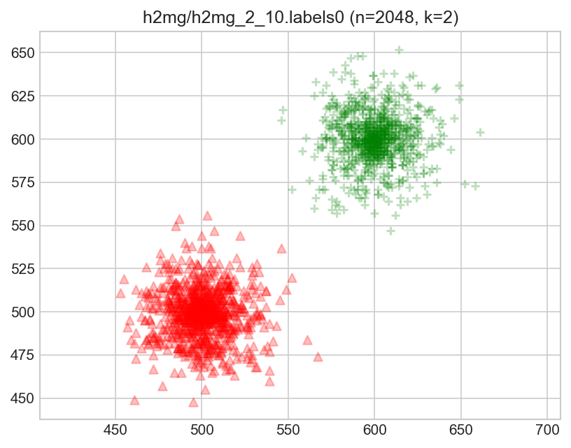

#### `labels1`

true_k= 2, noise=    0, true_g=0.000

label_counts=[1024, 1024]

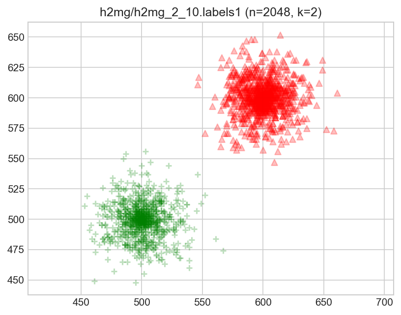

## h2mg/h2mg_2_20 (n=2048, d=2) 

    h2mg clustering benchmark
    Two 2-dimensional clusters, each with 1024 points. Each point is sampled
    from a sphere centered at its own cluster's centre, of radius that follows
    the Gaussian distribution with scale 20*2.
    
    
    Author: Marek Gagolewski (http://www.gagolewski.com)
    Copyleft 2020
    Licensed under the Creative Commons Attribution 4.0 International License
    
    `labels0` gives reference labels based on which probability distribution's
    mixture component was used to generate the corresponding points.
    `labels1` gives reference labels based on the distance to
    the true cluster centre (i.e., arg max_ p_i(x)).
    There is no noise class.
    

#### `labels0`

true_k= 2, noise=    0, true_g=0.000

label_counts=[1024, 1024]

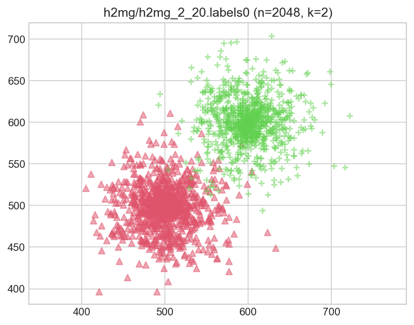

#### `labels1`

true_k= 2, noise=    0, true_g=0.003

label_counts=[1021, 1027]

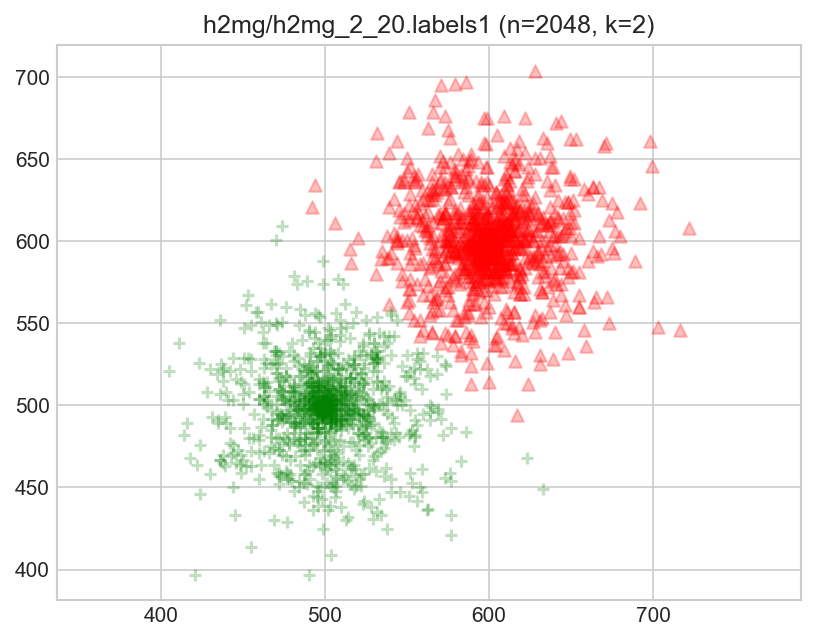

## h2mg/h2mg_2_30 (n=2048, d=2) 

    h2mg clustering benchmark
    Two 2-dimensional clusters, each with 1024 points. Each point is sampled
    from a sphere centered at its own cluster's centre, of radius that follows
    the Gaussian distribution with scale 30*2.
    
    
    Author: Marek Gagolewski (http://www.gagolewski.com)
    Copyleft 2020
    Licensed under the Creative Commons Attribution 4.0 International License
    
    `labels0` gives reference labels based on which probability distribution's
    mixture component was used to generate the corresponding points.
    `labels1` gives reference labels based on the distance to
    the true cluster centre (i.e., arg max_ p_i(x)).
    There is no noise class.
    

#### `labels0`

true_k= 2, noise=    0, true_g=0.000

label_counts=[1024, 1024]

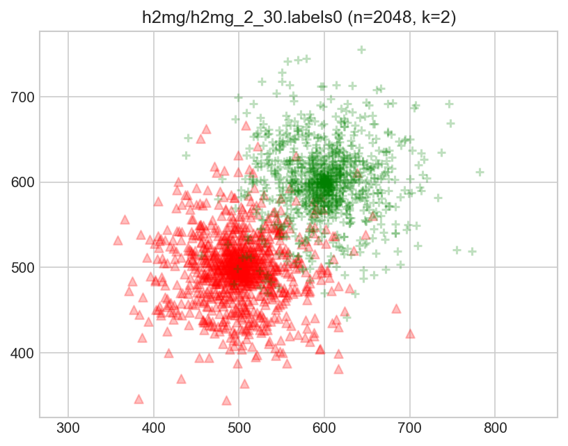

#### `labels1`

true_k= 2, noise=    0, true_g=0.012

label_counts=[1012, 1036]

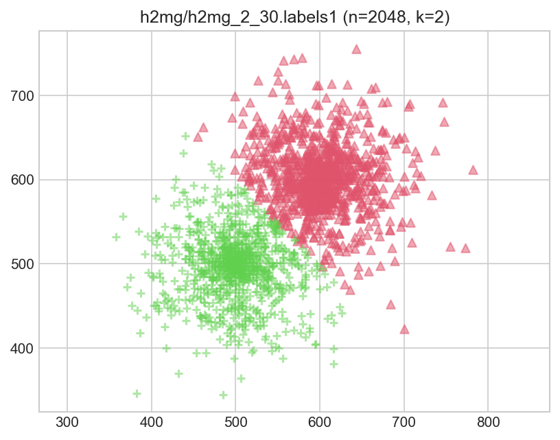

## h2mg/h2mg_2_40 (n=2048, d=2) 

    h2mg clustering benchmark
    Two 2-dimensional clusters, each with 1024 points. Each point is sampled
    from a sphere centered at its own cluster's centre, of radius that follows
    the Gaussian distribution with scale 40*2.
    
    
    Author: Marek Gagolewski (http://www.gagolewski.com)
    Copyleft 2020
    Licensed under the Creative Commons Attribution 4.0 International License
    
    `labels0` gives reference labels based on which probability distribution's
    mixture component was used to generate the corresponding points.
    `labels1` gives reference labels based on the distance to
    the true cluster centre (i.e., arg max_ p_i(x)).
    There is no noise class.
    

#### `labels0`

true_k= 2, noise=    0, true_g=0.000

label_counts=[1024, 1024]

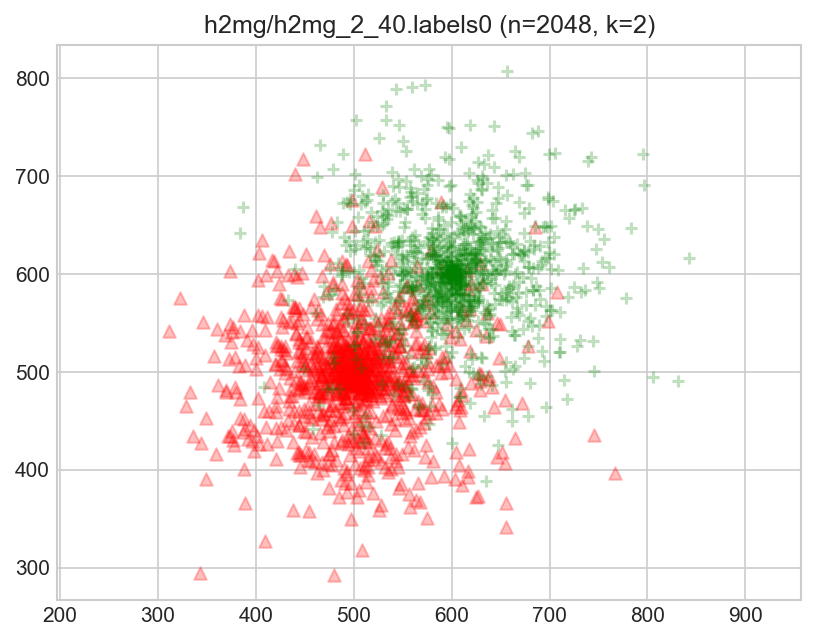

#### `labels1`

true_k= 2, noise=    0, true_g=0.004

label_counts=[1020, 1028]

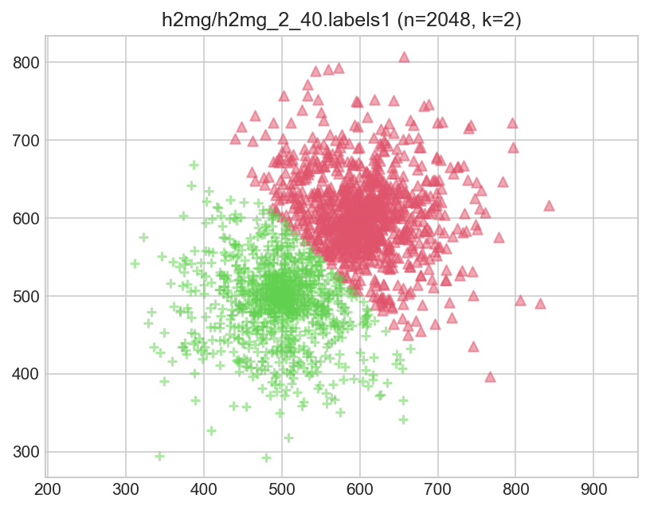

## h2mg/h2mg_2_50 (n=2048, d=2) 

    h2mg clustering benchmark
    Two 2-dimensional clusters, each with 1024 points. Each point is sampled
    from a sphere centered at its own cluster's centre, of radius that follows
    the Gaussian distribution with scale 50*2.
    
    
    Author: Marek Gagolewski (http://www.gagolewski.com)
    Copyleft 2020
    Licensed under the Creative Commons Attribution 4.0 International License
    
    `labels0` gives reference labels based on which probability distribution's
    mixture component was used to generate the corresponding points.
    `labels1` gives reference labels based on the distance to
    the true cluster centre (i.e., arg max_ p_i(x)).
    There is no noise class.
    

#### `labels0`

true_k= 2, noise=    0, true_g=0.000

label_counts=[1024, 1024]

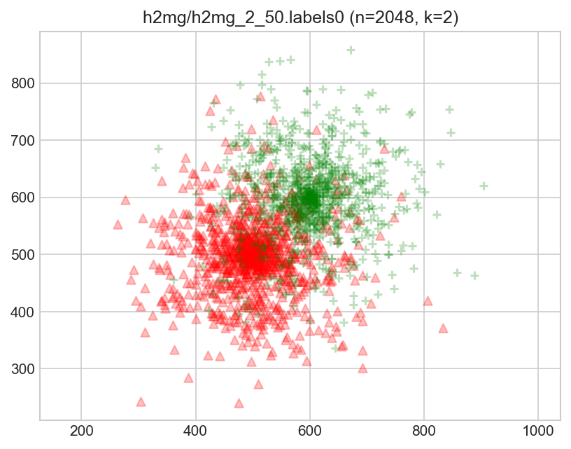

#### `labels1`

true_k= 2, noise=    0, true_g=0.001

label_counts=[1025, 1023]

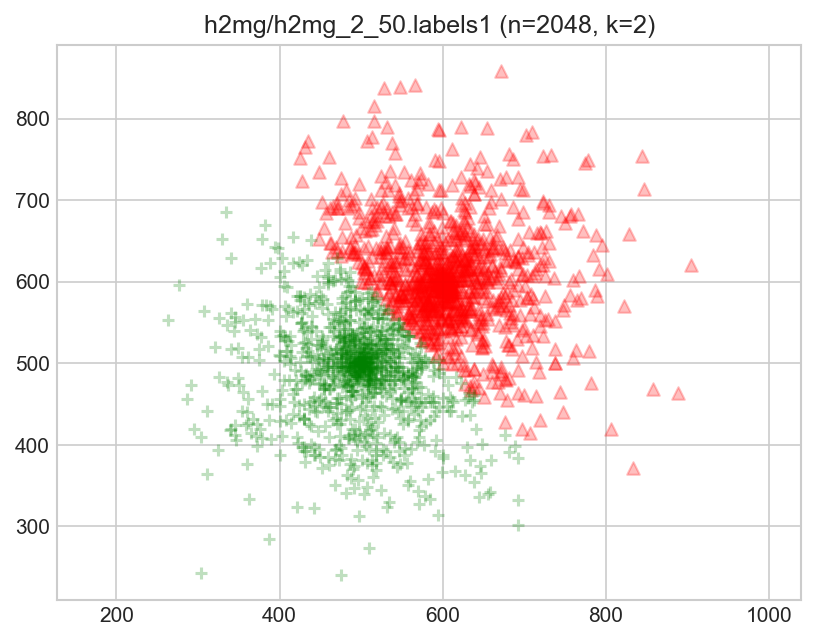

## h2mg/h2mg_2_60 (n=2048, d=2) 

    h2mg clustering benchmark
    Two 2-dimensional clusters, each with 1024 points. Each point is sampled
    from a sphere centered at its own cluster's centre, of radius that follows
    the Gaussian distribution with scale 60*2.
    
    
    Author: Marek Gagolewski (http://www.gagolewski.com)
    Copyleft 2020
    Licensed under the Creative Commons Attribution 4.0 International License
    
    `labels0` gives reference labels based on which probability distribution's
    mixture component was used to generate the corresponding points.
    `labels1` gives reference labels based on the distance to
    the true cluster centre (i.e., arg max_ p_i(x)).
    There is no noise class.
    

#### `labels0`

true_k= 2, noise=    0, true_g=0.000

label_counts=[1024, 1024]

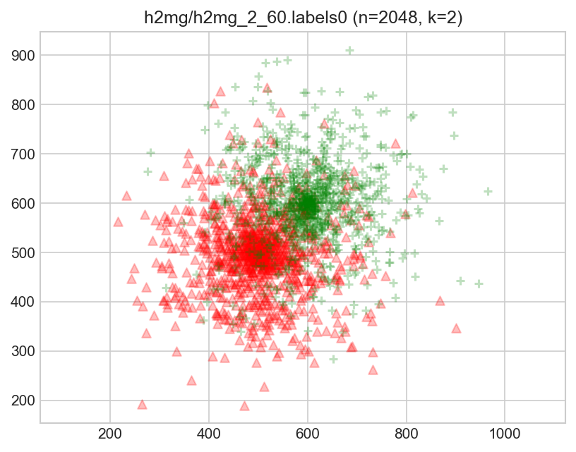

#### `labels1`

true_k= 2, noise=    0, true_g=0.005

label_counts=[1019, 1029]

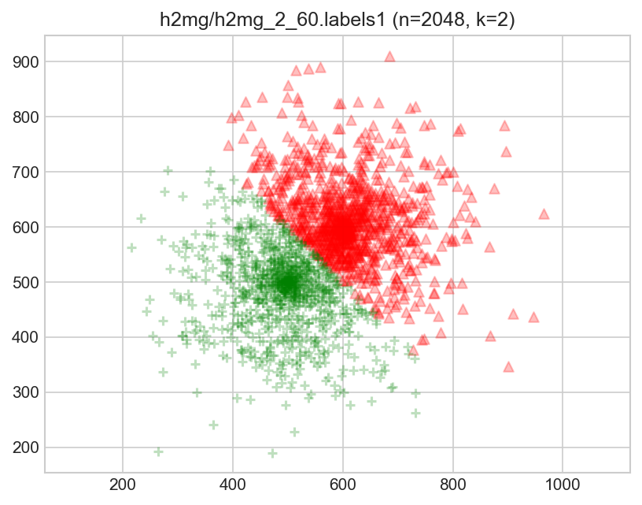

## h2mg/h2mg_2_70 (n=2048, d=2) 

    h2mg clustering benchmark
    Two 2-dimensional clusters, each with 1024 points. Each point is sampled
    from a sphere centered at its own cluster's centre, of radius that follows
    the Gaussian distribution with scale 70*2.
    
    
    Author: Marek Gagolewski (http://www.gagolewski.com)
    Copyleft 2020
    Licensed under the Creative Commons Attribution 4.0 International License
    
    `labels0` gives reference labels based on which probability distribution's
    mixture component was used to generate the corresponding points.
    `labels1` gives reference labels based on the distance to
    the true cluster centre (i.e., arg max_ p_i(x)).
    There is no noise class.
    

#### `labels0`

true_k= 2, noise=    0, true_g=0.000

label_counts=[1024, 1024]

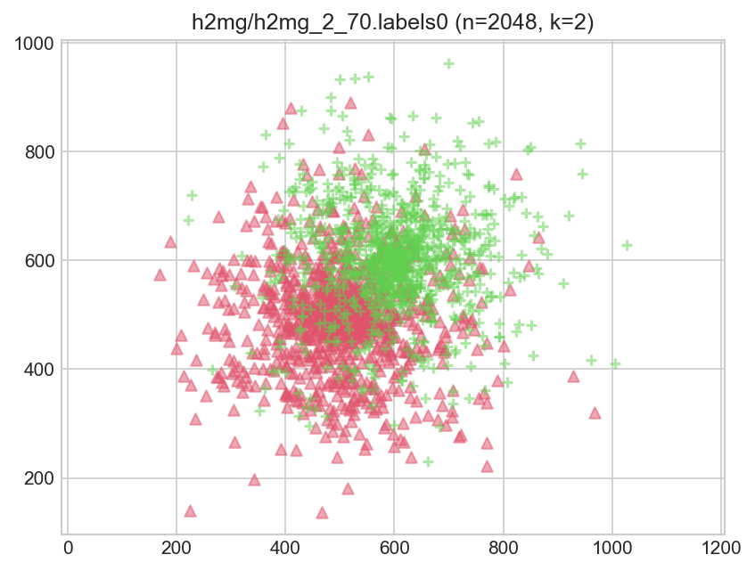

#### `labels1`

true_k= 2, noise=    0, true_g=0.002

label_counts=[1022, 1026]

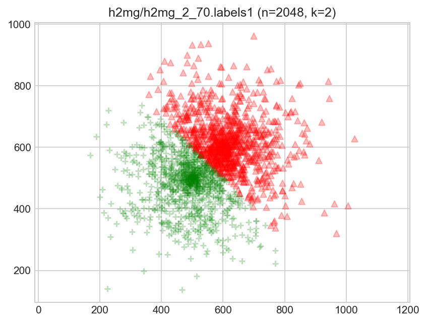

## h2mg/h2mg_2_80 (n=2048, d=2) 

    h2mg clustering benchmark
    Two 2-dimensional clusters, each with 1024 points. Each point is sampled
    from a sphere centered at its own cluster's centre, of radius that follows
    the Gaussian distribution with scale 80*2.
    
    
    Author: Marek Gagolewski (http://www.gagolewski.com)
    Copyleft 2020
    Licensed under the Creative Commons Attribution 4.0 International License
    
    `labels0` gives reference labels based on which probability distribution's
    mixture component was used to generate the corresponding points.
    `labels1` gives reference labels based on the distance to
    the true cluster centre (i.e., arg max_ p_i(x)).
    There is no noise class.
    

#### `labels0`

true_k= 2, noise=    0, true_g=0.000

label_counts=[1024, 1024]

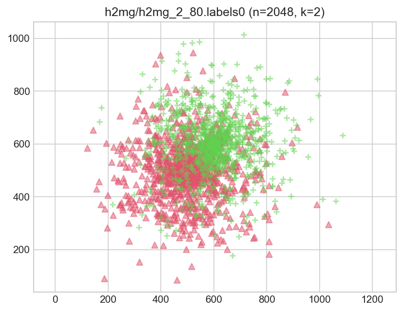

#### `labels1`

true_k= 2, noise=    0, true_g=0.011

label_counts=[1013, 1035]

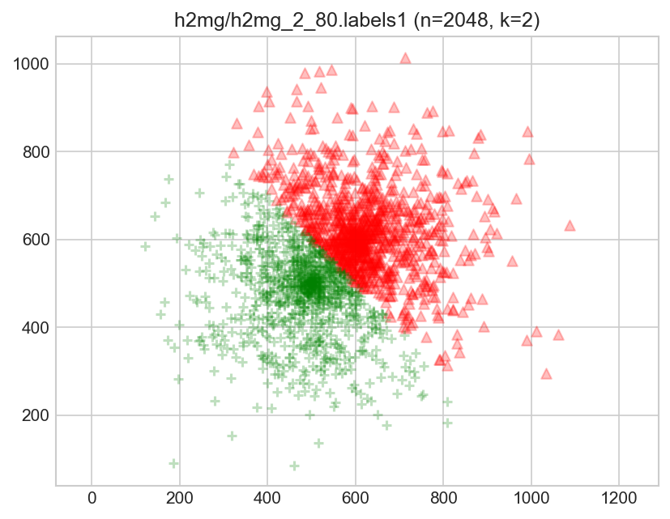

## h2mg/h2mg_2_90 (n=2048, d=2) 

    h2mg clustering benchmark
    Two 2-dimensional clusters, each with 1024 points. Each point is sampled
    from a sphere centered at its own cluster's centre, of radius that follows
    the Gaussian distribution with scale 90*2.
    
    
    Author: Marek Gagolewski (http://www.gagolewski.com)
    Copyleft 2020
    Licensed under the Creative Commons Attribution 4.0 International License
    
    `labels0` gives reference labels based on which probability distribution's
    mixture component was used to generate the corresponding points.
    `labels1` gives reference labels based on the distance to
    the true cluster centre (i.e., arg max_ p_i(x)).
    There is no noise class.
    

#### `labels0`

true_k= 2, noise=    0, true_g=0.000

label_counts=[1024, 1024]

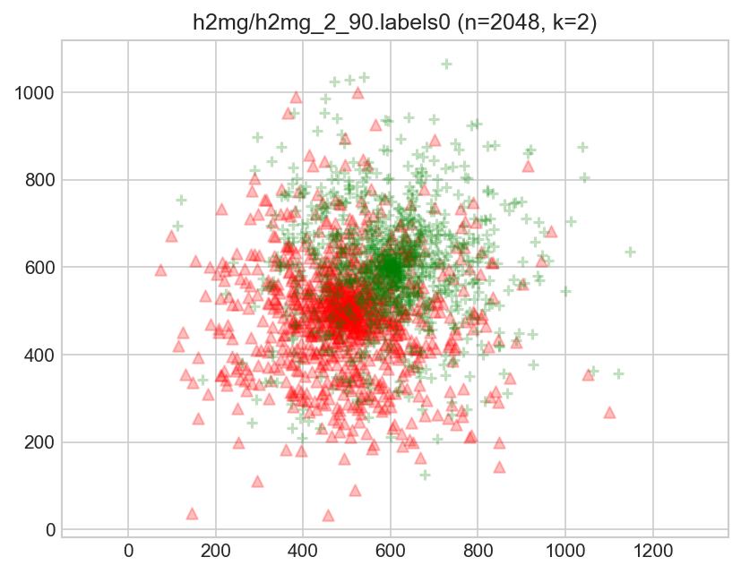

#### `labels1`

true_k= 2, noise=    0, true_g=0.017

label_counts=[1007, 1041]

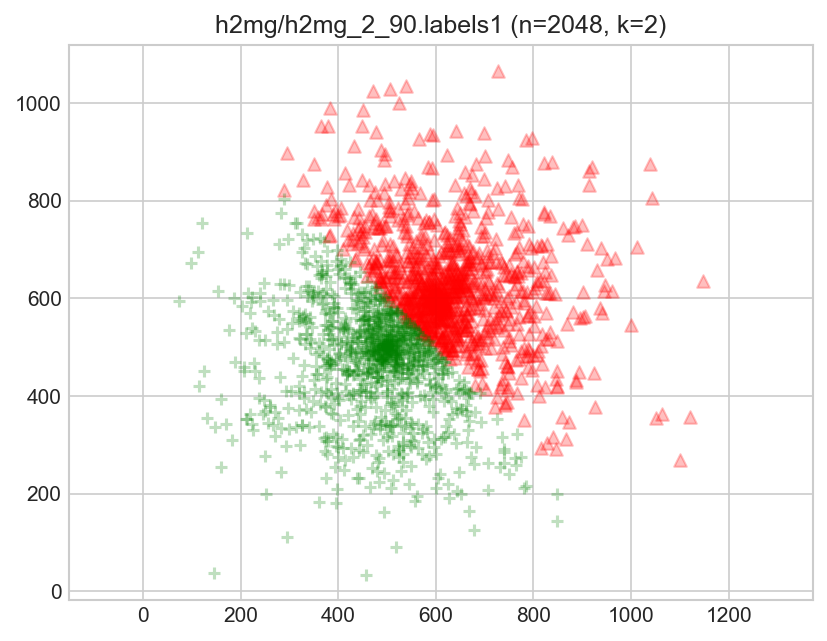

## h2mg/h2mg_4_10 (n=2048, d=4) 

    h2mg clustering benchmark
    Two 4-dimensional clusters, each with 1024 points. Each point is sampled
    from a sphere centered at its own cluster's centre, of radius that follows
    the Gaussian distribution with scale 10*4.
    
    
    Author: Marek Gagolewski (http://www.gagolewski.com)
    Copyleft 2020
    Licensed under the Creative Commons Attribution 4.0 International License
    
    `labels0` gives reference labels based on which probability distribution's
    mixture component was used to generate the corresponding points.
    `labels1` gives reference labels based on the distance to
    the true cluster centre (i.e., arg max_ p_i(x)).
    There is no noise class.
    

#### `labels0`

true_k= 2, noise=    0, true_g=0.000

label_counts=[1024, 1024]

> **(preview generation suppressed)**

#### `labels1`

true_k= 2, noise=    0, true_g=0.000

label_counts=[1024, 1024]

> **(preview generation suppressed)**

## h2mg/h2mg_4_20 (n=2048, d=4) 

    h2mg clustering benchmark
    Two 4-dimensional clusters, each with 1024 points. Each point is sampled
    from a sphere centered at its own cluster's centre, of radius that follows
    the Gaussian distribution with scale 20*4.
    
    
    Author: Marek Gagolewski (http://www.gagolewski.com)
    Copyleft 2020
    Licensed under the Creative Commons Attribution 4.0 International License
    
    `labels0` gives reference labels based on which probability distribution's
    mixture component was used to generate the corresponding points.
    `labels1` gives reference labels based on the distance to
    the true cluster centre (i.e., arg max_ p_i(x)).
    There is no noise class.
    

#### `labels0`

true_k= 2, noise=    0, true_g=0.000

label_counts=[1024, 1024]

> **(preview generation suppressed)**

#### `labels1`

true_k= 2, noise=    0, true_g=0.007

label_counts=[1017, 1031]

> **(preview generation suppressed)**

## h2mg/h2mg_4_30 (n=2048, d=4) 

    h2mg clustering benchmark
    Two 4-dimensional clusters, each with 1024 points. Each point is sampled
    from a sphere centered at its own cluster's centre, of radius that follows
    the Gaussian distribution with scale 30*4.
    
    
    Author: Marek Gagolewski (http://www.gagolewski.com)
    Copyleft 2020
    Licensed under the Creative Commons Attribution 4.0 International License
    
    `labels0` gives reference labels based on which probability distribution's
    mixture component was used to generate the corresponding points.
    `labels1` gives reference labels based on the distance to
    the true cluster centre (i.e., arg max_ p_i(x)).
    There is no noise class.
    

#### `labels0`

true_k= 2, noise=    0, true_g=0.000

label_counts=[1024, 1024]

> **(preview generation suppressed)**

#### `labels1`

true_k= 2, noise=    0, true_g=0.008

label_counts=[1032, 1016]

> **(preview generation suppressed)**

## h2mg/h2mg_4_40 (n=2048, d=4) 

    h2mg clustering benchmark
    Two 4-dimensional clusters, each with 1024 points. Each point is sampled
    from a sphere centered at its own cluster's centre, of radius that follows
    the Gaussian distribution with scale 40*4.
    
    
    Author: Marek Gagolewski (http://www.gagolewski.com)
    Copyleft 2020
    Licensed under the Creative Commons Attribution 4.0 International License
    
    `labels0` gives reference labels based on which probability distribution's
    mixture component was used to generate the corresponding points.
    `labels1` gives reference labels based on the distance to
    the true cluster centre (i.e., arg max_ p_i(x)).
    There is no noise class.
    

#### `labels0`

true_k= 2, noise=    0, true_g=0.000

label_counts=[1024, 1024]

> **(preview generation suppressed)**

#### `labels1`

true_k= 2, noise=    0, true_g=0.007

label_counts=[1031, 1017]

> **(preview generation suppressed)**

## h2mg/h2mg_4_50 (n=2048, d=4) 

    h2mg clustering benchmark
    Two 4-dimensional clusters, each with 1024 points. Each point is sampled
    from a sphere centered at its own cluster's centre, of radius that follows
    the Gaussian distribution with scale 50*4.
    
    
    Author: Marek Gagolewski (http://www.gagolewski.com)
    Copyleft 2020
    Licensed under the Creative Commons Attribution 4.0 International License
    
    `labels0` gives reference labels based on which probability distribution's
    mixture component was used to generate the corresponding points.
    `labels1` gives reference labels based on the distance to
    the true cluster centre (i.e., arg max_ p_i(x)).
    There is no noise class.
    

#### `labels0`

true_k= 2, noise=    0, true_g=0.000

label_counts=[1024, 1024]

> **(preview generation suppressed)**

#### `labels1`

true_k= 2, noise=    0, true_g=0.001

label_counts=[1025, 1023]

> **(preview generation suppressed)**

## h2mg/h2mg_4_60 (n=2048, d=4) 

    h2mg clustering benchmark
    Two 4-dimensional clusters, each with 1024 points. Each point is sampled
    from a sphere centered at its own cluster's centre, of radius that follows
    the Gaussian distribution with scale 60*4.
    
    
    Author: Marek Gagolewski (http://www.gagolewski.com)
    Copyleft 2020
    Licensed under the Creative Commons Attribution 4.0 International License
    
    `labels0` gives reference labels based on which probability distribution's
    mixture component was used to generate the corresponding points.
    `labels1` gives reference labels based on the distance to
    the true cluster centre (i.e., arg max_ p_i(x)).
    There is no noise class.
    

#### `labels0`

true_k= 2, noise=    0, true_g=0.000

label_counts=[1024, 1024]

> **(preview generation suppressed)**

#### `labels1`

true_k= 2, noise=    0, true_g=0.022

label_counts=[1047, 1001]

> **(preview generation suppressed)**

## h2mg/h2mg_4_70 (n=2048, d=4) 

    h2mg clustering benchmark
    Two 4-dimensional clusters, each with 1024 points. Each point is sampled
    from a sphere centered at its own cluster's centre, of radius that follows
    the Gaussian distribution with scale 70*4.
    
    
    Author: Marek Gagolewski (http://www.gagolewski.com)
    Copyleft 2020
    Licensed under the Creative Commons Attribution 4.0 International License
    
    `labels0` gives reference labels based on which probability distribution's
    mixture component was used to generate the corresponding points.
    `labels1` gives reference labels based on the distance to
    the true cluster centre (i.e., arg max_ p_i(x)).
    There is no noise class.
    

#### `labels0`

true_k= 2, noise=    0, true_g=0.000

label_counts=[1024, 1024]

> **(preview generation suppressed)**

#### `labels1`

true_k= 2, noise=    0, true_g=0.020

label_counts=[1044, 1004]

> **(preview generation suppressed)**

## h2mg/h2mg_4_80 (n=2048, d=4) 

    h2mg clustering benchmark
    Two 4-dimensional clusters, each with 1024 points. Each point is sampled
    from a sphere centered at its own cluster's centre, of radius that follows
    the Gaussian distribution with scale 80*4.
    
    
    Author: Marek Gagolewski (http://www.gagolewski.com)
    Copyleft 2020
    Licensed under the Creative Commons Attribution 4.0 International License
    
    `labels0` gives reference labels based on which probability distribution's
    mixture component was used to generate the corresponding points.
    `labels1` gives reference labels based on the distance to
    the true cluster centre (i.e., arg max_ p_i(x)).
    There is no noise class.
    

#### `labels0`

true_k= 2, noise=    0, true_g=0.000

label_counts=[1024, 1024]

> **(preview generation suppressed)**

#### `labels1`

true_k= 2, noise=    0, true_g=0.022

label_counts=[1047, 1001]

> **(preview generation suppressed)**

## h2mg/h2mg_4_90 (n=2048, d=4) 

    h2mg clustering benchmark
    Two 4-dimensional clusters, each with 1024 points. Each point is sampled
    from a sphere centered at its own cluster's centre, of radius that follows
    the Gaussian distribution with scale 90*4.
    
    
    Author: Marek Gagolewski (http://www.gagolewski.com)
    Copyleft 2020
    Licensed under the Creative Commons Attribution 4.0 International License
    
    `labels0` gives reference labels based on which probability distribution's
    mixture component was used to generate the corresponding points.
    `labels1` gives reference labels based on the distance to
    the true cluster centre (i.e., arg max_ p_i(x)).
    There is no noise class.
    

#### `labels0`

true_k= 2, noise=    0, true_g=0.000

label_counts=[1024, 1024]

> **(preview generation suppressed)**

#### `labels1`

true_k= 2, noise=    0, true_g=0.017

label_counts=[1041, 1007]

> **(preview generation suppressed)**

## h2mg/h2mg_8_10 (n=2048, d=8) 

    h2mg clustering benchmark
    Two 8-dimensional clusters, each with 1024 points. Each point is sampled
    from a sphere centered at its own cluster's centre, of radius that follows
    the Gaussian distribution with scale 10*8.
    
    
    Author: Marek Gagolewski (http://www.gagolewski.com)
    Copyleft 2020
    Licensed under the Creative Commons Attribution 4.0 International License
    
    `labels0` gives reference labels based on which probability distribution's
    mixture component was used to generate the corresponding points.
    `labels1` gives reference labels based on the distance to
    the true cluster centre (i.e., arg max_ p_i(x)).
    There is no noise class.
    

#### `labels0`

true_k= 2, noise=    0, true_g=0.000

label_counts=[1024, 1024]

> **(preview generation suppressed)**

#### `labels1`

true_k= 2, noise=    0, true_g=0.000

label_counts=[1024, 1024]

> **(preview generation suppressed)**

## h2mg/h2mg_8_20 (n=2048, d=8) 

    h2mg clustering benchmark
    Two 8-dimensional clusters, each with 1024 points. Each point is sampled
    from a sphere centered at its own cluster's centre, of radius that follows
    the Gaussian distribution with scale 20*8.
    
    
    Author: Marek Gagolewski (http://www.gagolewski.com)
    Copyleft 2020
    Licensed under the Creative Commons Attribution 4.0 International License
    
    `labels0` gives reference labels based on which probability distribution's
    mixture component was used to generate the corresponding points.
    `labels1` gives reference labels based on the distance to
    the true cluster centre (i.e., arg max_ p_i(x)).
    There is no noise class.
    

#### `labels0`

true_k= 2, noise=    0, true_g=0.000

label_counts=[1024, 1024]

> **(preview generation suppressed)**

#### `labels1`

true_k= 2, noise=    0, true_g=0.000

label_counts=[1024, 1024]

> **(preview generation suppressed)**

## h2mg/h2mg_8_30 (n=2048, d=8) 

    h2mg clustering benchmark
    Two 8-dimensional clusters, each with 1024 points. Each point is sampled
    from a sphere centered at its own cluster's centre, of radius that follows
    the Gaussian distribution with scale 30*8.
    
    
    Author: Marek Gagolewski (http://www.gagolewski.com)
    Copyleft 2020
    Licensed under the Creative Commons Attribution 4.0 International License
    
    `labels0` gives reference labels based on which probability distribution's
    mixture component was used to generate the corresponding points.
    `labels1` gives reference labels based on the distance to
    the true cluster centre (i.e., arg max_ p_i(x)).
    There is no noise class.
    

#### `labels0`

true_k= 2, noise=    0, true_g=0.000

label_counts=[1024, 1024]

> **(preview generation suppressed)**

#### `labels1`

true_k= 2, noise=    0, true_g=0.019

label_counts=[1043, 1005]

> **(preview generation suppressed)**

## h2mg/h2mg_8_40 (n=2048, d=8) 

    h2mg clustering benchmark
    Two 8-dimensional clusters, each with 1024 points. Each point is sampled
    from a sphere centered at its own cluster's centre, of radius that follows
    the Gaussian distribution with scale 40*8.
    
    
    Author: Marek Gagolewski (http://www.gagolewski.com)
    Copyleft 2020
    Licensed under the Creative Commons Attribution 4.0 International License
    
    `labels0` gives reference labels based on which probability distribution's
    mixture component was used to generate the corresponding points.
    `labels1` gives reference labels based on the distance to
    the true cluster centre (i.e., arg max_ p_i(x)).
    There is no noise class.
    

#### `labels0`

true_k= 2, noise=    0, true_g=0.000

label_counts=[1024, 1024]

> **(preview generation suppressed)**

#### `labels1`

true_k= 2, noise=    0, true_g=0.021

label_counts=[1046, 1002]

> **(preview generation suppressed)**

## h2mg/h2mg_8_50 (n=2048, d=8) 

    h2mg clustering benchmark
    Two 8-dimensional clusters, each with 1024 points. Each point is sampled
    from a sphere centered at its own cluster's centre, of radius that follows
    the Gaussian distribution with scale 50*8.
    
    
    Author: Marek Gagolewski (http://www.gagolewski.com)
    Copyleft 2020
    Licensed under the Creative Commons Attribution 4.0 International License
    
    `labels0` gives reference labels based on which probability distribution's
    mixture component was used to generate the corresponding points.
    `labels1` gives reference labels based on the distance to
    the true cluster centre (i.e., arg max_ p_i(x)).
    There is no noise class.
    

#### `labels0`

true_k= 2, noise=    0, true_g=0.000

label_counts=[1024, 1024]

> **(preview generation suppressed)**

#### `labels1`

true_k= 2, noise=    0, true_g=0.003

label_counts=[1027, 1021]

> **(preview generation suppressed)**

## h2mg/h2mg_8_60 (n=2048, d=8) 

    h2mg clustering benchmark
    Two 8-dimensional clusters, each with 1024 points. Each point is sampled
    from a sphere centered at its own cluster's centre, of radius that follows
    the Gaussian distribution with scale 60*8.
    
    
    Author: Marek Gagolewski (http://www.gagolewski.com)
    Copyleft 2020
    Licensed under the Creative Commons Attribution 4.0 International License
    
    `labels0` gives reference labels based on which probability distribution's
    mixture component was used to generate the corresponding points.
    `labels1` gives reference labels based on the distance to
    the true cluster centre (i.e., arg max_ p_i(x)).
    There is no noise class.
    

#### `labels0`

true_k= 2, noise=    0, true_g=0.000

label_counts=[1024, 1024]

> **(preview generation suppressed)**

#### `labels1`

true_k= 2, noise=    0, true_g=0.003

label_counts=[1027, 1021]

> **(preview generation suppressed)**

## h2mg/h2mg_8_70 (n=2048, d=8) 

    h2mg clustering benchmark
    Two 8-dimensional clusters, each with 1024 points. Each point is sampled
    from a sphere centered at its own cluster's centre, of radius that follows
    the Gaussian distribution with scale 70*8.
    
    
    Author: Marek Gagolewski (http://www.gagolewski.com)
    Copyleft 2020
    Licensed under the Creative Commons Attribution 4.0 International License
    
    `labels0` gives reference labels based on which probability distribution's
    mixture component was used to generate the corresponding points.
    `labels1` gives reference labels based on the distance to
    the true cluster centre (i.e., arg max_ p_i(x)).
    There is no noise class.
    

#### `labels0`

true_k= 2, noise=    0, true_g=0.000

label_counts=[1024, 1024]

> **(preview generation suppressed)**

#### `labels1`

true_k= 2, noise=    0, true_g=0.003

label_counts=[1027, 1021]

> **(preview generation suppressed)**

## h2mg/h2mg_8_80 (n=2048, d=8) 

    h2mg clustering benchmark
    Two 8-dimensional clusters, each with 1024 points. Each point is sampled
    from a sphere centered at its own cluster's centre, of radius that follows
    the Gaussian distribution with scale 80*8.
    
    
    Author: Marek Gagolewski (http://www.gagolewski.com)
    Copyleft 2020
    Licensed under the Creative Commons Attribution 4.0 International License
    
    `labels0` gives reference labels based on which probability distribution's
    mixture component was used to generate the corresponding points.
    `labels1` gives reference labels based on the distance to
    the true cluster centre (i.e., arg max_ p_i(x)).
    There is no noise class.
    

#### `labels0`

true_k= 2, noise=    0, true_g=0.000

label_counts=[1024, 1024]

> **(preview generation suppressed)**

#### `labels1`

true_k= 2, noise=    0, true_g=0.006

label_counts=[1030, 1018]

> **(preview generation suppressed)**

## h2mg/h2mg_8_90 (n=2048, d=8) 

    h2mg clustering benchmark
    Two 8-dimensional clusters, each with 1024 points. Each point is sampled
    from a sphere centered at its own cluster's centre, of radius that follows
    the Gaussian distribution with scale 90*8.
    
    
    Author: Marek Gagolewski (http://www.gagolewski.com)
    Copyleft 2020
    Licensed under the Creative Commons Attribution 4.0 International License
    
    `labels0` gives reference labels based on which probability distribution's
    mixture component was used to generate the corresponding points.
    `labels1` gives reference labels based on the distance to
    the true cluster centre (i.e., arg max_ p_i(x)).
    There is no noise class.
    

#### `labels0`

true_k= 2, noise=    0, true_g=0.000

label_counts=[1024, 1024]

> **(preview generation suppressed)**

#### `labels1`

true_k= 2, noise=    0, true_g=0.010

label_counts=[1034, 1014]

> **(preview generation suppressed)**

## h2mg/h2mg_16_10 (n=2048, d=16) 

    h2mg clustering benchmark
    Two 16-dimensional clusters, each with 1024 points. Each point is sampled
    from a sphere centered at its own cluster's centre, of radius that follows
    the Gaussian distribution with scale 10*16.
    
    
    Author: Marek Gagolewski (http://www.gagolewski.com)
    Copyleft 2020
    Licensed under the Creative Commons Attribution 4.0 International License
    
    `labels0` gives reference labels based on which probability distribution's
    mixture component was used to generate the corresponding points.
    `labels1` gives reference labels based on the distance to
    the true cluster centre (i.e., arg max_ p_i(x)).
    There is no noise class.
    

#### `labels0`

true_k= 2, noise=    0, true_g=0.000

label_counts=[1024, 1024]

> **(preview generation suppressed)**

#### `labels1`

true_k= 2, noise=    0, true_g=0.000

label_counts=[1024, 1024]

> **(preview generation suppressed)**

## h2mg/h2mg_16_20 (n=2048, d=16) 

    h2mg clustering benchmark
    Two 16-dimensional clusters, each with 1024 points. Each point is sampled
    from a sphere centered at its own cluster's centre, of radius that follows
    the Gaussian distribution with scale 20*16.
    
    
    Author: Marek Gagolewski (http://www.gagolewski.com)
    Copyleft 2020
    Licensed under the Creative Commons Attribution 4.0 International License
    
    `labels0` gives reference labels based on which probability distribution's
    mixture component was used to generate the corresponding points.
    `labels1` gives reference labels based on the distance to
    the true cluster centre (i.e., arg max_ p_i(x)).
    There is no noise class.
    

#### `labels0`

true_k= 2, noise=    0, true_g=0.000

label_counts=[1024, 1024]

> **(preview generation suppressed)**

#### `labels1`

true_k= 2, noise=    0, true_g=0.004

label_counts=[1028, 1020]

> **(preview generation suppressed)**

## h2mg/h2mg_16_30 (n=2048, d=16) 

    h2mg clustering benchmark
    Two 16-dimensional clusters, each with 1024 points. Each point is sampled
    from a sphere centered at its own cluster's centre, of radius that follows
    the Gaussian distribution with scale 30*16.
    
    
    Author: Marek Gagolewski (http://www.gagolewski.com)
    Copyleft 2020
    Licensed under the Creative Commons Attribution 4.0 International License
    
    `labels0` gives reference labels based on which probability distribution's
    mixture component was used to generate the corresponding points.
    `labels1` gives reference labels based on the distance to
    the true cluster centre (i.e., arg max_ p_i(x)).
    There is no noise class.
    

#### `labels0`

true_k= 2, noise=    0, true_g=0.000

label_counts=[1024, 1024]

> **(preview generation suppressed)**

#### `labels1`

true_k= 2, noise=    0, true_g=0.003

label_counts=[1027, 1021]

> **(preview generation suppressed)**

## h2mg/h2mg_16_40 (n=2048, d=16) 

    h2mg clustering benchmark
    Two 16-dimensional clusters, each with 1024 points. Each point is sampled
    from a sphere centered at its own cluster's centre, of radius that follows
    the Gaussian distribution with scale 40*16.
    
    
    Author: Marek Gagolewski (http://www.gagolewski.com)
    Copyleft 2020
    Licensed under the Creative Commons Attribution 4.0 International License
    
    `labels0` gives reference labels based on which probability distribution's
    mixture component was used to generate the corresponding points.
    `labels1` gives reference labels based on the distance to
    the true cluster centre (i.e., arg max_ p_i(x)).
    There is no noise class.
    

#### `labels0`

true_k= 2, noise=    0, true_g=0.000

label_counts=[1024, 1024]

> **(preview generation suppressed)**

#### `labels1`

true_k= 2, noise=    0, true_g=0.010

label_counts=[1014, 1034]

> **(preview generation suppressed)**

## h2mg/h2mg_16_50 (n=2048, d=16) 

    h2mg clustering benchmark
    Two 16-dimensional clusters, each with 1024 points. Each point is sampled
    from a sphere centered at its own cluster's centre, of radius that follows
    the Gaussian distribution with scale 50*16.
    
    
    Author: Marek Gagolewski (http://www.gagolewski.com)
    Copyleft 2020
    Licensed under the Creative Commons Attribution 4.0 International License
    
    `labels0` gives reference labels based on which probability distribution's
    mixture component was used to generate the corresponding points.
    `labels1` gives reference labels based on the distance to
    the true cluster centre (i.e., arg max_ p_i(x)).
    There is no noise class.
    

#### `labels0`

true_k= 2, noise=    0, true_g=0.000

label_counts=[1024, 1024]

> **(preview generation suppressed)**

#### `labels1`

true_k= 2, noise=    0, true_g=0.021

label_counts=[1002, 1046]

> **(preview generation suppressed)**

## h2mg/h2mg_16_60 (n=2048, d=16) 

    h2mg clustering benchmark
    Two 16-dimensional clusters, each with 1024 points. Each point is sampled
    from a sphere centered at its own cluster's centre, of radius that follows
    the Gaussian distribution with scale 60*16.
    
    
    Author: Marek Gagolewski (http://www.gagolewski.com)
    Copyleft 2020
    Licensed under the Creative Commons Attribution 4.0 International License
    
    `labels0` gives reference labels based on which probability distribution's
    mixture component was used to generate the corresponding points.
    `labels1` gives reference labels based on the distance to
    the true cluster centre (i.e., arg max_ p_i(x)).
    There is no noise class.
    

#### `labels0`

true_k= 2, noise=    0, true_g=0.000

label_counts=[1024, 1024]

> **(preview generation suppressed)**

#### `labels1`

true_k= 2, noise=    0, true_g=0.004

label_counts=[1020, 1028]

> **(preview generation suppressed)**

## h2mg/h2mg_16_70 (n=2048, d=16) 

    h2mg clustering benchmark
    Two 16-dimensional clusters, each with 1024 points. Each point is sampled
    from a sphere centered at its own cluster's centre, of radius that follows
    the Gaussian distribution with scale 70*16.
    
    
    Author: Marek Gagolewski (http://www.gagolewski.com)
    Copyleft 2020
    Licensed under the Creative Commons Attribution 4.0 International License
    
    `labels0` gives reference labels based on which probability distribution's
    mixture component was used to generate the corresponding points.
    `labels1` gives reference labels based on the distance to
    the true cluster centre (i.e., arg max_ p_i(x)).
    There is no noise class.
    

#### `labels0`

true_k= 2, noise=    0, true_g=0.000

label_counts=[1024, 1024]

> **(preview generation suppressed)**

#### `labels1`

true_k= 2, noise=    0, true_g=0.010

label_counts=[1014, 1034]

> **(preview generation suppressed)**

## h2mg/h2mg_16_80 (n=2048, d=16) 

    h2mg clustering benchmark
    Two 16-dimensional clusters, each with 1024 points. Each point is sampled
    from a sphere centered at its own cluster's centre, of radius that follows
    the Gaussian distribution with scale 80*16.
    
    
    Author: Marek Gagolewski (http://www.gagolewski.com)
    Copyleft 2020
    Licensed under the Creative Commons Attribution 4.0 International License
    
    `labels0` gives reference labels based on which probability distribution's
    mixture component was used to generate the corresponding points.
    `labels1` gives reference labels based on the distance to
    the true cluster centre (i.e., arg max_ p_i(x)).
    There is no noise class.
    

#### `labels0`

true_k= 2, noise=    0, true_g=0.000

label_counts=[1024, 1024]

> **(preview generation suppressed)**

#### `labels1`

true_k= 2, noise=    0, true_g=0.003

label_counts=[1021, 1027]

> **(preview generation suppressed)**

## h2mg/h2mg_16_90 (n=2048, d=16) 

    h2mg clustering benchmark
    Two 16-dimensional clusters, each with 1024 points. Each point is sampled
    from a sphere centered at its own cluster's centre, of radius that follows
    the Gaussian distribution with scale 90*16.
    
    
    Author: Marek Gagolewski (http://www.gagolewski.com)
    Copyleft 2020
    Licensed under the Creative Commons Attribution 4.0 International License
    
    `labels0` gives reference labels based on which probability distribution's
    mixture component was used to generate the corresponding points.
    `labels1` gives reference labels based on the distance to
    the true cluster centre (i.e., arg max_ p_i(x)).
    There is no noise class.
    

#### `labels0`

true_k= 2, noise=    0, true_g=0.000

label_counts=[1024, 1024]

> **(preview generation suppressed)**

#### `labels1`

true_k= 2, noise=    0, true_g=0.002

label_counts=[1022, 1026]

> **(preview generation suppressed)**

## h2mg/h2mg_32_10 (n=2048, d=32) 

    h2mg clustering benchmark
    Two 32-dimensional clusters, each with 1024 points. Each point is sampled
    from a sphere centered at its own cluster's centre, of radius that follows
    the Gaussian distribution with scale 10*32.
    
    
    Author: Marek Gagolewski (http://www.gagolewski.com)
    Copyleft 2020
    Licensed under the Creative Commons Attribution 4.0 International License
    
    `labels0` gives reference labels based on which probability distribution's
    mixture component was used to generate the corresponding points.
    `labels1` gives reference labels based on the distance to
    the true cluster centre (i.e., arg max_ p_i(x)).
    There is no noise class.
    

#### `labels0`

true_k= 2, noise=    0, true_g=0.000

label_counts=[1024, 1024]

> **(preview generation suppressed)**

#### `labels1`

true_k= 2, noise=    0, true_g=0.001

label_counts=[1025, 1023]

> **(preview generation suppressed)**

## h2mg/h2mg_32_20 (n=2048, d=32) 

    h2mg clustering benchmark
    Two 32-dimensional clusters, each with 1024 points. Each point is sampled
    from a sphere centered at its own cluster's centre, of radius that follows
    the Gaussian distribution with scale 20*32.
    
    
    Author: Marek Gagolewski (http://www.gagolewski.com)
    Copyleft 2020
    Licensed under the Creative Commons Attribution 4.0 International License
    
    `labels0` gives reference labels based on which probability distribution's
    mixture component was used to generate the corresponding points.
    `labels1` gives reference labels based on the distance to
    the true cluster centre (i.e., arg max_ p_i(x)).
    There is no noise class.
    

#### `labels0`

true_k= 2, noise=    0, true_g=0.000

label_counts=[1024, 1024]

> **(preview generation suppressed)**

#### `labels1`

true_k= 2, noise=    0, true_g=0.006

label_counts=[1030, 1018]

> **(preview generation suppressed)**

## h2mg/h2mg_32_30 (n=2048, d=32) 

    h2mg clustering benchmark
    Two 32-dimensional clusters, each with 1024 points. Each point is sampled
    from a sphere centered at its own cluster's centre, of radius that follows
    the Gaussian distribution with scale 30*32.
    
    
    Author: Marek Gagolewski (http://www.gagolewski.com)
    Copyleft 2020
    Licensed under the Creative Commons Attribution 4.0 International License
    
    `labels0` gives reference labels based on which probability distribution's
    mixture component was used to generate the corresponding points.
    `labels1` gives reference labels based on the distance to
    the true cluster centre (i.e., arg max_ p_i(x)).
    There is no noise class.
    

#### `labels0`

true_k= 2, noise=    0, true_g=0.000

label_counts=[1024, 1024]

> **(preview generation suppressed)**

#### `labels1`

true_k= 2, noise=    0, true_g=0.007

label_counts=[1017, 1031]

> **(preview generation suppressed)**

## h2mg/h2mg_32_40 (n=2048, d=32) 

    h2mg clustering benchmark
    Two 32-dimensional clusters, each with 1024 points. Each point is sampled
    from a sphere centered at its own cluster's centre, of radius that follows
    the Gaussian distribution with scale 40*32.
    
    
    Author: Marek Gagolewski (http://www.gagolewski.com)
    Copyleft 2020
    Licensed under the Creative Commons Attribution 4.0 International License
    
    `labels0` gives reference labels based on which probability distribution's
    mixture component was used to generate the corresponding points.
    `labels1` gives reference labels based on the distance to
    the true cluster centre (i.e., arg max_ p_i(x)).
    There is no noise class.
    

#### `labels0`

true_k= 2, noise=    0, true_g=0.000

label_counts=[1024, 1024]

> **(preview generation suppressed)**

#### `labels1`

true_k= 2, noise=    0, true_g=0.017

label_counts=[1007, 1041]

> **(preview generation suppressed)**

## h2mg/h2mg_32_50 (n=2048, d=32) 

    h2mg clustering benchmark
    Two 32-dimensional clusters, each with 1024 points. Each point is sampled
    from a sphere centered at its own cluster's centre, of radius that follows
    the Gaussian distribution with scale 50*32.
    
    
    Author: Marek Gagolewski (http://www.gagolewski.com)
    Copyleft 2020
    Licensed under the Creative Commons Attribution 4.0 International License
    
    `labels0` gives reference labels based on which probability distribution's
    mixture component was used to generate the corresponding points.
    `labels1` gives reference labels based on the distance to
    the true cluster centre (i.e., arg max_ p_i(x)).
    There is no noise class.
    

#### `labels0`

true_k= 2, noise=    0, true_g=0.000

label_counts=[1024, 1024]

> **(preview generation suppressed)**

#### `labels1`

true_k= 2, noise=    0, true_g=0.019

label_counts=[1005, 1043]

> **(preview generation suppressed)**

## h2mg/h2mg_32_60 (n=2048, d=32) 

    h2mg clustering benchmark
    Two 32-dimensional clusters, each with 1024 points. Each point is sampled
    from a sphere centered at its own cluster's centre, of radius that follows
    the Gaussian distribution with scale 60*32.
    
    
    Author: Marek Gagolewski (http://www.gagolewski.com)
    Copyleft 2020
    Licensed under the Creative Commons Attribution 4.0 International License
    
    `labels0` gives reference labels based on which probability distribution's
    mixture component was used to generate the corresponding points.
    `labels1` gives reference labels based on the distance to
    the true cluster centre (i.e., arg max_ p_i(x)).
    There is no noise class.
    

#### `labels0`

true_k= 2, noise=    0, true_g=0.000

label_counts=[1024, 1024]

> **(preview generation suppressed)**

#### `labels1`

true_k= 2, noise=    0, true_g=0.011

label_counts=[1013, 1035]

> **(preview generation suppressed)**

## h2mg/h2mg_32_70 (n=2048, d=32) 

    h2mg clustering benchmark
    Two 32-dimensional clusters, each with 1024 points. Each point is sampled
    from a sphere centered at its own cluster's centre, of radius that follows
    the Gaussian distribution with scale 70*32.
    
    
    Author: Marek Gagolewski (http://www.gagolewski.com)
    Copyleft 2020
    Licensed under the Creative Commons Attribution 4.0 International License
    
    `labels0` gives reference labels based on which probability distribution's
    mixture component was used to generate the corresponding points.
    `labels1` gives reference labels based on the distance to
    the true cluster centre (i.e., arg max_ p_i(x)).
    There is no noise class.
    

#### `labels0`

true_k= 2, noise=    0, true_g=0.000

label_counts=[1024, 1024]

> **(preview generation suppressed)**

#### `labels1`

true_k= 2, noise=    0, true_g=0.008

label_counts=[1016, 1032]

> **(preview generation suppressed)**

## h2mg/h2mg_32_80 (n=2048, d=32) 

    h2mg clustering benchmark
    Two 32-dimensional clusters, each with 1024 points. Each point is sampled
    from a sphere centered at its own cluster's centre, of radius that follows
    the Gaussian distribution with scale 80*32.
    
    
    Author: Marek Gagolewski (http://www.gagolewski.com)
    Copyleft 2020
    Licensed under the Creative Commons Attribution 4.0 International License
    
    `labels0` gives reference labels based on which probability distribution's
    mixture component was used to generate the corresponding points.
    `labels1` gives reference labels based on the distance to
    the true cluster centre (i.e., arg max_ p_i(x)).
    There is no noise class.
    

#### `labels0`

true_k= 2, noise=    0, true_g=0.000

label_counts=[1024, 1024]

> **(preview generation suppressed)**

#### `labels1`

true_k= 2, noise=    0, true_g=0.004

label_counts=[1020, 1028]

> **(preview generation suppressed)**

## h2mg/h2mg_32_90 (n=2048, d=32) 

    h2mg clustering benchmark
    Two 32-dimensional clusters, each with 1024 points. Each point is sampled
    from a sphere centered at its own cluster's centre, of radius that follows
    the Gaussian distribution with scale 90*32.
    
    
    Author: Marek Gagolewski (http://www.gagolewski.com)
    Copyleft 2020
    Licensed under the Creative Commons Attribution 4.0 International License
    
    `labels0` gives reference labels based on which probability distribution's
    mixture component was used to generate the corresponding points.
    `labels1` gives reference labels based on the distance to
    the true cluster centre (i.e., arg max_ p_i(x)).
    There is no noise class.
    

#### `labels0`

true_k= 2, noise=    0, true_g=0.000

label_counts=[1024, 1024]

> **(preview generation suppressed)**

#### `labels1`

true_k= 2, noise=    0, true_g=0.008

label_counts=[1016, 1032]

> **(preview generation suppressed)**

## h2mg/h2mg_64_10 (n=2048, d=64) 

    h2mg clustering benchmark
    Two 64-dimensional clusters, each with 1024 points. Each point is sampled
    from a sphere centered at its own cluster's centre, of radius that follows
    the Gaussian distribution with scale 10*64.
    
    
    Author: Marek Gagolewski (http://www.gagolewski.com)
    Copyleft 2020
    Licensed under the Creative Commons Attribution 4.0 International License
    
    `labels0` gives reference labels based on which probability distribution's
    mixture component was used to generate the corresponding points.
    `labels1` gives reference labels based on the distance to
    the true cluster centre (i.e., arg max_ p_i(x)).
    There is no noise class.
    

#### `labels0`

true_k= 2, noise=    0, true_g=0.000

label_counts=[1024, 1024]

> **(preview generation suppressed)**

#### `labels1`

true_k= 2, noise=    0, true_g=0.000

label_counts=[1024, 1024]

> **(preview generation suppressed)**

## h2mg/h2mg_64_20 (n=2048, d=64) 

    h2mg clustering benchmark
    Two 64-dimensional clusters, each with 1024 points. Each point is sampled
    from a sphere centered at its own cluster's centre, of radius that follows
    the Gaussian distribution with scale 20*64.
    
    
    Author: Marek Gagolewski (http://www.gagolewski.com)
    Copyleft 2020
    Licensed under the Creative Commons Attribution 4.0 International License
    
    `labels0` gives reference labels based on which probability distribution's
    mixture component was used to generate the corresponding points.
    `labels1` gives reference labels based on the distance to
    the true cluster centre (i.e., arg max_ p_i(x)).
    There is no noise class.
    

#### `labels0`

true_k= 2, noise=    0, true_g=0.000

label_counts=[1024, 1024]

> **(preview generation suppressed)**

#### `labels1`

true_k= 2, noise=    0, true_g=0.003

label_counts=[1021, 1027]

> **(preview generation suppressed)**

## h2mg/h2mg_64_30 (n=2048, d=64) 

    h2mg clustering benchmark
    Two 64-dimensional clusters, each with 1024 points. Each point is sampled
    from a sphere centered at its own cluster's centre, of radius that follows
    the Gaussian distribution with scale 30*64.
    
    
    Author: Marek Gagolewski (http://www.gagolewski.com)
    Copyleft 2020
    Licensed under the Creative Commons Attribution 4.0 International License
    
    `labels0` gives reference labels based on which probability distribution's
    mixture component was used to generate the corresponding points.
    `labels1` gives reference labels based on the distance to
    the true cluster centre (i.e., arg max_ p_i(x)).
    There is no noise class.
    

#### `labels0`

true_k= 2, noise=    0, true_g=0.000

label_counts=[1024, 1024]

> **(preview generation suppressed)**

#### `labels1`

true_k= 2, noise=    0, true_g=0.011

label_counts=[1013, 1035]

> **(preview generation suppressed)**

## h2mg/h2mg_64_40 (n=2048, d=64) 

    h2mg clustering benchmark
    Two 64-dimensional clusters, each with 1024 points. Each point is sampled
    from a sphere centered at its own cluster's centre, of radius that follows
    the Gaussian distribution with scale 40*64.
    
    
    Author: Marek Gagolewski (http://www.gagolewski.com)
    Copyleft 2020
    Licensed under the Creative Commons Attribution 4.0 International License
    
    `labels0` gives reference labels based on which probability distribution's
    mixture component was used to generate the corresponding points.
    `labels1` gives reference labels based on the distance to
    the true cluster centre (i.e., arg max_ p_i(x)).
    There is no noise class.
    

#### `labels0`

true_k= 2, noise=    0, true_g=0.000

label_counts=[1024, 1024]

> **(preview generation suppressed)**

#### `labels1`

true_k= 2, noise=    0, true_g=0.007

label_counts=[1017, 1031]

> **(preview generation suppressed)**

## h2mg/h2mg_64_50 (n=2048, d=64) 

    h2mg clustering benchmark
    Two 64-dimensional clusters, each with 1024 points. Each point is sampled
    from a sphere centered at its own cluster's centre, of radius that follows
    the Gaussian distribution with scale 50*64.
    
    
    Author: Marek Gagolewski (http://www.gagolewski.com)
    Copyleft 2020
    Licensed under the Creative Commons Attribution 4.0 International License
    
    `labels0` gives reference labels based on which probability distribution's
    mixture component was used to generate the corresponding points.
    `labels1` gives reference labels based on the distance to
    the true cluster centre (i.e., arg max_ p_i(x)).
    There is no noise class.
    

#### `labels0`

true_k= 2, noise=    0, true_g=0.000

label_counts=[1024, 1024]

> **(preview generation suppressed)**

#### `labels1`

true_k= 2, noise=    0, true_g=0.004

label_counts=[1020, 1028]

> **(preview generation suppressed)**

## h2mg/h2mg_64_60 (n=2048, d=64) 

    h2mg clustering benchmark
    Two 64-dimensional clusters, each with 1024 points. Each point is sampled
    from a sphere centered at its own cluster's centre, of radius that follows
    the Gaussian distribution with scale 60*64.
    
    
    Author: Marek Gagolewski (http://www.gagolewski.com)
    Copyleft 2020
    Licensed under the Creative Commons Attribution 4.0 International License
    
    `labels0` gives reference labels based on which probability distribution's
    mixture component was used to generate the corresponding points.
    `labels1` gives reference labels based on the distance to
    the true cluster centre (i.e., arg max_ p_i(x)).
    There is no noise class.
    

#### `labels0`

true_k= 2, noise=    0, true_g=0.000

label_counts=[1024, 1024]

> **(preview generation suppressed)**

#### `labels1`

true_k= 2, noise=    0, true_g=0.011

label_counts=[1013, 1035]

> **(preview generation suppressed)**

## h2mg/h2mg_64_70 (n=2048, d=64) 

    h2mg clustering benchmark
    Two 64-dimensional clusters, each with 1024 points. Each point is sampled
    from a sphere centered at its own cluster's centre, of radius that follows
    the Gaussian distribution with scale 70*64.
    
    
    Author: Marek Gagolewski (http://www.gagolewski.com)
    Copyleft 2020
    Licensed under the Creative Commons Attribution 4.0 International License
    
    `labels0` gives reference labels based on which probability distribution's
    mixture component was used to generate the corresponding points.
    `labels1` gives reference labels based on the distance to
    the true cluster centre (i.e., arg max_ p_i(x)).
    There is no noise class.
    

#### `labels0`

true_k= 2, noise=    0, true_g=0.000

label_counts=[1024, 1024]

> **(preview generation suppressed)**

#### `labels1`

true_k= 2, noise=    0, true_g=0.009

label_counts=[1015, 1033]

> **(preview generation suppressed)**

## h2mg/h2mg_64_80 (n=2048, d=64) 

    h2mg clustering benchmark
    Two 64-dimensional clusters, each with 1024 points. Each point is sampled
    from a sphere centered at its own cluster's centre, of radius that follows
    the Gaussian distribution with scale 80*64.
    
    
    Author: Marek Gagolewski (http://www.gagolewski.com)
    Copyleft 2020
    Licensed under the Creative Commons Attribution 4.0 International License
    
    `labels0` gives reference labels based on which probability distribution's
    mixture component was used to generate the corresponding points.
    `labels1` gives reference labels based on the distance to
    the true cluster centre (i.e., arg max_ p_i(x)).
    There is no noise class.
    

#### `labels0`

true_k= 2, noise=    0, true_g=0.000

label_counts=[1024, 1024]

> **(preview generation suppressed)**

#### `labels1`

true_k= 2, noise=    0, true_g=0.004

label_counts=[1020, 1028]

> **(preview generation suppressed)**

## h2mg/h2mg_64_90 (n=2048, d=64) 

    h2mg clustering benchmark
    Two 64-dimensional clusters, each with 1024 points. Each point is sampled
    from a sphere centered at its own cluster's centre, of radius that follows
    the Gaussian distribution with scale 90*64.
    
    
    Author: Marek Gagolewski (http://www.gagolewski.com)
    Copyleft 2020
    Licensed under the Creative Commons Attribution 4.0 International License
    
    `labels0` gives reference labels based on which probability distribution's
    mixture component was used to generate the corresponding points.
    `labels1` gives reference labels based on the distance to
    the true cluster centre (i.e., arg max_ p_i(x)).
    There is no noise class.
    

#### `labels0`

true_k= 2, noise=    0, true_g=0.000

label_counts=[1024, 1024]

> **(preview generation suppressed)**

#### `labels1`

true_k= 2, noise=    0, true_g=0.005

label_counts=[1019, 1029]

> **(preview generation suppressed)**

## h2mg/h2mg_128_10 (n=2048, d=128) 

    h2mg clustering benchmark
    Two 128-dimensional clusters, each with 1024 points. Each point is sampled
    from a sphere centered at its own cluster's centre, of radius that follows
    the Gaussian distribution with scale 10*128.
    
    
    Author: Marek Gagolewski (http://www.gagolewski.com)
    Copyleft 2020
    Licensed under the Creative Commons Attribution 4.0 International License
    
    `labels0` gives reference labels based on which probability distribution's
    mixture component was used to generate the corresponding points.
    `labels1` gives reference labels based on the distance to
    the true cluster centre (i.e., arg max_ p_i(x)).
    There is no noise class.
    

#### `labels0`

true_k= 2, noise=    0, true_g=0.000

label_counts=[1024, 1024]

> **(preview generation suppressed)**

#### `labels1`

true_k= 2, noise=    0, true_g=0.002

label_counts=[1026, 1022]

> **(preview generation suppressed)**

## h2mg/h2mg_128_20 (n=2048, d=128) 

    h2mg clustering benchmark
    Two 128-dimensional clusters, each with 1024 points. Each point is sampled
    from a sphere centered at its own cluster's centre, of radius that follows
    the Gaussian distribution with scale 20*128.
    
    
    Author: Marek Gagolewski (http://www.gagolewski.com)
    Copyleft 2020
    Licensed under the Creative Commons Attribution 4.0 International License
    
    `labels0` gives reference labels based on which probability distribution's
    mixture component was used to generate the corresponding points.
    `labels1` gives reference labels based on the distance to
    the true cluster centre (i.e., arg max_ p_i(x)).
    There is no noise class.
    

#### `labels0`

true_k= 2, noise=    0, true_g=0.000

label_counts=[1024, 1024]

> **(preview generation suppressed)**

#### `labels1`

true_k= 2, noise=    0, true_g=0.007

label_counts=[1017, 1031]

> **(preview generation suppressed)**

## h2mg/h2mg_128_30 (n=2048, d=128) 

    h2mg clustering benchmark
    Two 128-dimensional clusters, each with 1024 points. Each point is sampled
    from a sphere centered at its own cluster's centre, of radius that follows
    the Gaussian distribution with scale 30*128.
    
    
    Author: Marek Gagolewski (http://www.gagolewski.com)
    Copyleft 2020
    Licensed under the Creative Commons Attribution 4.0 International License
    
    `labels0` gives reference labels based on which probability distribution's
    mixture component was used to generate the corresponding points.
    `labels1` gives reference labels based on the distance to
    the true cluster centre (i.e., arg max_ p_i(x)).
    There is no noise class.
    

#### `labels0`

true_k= 2, noise=    0, true_g=0.000

label_counts=[1024, 1024]

> **(preview generation suppressed)**

#### `labels1`

true_k= 2, noise=    0, true_g=0.002

label_counts=[1026, 1022]

> **(preview generation suppressed)**

## h2mg/h2mg_128_40 (n=2048, d=128) 

    h2mg clustering benchmark
    Two 128-dimensional clusters, each with 1024 points. Each point is sampled
    from a sphere centered at its own cluster's centre, of radius that follows
    the Gaussian distribution with scale 40*128.
    
    
    Author: Marek Gagolewski (http://www.gagolewski.com)
    Copyleft 2020
    Licensed under the Creative Commons Attribution 4.0 International License
    
    `labels0` gives reference labels based on which probability distribution's
    mixture component was used to generate the corresponding points.
    `labels1` gives reference labels based on the distance to
    the true cluster centre (i.e., arg max_ p_i(x)).
    There is no noise class.
    

#### `labels0`

true_k= 2, noise=    0, true_g=0.000

label_counts=[1024, 1024]

> **(preview generation suppressed)**

#### `labels1`

true_k= 2, noise=    0, true_g=0.015

label_counts=[1009, 1039]

> **(preview generation suppressed)**

## h2mg/h2mg_128_50 (n=2048, d=128) 

    h2mg clustering benchmark
    Two 128-dimensional clusters, each with 1024 points. Each point is sampled
    from a sphere centered at its own cluster's centre, of radius that follows
    the Gaussian distribution with scale 50*128.
    
    
    Author: Marek Gagolewski (http://www.gagolewski.com)
    Copyleft 2020
    Licensed under the Creative Commons Attribution 4.0 International License
    
    `labels0` gives reference labels based on which probability distribution's
    mixture component was used to generate the corresponding points.
    `labels1` gives reference labels based on the distance to
    the true cluster centre (i.e., arg max_ p_i(x)).
    There is no noise class.
    

#### `labels0`

true_k= 2, noise=    0, true_g=0.000

label_counts=[1024, 1024]

> **(preview generation suppressed)**

#### `labels1`

true_k= 2, noise=    0, true_g=0.011

label_counts=[1013, 1035]

> **(preview generation suppressed)**

## h2mg/h2mg_128_60 (n=2048, d=128) 

    h2mg clustering benchmark
    Two 128-dimensional clusters, each with 1024 points. Each point is sampled
    from a sphere centered at its own cluster's centre, of radius that follows
    the Gaussian distribution with scale 60*128.
    
    
    Author: Marek Gagolewski (http://www.gagolewski.com)
    Copyleft 2020
    Licensed under the Creative Commons Attribution 4.0 International License
    
    `labels0` gives reference labels based on which probability distribution's
    mixture component was used to generate the corresponding points.
    `labels1` gives reference labels based on the distance to
    the true cluster centre (i.e., arg max_ p_i(x)).
    There is no noise class.
    

#### `labels0`

true_k= 2, noise=    0, true_g=0.000

label_counts=[1024, 1024]

> **(preview generation suppressed)**

#### `labels1`

true_k= 2, noise=    0, true_g=0.013

label_counts=[1011, 1037]

> **(preview generation suppressed)**

## h2mg/h2mg_128_70 (n=2048, d=128) 

    h2mg clustering benchmark
    Two 128-dimensional clusters, each with 1024 points. Each point is sampled
    from a sphere centered at its own cluster's centre, of radius that follows
    the Gaussian distribution with scale 70*128.
    
    
    Author: Marek Gagolewski (http://www.gagolewski.com)
    Copyleft 2020
    Licensed under the Creative Commons Attribution 4.0 International License
    
    `labels0` gives reference labels based on which probability distribution's
    mixture component was used to generate the corresponding points.
    `labels1` gives reference labels based on the distance to
    the true cluster centre (i.e., arg max_ p_i(x)).
    There is no noise class.
    

#### `labels0`

true_k= 2, noise=    0, true_g=0.000

label_counts=[1024, 1024]

> **(preview generation suppressed)**

#### `labels1`

true_k= 2, noise=    0, true_g=0.015

label_counts=[1009, 1039]

> **(preview generation suppressed)**

## h2mg/h2mg_128_80 (n=2048, d=128) 

    h2mg clustering benchmark
    Two 128-dimensional clusters, each with 1024 points. Each point is sampled
    from a sphere centered at its own cluster's centre, of radius that follows
    the Gaussian distribution with scale 80*128.
    
    
    Author: Marek Gagolewski (http://www.gagolewski.com)
    Copyleft 2020
    Licensed under the Creative Commons Attribution 4.0 International License
    
    `labels0` gives reference labels based on which probability distribution's
    mixture component was used to generate the corresponding points.
    `labels1` gives reference labels based on the distance to
    the true cluster centre (i.e., arg max_ p_i(x)).
    There is no noise class.
    

#### `labels0`

true_k= 2, noise=    0, true_g=0.000

label_counts=[1024, 1024]

> **(preview generation suppressed)**

#### `labels1`

true_k= 2, noise=    0, true_g=0.015

label_counts=[1009, 1039]

> **(preview generation suppressed)**

## h2mg/h2mg_128_90 (n=2048, d=128) 

    h2mg clustering benchmark
    Two 128-dimensional clusters, each with 1024 points. Each point is sampled
    from a sphere centered at its own cluster's centre, of radius that follows
    the Gaussian distribution with scale 90*128.
    
    
    Author: Marek Gagolewski (http://www.gagolewski.com)
    Copyleft 2020
    Licensed under the Creative Commons Attribution 4.0 International License
    
    `labels0` gives reference labels based on which probability distribution's
    mixture component was used to generate the corresponding points.
    `labels1` gives reference labels based on the distance to
    the true cluster centre (i.e., arg max_ p_i(x)).
    There is no noise class.
    

#### `labels0`

true_k= 2, noise=    0, true_g=0.000

label_counts=[1024, 1024]

> **(preview generation suppressed)**

#### `labels1`

true_k= 2, noise=    0, true_g=0.013

label_counts=[1011, 1037]

> **(preview generation suppressed)**

