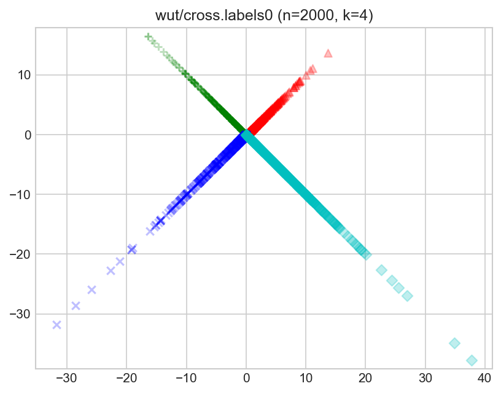
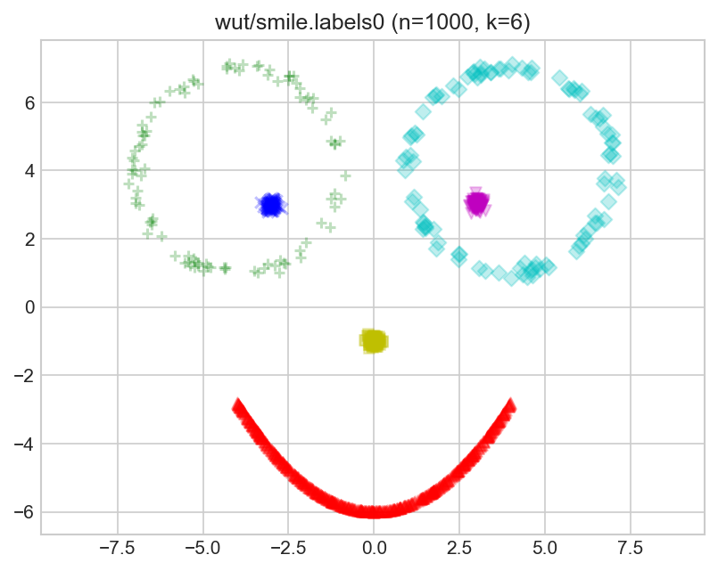
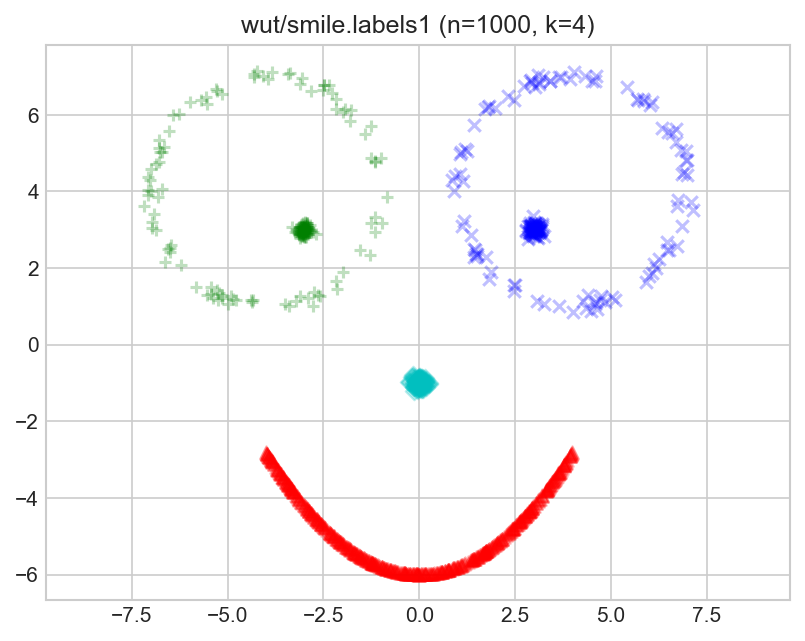
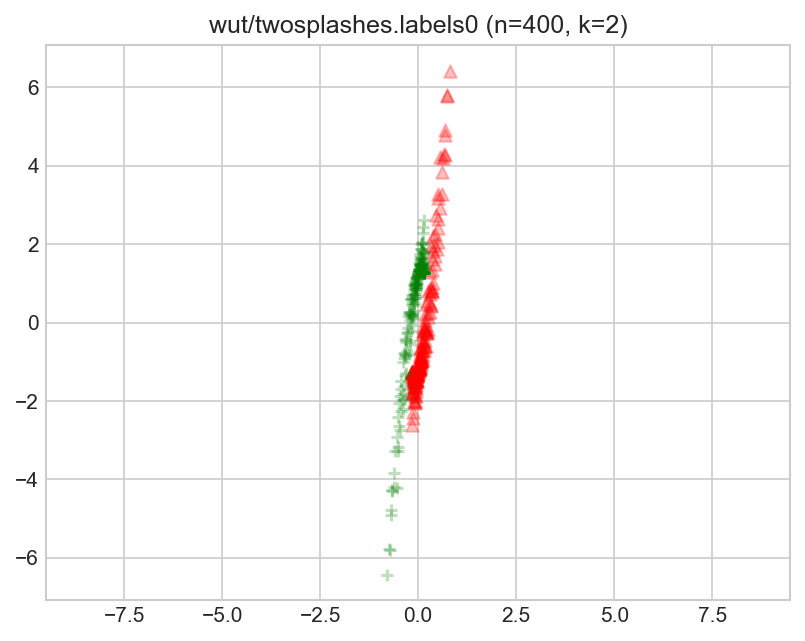
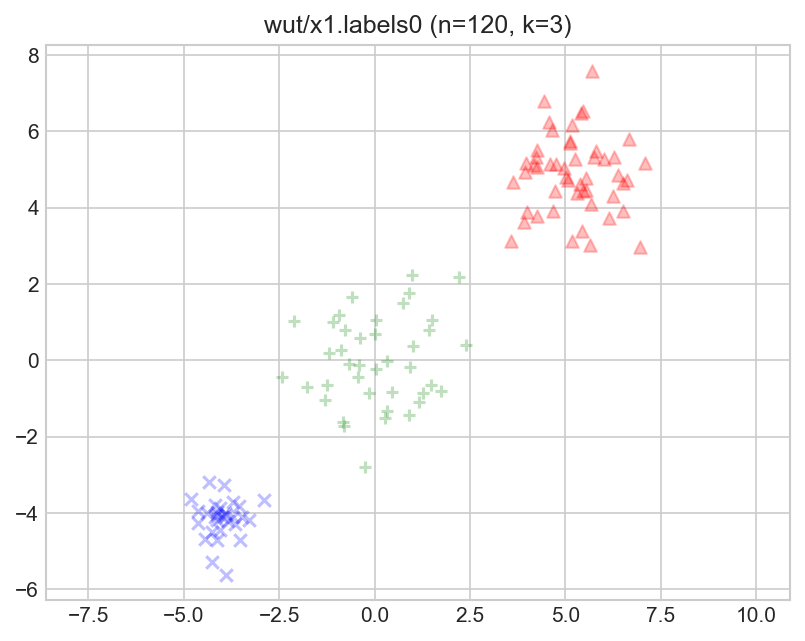
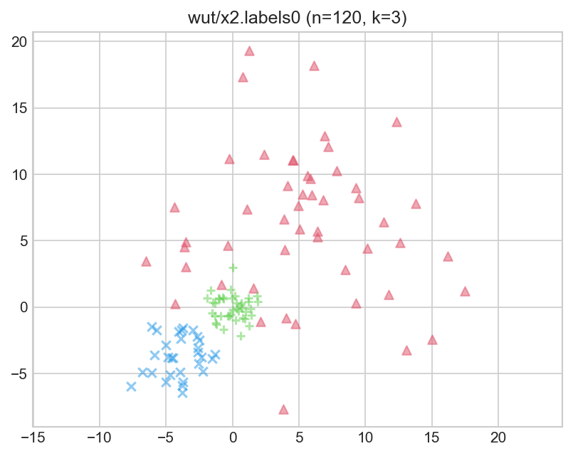
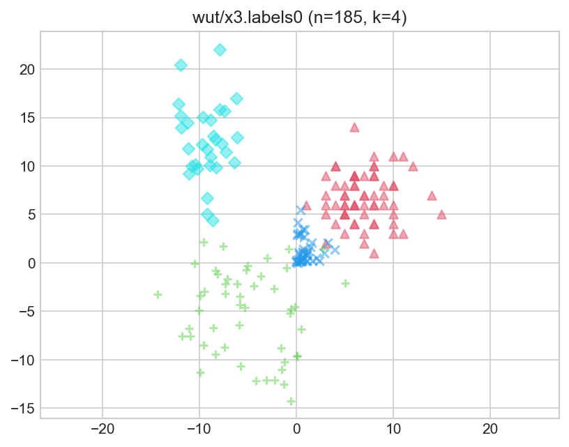
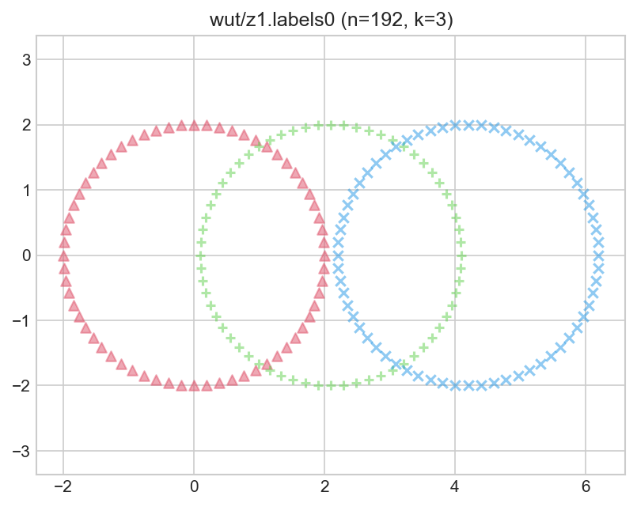
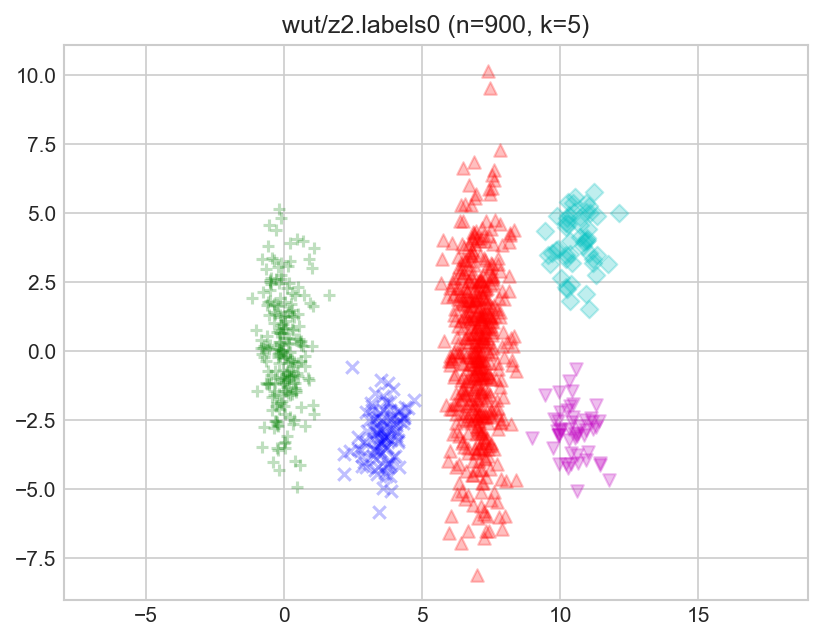
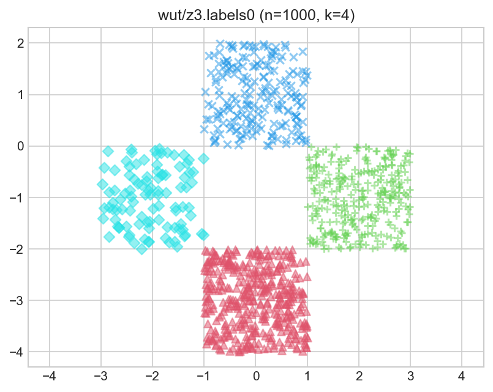

**[Benchmark Suite for Clustering Algorithms -- Version 1](https://github.com/gagolews/clustering_benchmarks_v1)
is maintained by [Marek Gagolewski](http://www.gagolewski.com)**

--------------------------------------------------------------------------------

**Datasets**

* [wut/cross](#wut_cross)
* [wut/smile](#wut_smile)
* [wut/twosplashes](#wut_twosplashes)
* [wut/x1](#wut_x1)
* [wut/x2](#wut_x2)
* [wut/x3](#wut_x3)
* [wut/z1](#wut_z1)
* [wut/z2](#wut_z2)
* [wut/z3](#wut_z3)

--------------------------------------------------------------------------------

## wut/cross (n=2000, d=2) 

    Author: Przemyslaw Kosewski (Warsaw University of Technology)
    
    `labels0` come from the Author himself.
    `0` denotes the noise class (if present).
    

#### `labels0`

true_k= 4, noise=    0, true_g=0.000

label_counts=[500, 500, 500, 500]

## wut/smile (n=1000, d=2) 

    Author: Przemyslaw Kosewski (Warsaw University of Technology)
    
    `labels0` come from the Author himself.
    `labels1` generated by M. Gagolewski.
    `0` denotes the noise class (if present).
    

#### `labels0`

true_k= 6, noise=    0, true_g=0.400

label_counts=[500, 100, 100, 100, 100, 100]

#### `labels1`

true_k= 4, noise=    0, true_g=0.400

label_counts=[500, 200, 200, 100]

## wut/twosplashes (n=400, d=2) 

    Author: Jedrzej Krauze (Warsaw University of Technology)
    
    `labels0` come from the Author himself.
    `0` denotes the noise class (if present).
    

#### `labels0`

true_k= 2, noise=    0, true_g=0.000

label_counts=[200, 200]

## wut/x1 (n=120, d=2) 

    Author: Eliza Kaczorek (Warsaw University of Technology)
    
    `labels0` come from the Author herself.
    `0` denotes the noise class (if present).
    

#### `labels0`

true_k= 3, noise=    0, true_g=0.167

label_counts=[50, 40, 30]

## wut/x2 (n=120, d=2) 

    Author: Eliza Kaczorek (Warsaw University of Technology)
    
    `labels0` come from the Author herself.
    `0` denotes the noise class (if present).
    

#### `labels0`

true_k= 3, noise=    0, true_g=0.167

label_counts=[50, 40, 30]

## wut/x3 (n=185, d=2) 

    Author: Eliza Kaczorek (Warsaw University of Technology)
    
    `labels0` come from the Author herself.
    `0` denotes the noise class (if present).
    

#### `labels0`

true_k= 4, noise=    0, true_g=0.207

label_counts=[65, 50, 40, 30]

## wut/z1 (n=192, d=2) 

    Author: Anna Gierlak (Warsaw University of Technology)
    
    `labels0` come from the Author herself.
    `0` denotes the noise class (if present).
    

#### `labels0`

true_k= 3, noise=    0, true_g=0.000

label_counts=[64, 64, 64]

## wut/z2 (n=900, d=2) 

    Author: Anna Gierlak (Warsaw University of Technology)
    
    `labels0` come from the Author herself.
    `0` denotes the noise class (if present).
    

#### `labels0`

true_k= 5, noise=    0, true_g=0.583

label_counts=[500, 200, 100, 50, 50]

## wut/z3 (n=1000, d=2) 

    Author: Anna Gierlak (Warsaw University of Technology)
    
    `labels0` come from the Author herself.
    `0` denotes the noise class (if present).
    

#### `labels0`

true_k= 4, noise=    0, true_g=0.333

label_counts=[400, 300, 200, 100]

